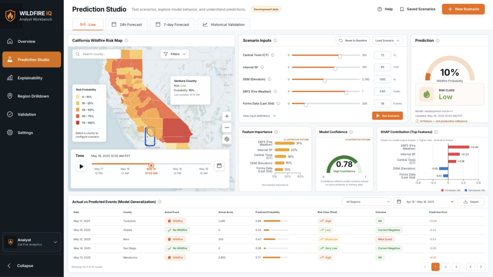
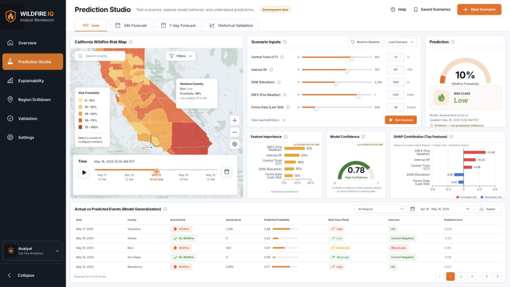
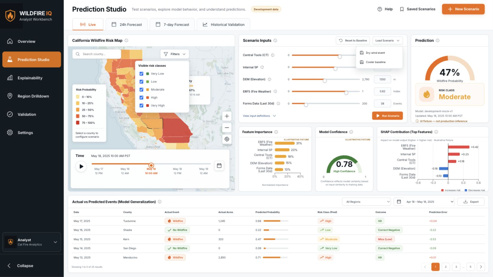
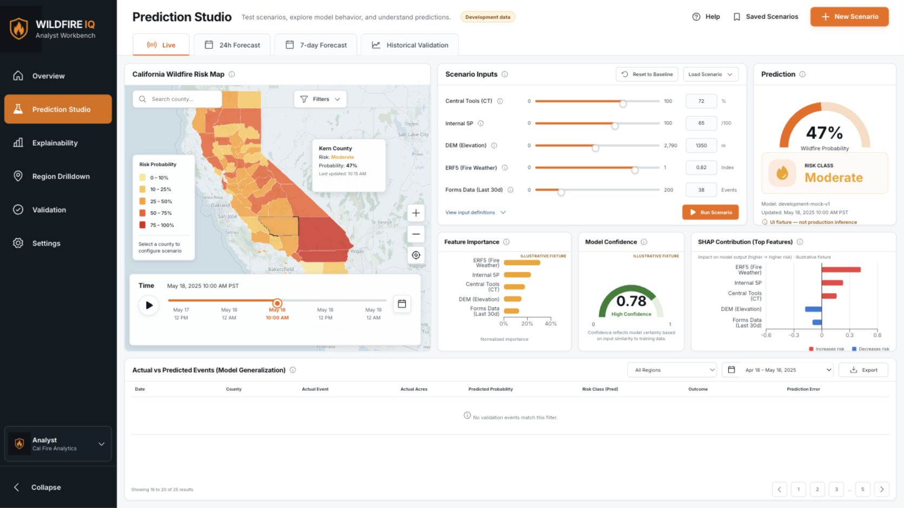
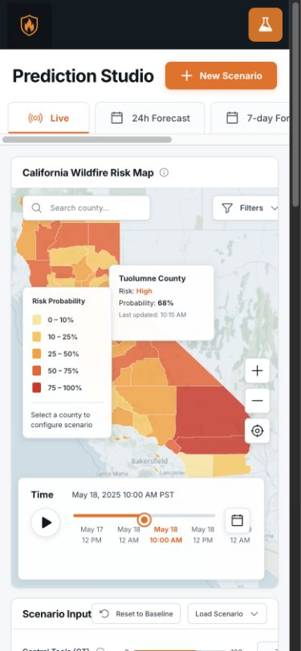
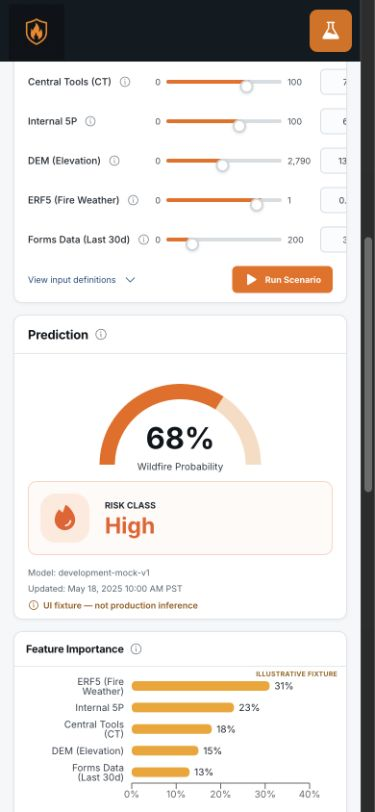
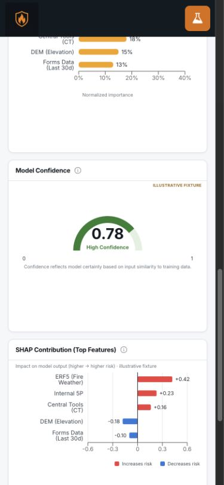
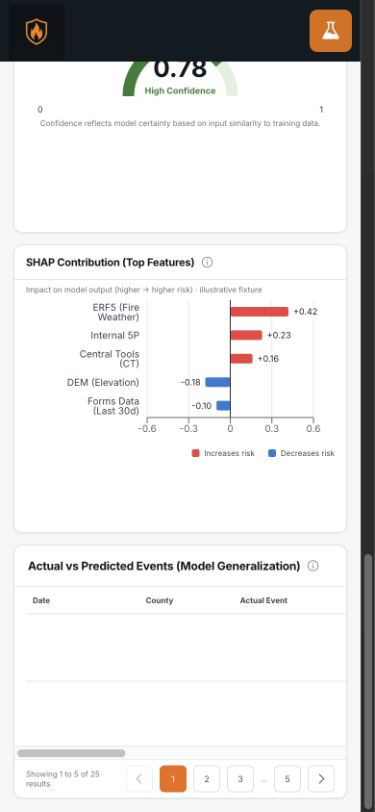

# Prediction Studio UI Audit

Audit date: August 11, 2026
Surface: Phase 1 Prediction Studio
Mode: Combined UX and accessibility audit
Primary user goal: inspect a county, adjust scenario inputs, run a prediction, understand the explanation, and validate model behavior without losing context.

## Overall verdict

The initial audit found structural defects in the map, sliders, pagination, menus, and narrow layouts. The remediation pass is complete: every P1 and P2 finding below has been fixed and reverified in the browser. Final source-comparison evidence and runtime checks are recorded in `design-qa.md`.

## Captured flow

### 1. Desktop baseline — needs work

Strengths: the major regions match the approved visual hierarchy, panels are grouped logically, the prediction is prominent, and the primary scenario action is visible.

Findings:

- **P1 — Map geometry is not registered to the basemap.** The D3 county overlay and MapLibre raster map maintain separate zoom and pan state. Counties visibly drift over basemap labels and direct map gestures can change only the basemap.
- **P1 — Sliders expose two overlapping controls.** A semantic `progress` element is stacked under each range input, producing duplicate control semantics and a tiny four-pixel hit area. Native keyboard changes were not observed during the audit.
- **P2 — Dense UI text is undersized.** Nine-pixel labels dominate scenario controls, charts, metadata, table headers, and the legend. This makes the app markedly harder to scan than the approved reference.
- **P2 — Chart labels wrap inconsistently.** Feature names lose spaces or break at awkward points, fixture labels compete with data, and the confidence label is hard-coded instead of derived from the value.
- **P2 — Risk colors conflict.** The map/legend use a yellow-to-red probability palette while the filter menu uses green semantic badge colors for the same visible map classes.

### 2. Map zoom — broken

Findings:

- **P1 — Zoom synchronization is fragile.** Custom buttons independently change `overlayZoom` and MapLibre zoom. The two systems use different origins and scaling rules, so the overlay cannot remain geographically accurate.
- **P2 — Selection and hover cards compete for map space.** Their fixed positions can cover county geometry and collide with the filter menu.
- **P2 — Date control is inert.** The calendar button is presented as interactive but has no behavior.

### 3. Menus and controls — needs work

Findings:

- **P2 — Menus do not dismiss on outside click or Escape.** Multiple floating menus can remain open at once and obscure the map and inputs.
- **P2 — Visible filter swatches do not match the colors being filtered.** This weakens trust in the risk layer.
- **P2 — Several visible controls are inert.** Help, Saved Scenarios, analyst profile, and the map date button lack a visible outcome.

### 4. Pagination — broken

Findings:

- **P1 — Pagination can enter an empty page while claiming results exist.** The adapter reports 25 results but supplies only 10 events.
- **P1 — Validation reload loops after leaving page one.** The effect depends on the result object that it replaces, causing repeated requests and renders.
- **P2 — Page four has no active page button.** Pagination always renders 1, 2, 3, …, 5, so intermediate pages lose location context.
- **P2 — Date and region filters are misleading.** Date selection does not affect data; region filtering applies only to the currently loaded page; the footer still reports unfiltered totals.

### 5. Mobile entry and map — broken

Findings:

- **P1 — Primary navigation is unavailable.** At narrow widths all inactive navigation items disappear and no menu control replaces them.
- **P1 — The map is not framed for the viewport.** The county layer is oversized and clipped; fixed cards crowd the usable map.
- **P2 — Mode tabs show a permanent scrollbar and truncate labels without a clear overflow affordance.**
- **P2 — Scenario panel title collides with its header actions.** The title is visibly clipped at the next scroll position.

### 6. Mobile scenario and prediction — broken

Findings:

- **P1 — Scenario values and units are cut off.** The desktop grid remains wider than the card and the panel hides the overflow.
- **P2 — Compact controls miss practical touch-target sizes.** Slider tracks, mini buttons, and icon controls are smaller than a comfortable mobile target.
- **P2 — Prediction risk icon background remains orange even for non-orange risk classes.** The surface color should follow the semantic risk token.

### 7. Mobile explanations — needs work

Findings:

- **P2 — Explanation cards reserve excessive blank height.** Fixed 300-pixel minimums leave large empty regions below short charts.
- **P2 — Small chart labels and legends are difficult to read.** Several labels fall below a comfortable mobile text size.

### 8. Mobile validation — needs work

Findings:

- **P2 — Filtering and export controls disappear on mobile.** The table is still scrollable, but important context controls are removed instead of reflowed.
- **P2 — Footer copy wraps awkwardly and pagination consumes most of the card width.**

## Accessibility risks

- Range inputs need reliable keyboard behavior, a single semantic control, readable value text, and a visible focus state.
- Mobile navigation needs a keyboard- and screen-reader-operable menu.
- Dismissing menus must work with Escape and outside click while preserving focus.
- Information icons currently rely on `title` tooltips and are not consistently keyboard discoverable.
- Map selection remains primarily pointer driven; county search should stay the keyboard-accessible selection path and be described as such.
- Visible text, especially nine-pixel labels, should be increased and contrast rechecked after the type-scale update.

## Evidence limits

This audit verifies visible layout, browser interaction, DOM semantics, responsive reflow, and console output in the current local build. It does not claim full WCAG compliance, screen-reader interoperability, production tile reliability, real model correctness, or GCP integration behavior. Those require dedicated assistive-technology tests and the original production services.

## Repair priorities

1. Move county fills and selection lines into MapLibre so all map movement shares one coordinate system.
2. Replace progress/range stacks with one robust slider control and responsive input grouping.
3. stop the validation reload loop; make adapter totals and filters truthful; render a complete pagination window.
4. Add usable mobile navigation and responsive panel/header layouts.
5. Normalize typography, chart labels, risk colors, menus, touch targets, and inert controls.
6. Re-run interaction, keyboard, responsive, console, automated, and source-comparison QA.

## Remediation verification

- **Map:** MapLibre now owns pan and zoom; county paths are reprojected from live map coordinates on movement and remain aligned. County selection, zoom, reset, filters, and the date control were browser-tested.
- **Sliders:** each feature uses one semantic range input with a larger hit target, visible focus treatment, keyboard behavior, clamped typed values, and consistent number formatting. The timeline uses the same single-control pattern.
- **Validation:** request dependencies no longer loop, fixtures truthfully contain 25 rows, filtering occurs before pagination, all five pages contain results, the active page is always represented, and the footer reflects the filtered set.
- **Navigation and menus:** mobile navigation, profile, Help, Saved Scenarios, presets, filters, and date controls now have visible outcomes and dismiss with Escape or outside click.
- **Responsive layout:** scenario inputs, units, explanation cards, table filters, export, rows, and pagination reflow without document-level horizontal overflow at 390 pixels. The 1280 × 800 layout no longer overlaps the validation panel.
- **Typography and charts:** dense text sizes and spacing were normalized; all feature labels render; confidence and risk colors derive from the active result; chart containers no longer emit size warnings.
- **Verification:** final clean browser reloads produced no new warnings or errors. TypeScript, 11 Vitest tests, 4 Sites worker tests, and the production build all passed.

Remediation result: **passed**
