# Milestone 2 — Dataset Preparation Report

**AI-Powered Wildfire Early Detection and Alerting System**

*Dataset selection, exploratory data analysis, preprocessing pipeline, and train/validation/test split for a multi-source wildfire risk model*

## 1. Dataset Overview

This project builds a per-pixel wildfire risk model for California from six independently sourced geospatial datasets, mirrored into two Google Cloud Storage buckets and accessed anonymously via gcsfs/rasterio (GDAL configured with GS_NO_SIGN_REQUEST=YES). All six sources were verified by directly opening sample files rather than assumed from documentation, and the structure below reflects that live verification.

### 1.1 Data Sources and Storage Locations

| **Source** | **Bucket / Path** | **Role** |
| --- | --- | --- |
| **FIRMS (MODIS Active Fire)** | **gs://wildfire-detection-first/firms_daily_geotiff/** | **Label (fire / no-fire)** |
| **Landsat 8** | **gs://dsai-lab-project/wildfire_satellite/raw/landsat/** | **Vegetation + thermal input** |
| **Sentinel-2** | **gs://dsai-lab-project/wildfire_satellite/raw/sentinel2/** | **Vegetation / moisture input** |
| **Sentinel-5P** | **gs://dsai-lab-project/wildfire_satellite/raw/sentinel5p/** | **Atmospheric / pre-smoke input** |
| **ERA5 (reanalysis)** | **gs://dsai-lab-project/wildfire_satellite/era5/raw/{year}/** | **Weather input** |
| **Copernicus DEM** | **gs://dsai-lab-project/wildfire_satellite/dem/2021-2025/california/terrain/** | **Static terrain input** |

### 1.2 Dataset Source and Provenance

Each of the six sources originates from a public earth-observation or reanalysis program; the GCS buckets used in this project are a working mirror assembled for the course project rather than the original distribution point:

- FIRMS active fire detections — NASA FIRMS / MODIS active fire product (LANCE / NASA Earthdata).

- Landsat 8 surface reflectance and thermal bands — USGS/NASA Landsat program.

- Sentinel-2 multispectral imagery — ESA Copernicus Programme.

- Sentinel-5P atmospheric composition (aerosol index) — ESA Copernicus Programme.

- ERA5 hourly reanalysis — ECMWF / Copernicus Climate Change Service (C3S), Copernicus Climate Data Store.

- Copernicus DEM (GLO-30 derived terrain layers) — ESA Copernicus / Copernicus DEM.

### 1.3 License and Usage Permissions

NASA (FIRMS, Landsat), USGS (Landsat) and ESA/Copernicus (Sentinel-2, Sentinel-5P, Copernicus DEM, and C3S ERA5) data are distributed under open, free-and-open-access data policies that permit non-commercial and commercial reuse with attribution — no separate license fee or per-use agreement applies to the original source data. Two caveats apply to this project specifically:

- The GCS buckets used here (wildfire-detection-first, dsai-lab-project) are a project-internal mirror, not the original distribution channel — confirm with the team/instructor whether any additional access terms apply to redistributing this mirrored copy (e.g., on Kaggle).

- ERA5 access via the Copernicus Climate Data Store requires attribution to the Copernicus Climate Change Service and ECMWF in any publication or redistribution of derived data.

Recommended attribution line for the report/dataset card: “Contains modified Copernicus Sentinel data, ERA5 data (Copernicus Climate Change Service), Copernicus DEM data, and NASA FIRMS/Landsat data.”

### 1.4 Number of Data Points

Because this is a multi-source raster fusion problem rather than a flat tabular dataset, scale is best reported per source (raw files) and then as fused daily samples once the pipeline is complete:

| **Source** | **File count** | **Native resolution** | **Temporal coverage** |
| --- | --- | --- | --- |
| **FIRMS** | **3,642 daily GeoTIFFs** | **~1 km (1056 × 1153 px, MODIS grid)** | **2016-01-01 to 2025-12-31, daily** |
| **Landsat 8** | **264 tiles found (144 in the earlier progress-file count; 36 tiles for 2024 alone)** | **~30 m (10,496 × 10,496 px tiles)** | **Confirmed present only for 2024–2025** |
| **Sentinel-2** | **480 tiles** | **~10 m (9,472 × 9,472 px tiles)** | **2016–2025** |
| **Sentinel-5P** | **91 monthly composites** | **~1–2 km (1,069 × 1,146 px)** | **2018-06 to 2025-12** |
| **ERA5** | **12 monthly files/year × 5 years (2021–2025)** | **~0.25° (38 × 41 grid, hourly)** | **2021–2025, hourly, aggregated to daily** |
| **Copernicus DEM** | **6 precomputed static layers** | **Matches DEM native tiling** | **Static (2021–2025 acquisition label)** |

Once fused onto the FIRMS reference grid with a 7-day history window (Section 4), the number of usable labeled daily samples is bounded by whichever source has the narrowest coverage window that is treated as required — see Section 5 for the exact constraint and the split sizes that follow from it.

### 1.5 Classes / Categories

The prediction target is a per-pixel binary label derived from FIRMS: fire (1) vs. no-fire (0), thresholded on detection confidence ≥ 30. On a representative fire-season date (2020-08-20), raw (unfiltered) fire-pixel prevalence was 0.41%, and after the confidence≥30 filter it dropped to 0.177% (5,045 raw valid pixels vs. 2,155 after filtering) — confirming a severe class imbalance that motivates a weighted loss (e.g., focal loss or weighted BCE) rather than plain accuracy as the primary training/evaluation metric.

### 1.6 Other Relevant Metadata

- Area of interest: California, bounding box north 42.01°, south 32.53°, west −124.41°, east −114.13°.

- Coordinate reference system: EPSG:4326 across sources (confirmed on Sentinel-2 and Landsat 8 samples).

- Feature bands per source: FIRMS — confidence, brightness_temp_K, detection_flag; Landsat 8 — blue, green, red, nir, thermal_raw (no SWIR, no QA band); Sentinel-2 — B2, B3, B4, B8, B11, B12 (6 bands, matches the assumed structure exactly); Sentinel-5P — aerosol_index only (no CO channel, dropped from the original feature plan); ERA5 — 14 variables (t2m, d2m, sp, u10, v10, i10fg, tp, swvl1, swvl2, cvh, cvl, lai_hv, lai_lv, blh); DEM — elevation, slope, aspect, hillshade, TPI, TRI.

- Known open item: Landsat 8 coverage is confirmed only for 2024–2025 (144–264 tiles depending on listing pass), despite an accompanying progress file claiming coverage since 2016 — flagged for the team rather than assumed away.

## 2. Exploratory Data Analysis (EDA)

EDA was run per source using a consistent checklist — null/no-data rate, value range, skewness, a visual check, and (for the label) class balance — then extended with cross-source checks: a coverage timeline, spatial clustering of fire detections, and a feature-vs-label validation using real fused data.

### 2.1 FIRMS — Label Source

On 2020-08-20, all three FIRMS bands showed 5,045 valid (non-NaN) pixels out of 1,056×1,153 (0.41%) — confirming that active-fire detections are genuinely rare on any given day, which is expected behavior for this product rather than a data-quality issue. Confidence ranged 6–100 (skew −1.99, i.e. concentrated at high confidence), and brightness temperature ranged 300.5–500K (skew 1.46).

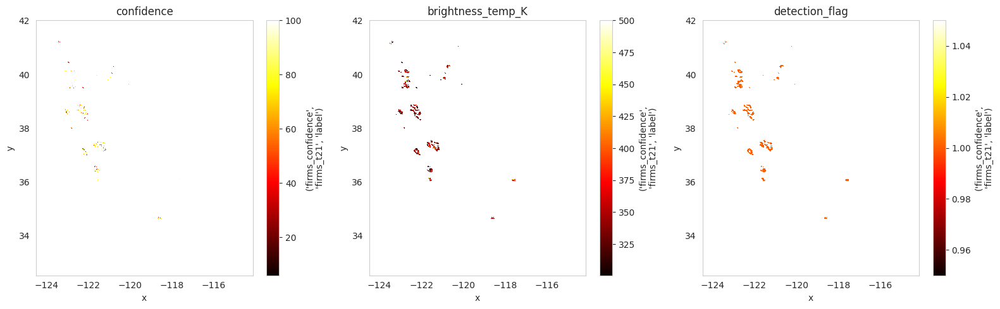

*Figure 1. FIRMS confidence, brightness temperature, and detection flag bands (2020-08-20).*

#### 2.1.1 Real Fire-Event Lifecycle

To confirm the temporal signal the model depends on actually exists in the raw label data, the raw valid-pixel percentage was tracked across 5 consecutive days of a real August 2020 California fire event.

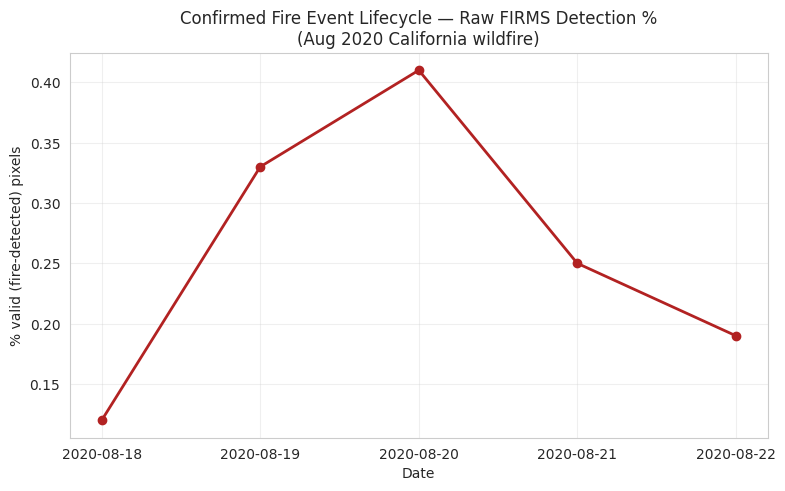

*Figure 2. Raw FIRMS detection percentage across a 5-day window, showing a rise–peak–decline pattern consistent with a real fire event.*

This rise–peak–decline pattern is direct, day-by-day evidence of the temporal signal the project depends on, observed in raw label data before any modeling is applied.

### 2.2 Landsat 8

Across the sampled 2024 tile (10,496 × 10,496, 5 bands), 14.2% of pixels were no-data across all optical/thermal bands. Optical bands showed strong positive skew (blue 3.47, green 3.13, red 2.81, nir 1.53), typical of reflectance data dominated by low-to-mid values with a long bright tail. Thermal, once converted from raw digital numbers to Celsius via Kelvin = raw × 0.00341802 + 149.0, ranged −36.0°C to 47.4°C — physically plausible for California land-surface temperature.

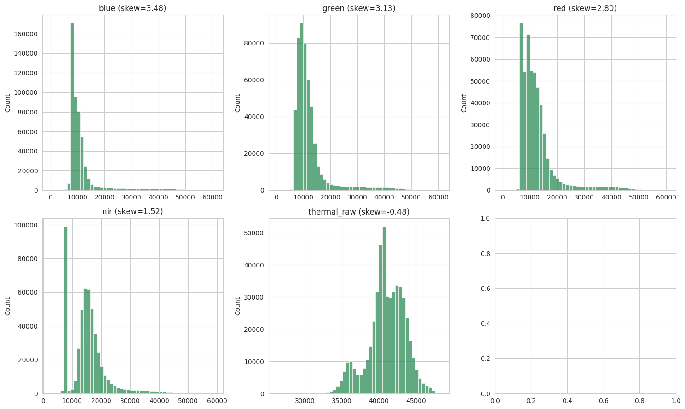

*Figure 3. Landsat 8 per-band value distributions (blue, green, red, nir, thermal_raw).*

### 2.3 Sentinel-2

The sampled tile (6 × 9,472 × 9,472) confirmed the assumed 6-band order [B2, B3, B4, B8, B11, B12] exactly, verified against the file's own long_name attribute. No-data rate was 63.18% across all bands on this particular tile (tile-edge/overlap effect rather than a source-wide rate). No cloud mask (SCL) is available in this source, so cloud contamination is not filtered at the EDA stage — noted as a limitation in Section 3.

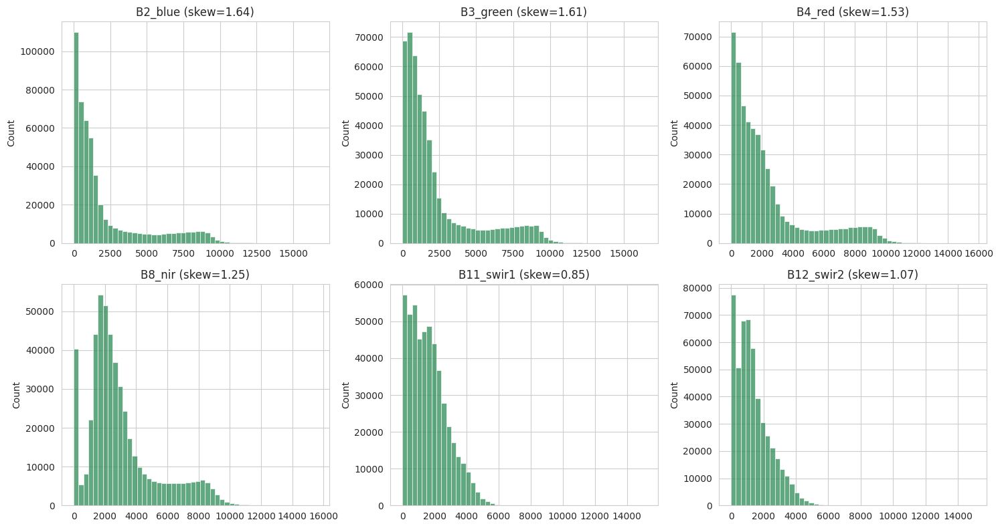

*Figure 4. Sentinel-2 per-band value distributions across all 6 confirmed bands.*

### 2.4 Sentinel-5P

Confirmed single-band structure: aerosol_index only (no CO channel, contrary to the original feature plan). Null rate was 5.74%, values ranged −2.4868 to 2.9347 (skew 0.33), a clean match for the expected Absorbing Aerosol Index range. Confirmed coverage spans 2018-06 through 2025-12 (91 monthly files), earlier than the Aug-2021 start originally assumed.

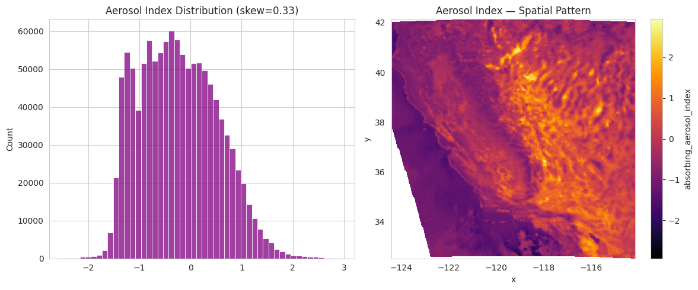

*Figure 5. Sentinel-5P aerosol index distribution and spatial pattern for a sample month.*

### 2.5 ERA5

A sample month (January 2021, 744 hourly steps, 38 × 41 grid) confirmed all 14 expected variables present with zero nulls. Ranges were physically sensible: t2m 259.99–304.42 K, sp 72,617–103,251 Pa, wind components u10 −5.83 to 6.32 m/s and v10 −11.49 to 4.37 m/s, and total precipitation (tp) strongly right-skewed (55.18) as expected for a mostly-dry, occasionally-heavy variable.

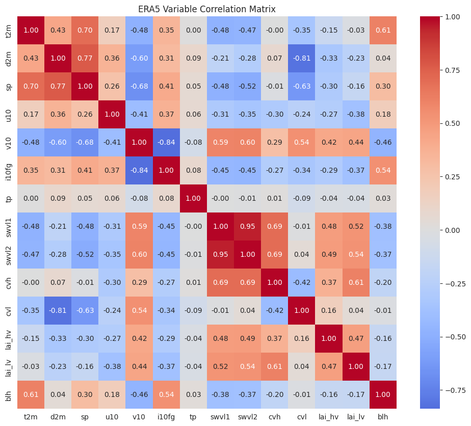

*Figure 6. Correlation matrix across the 14 confirmed ERA5 variables for a sample day.*

### 2.6 Copernicus DEM

The 6 precomputed terrain layers were downloaded and inspected directly: elevation ranged −85.72 to 4292.83 m (mean 1037.03 m), slope 0–55.44° (mean 8.42°), aspect 12.51–346.72° (mean 178.97°, and near-zero skew as expected for a circular/directional variable), hillshade 10.24–249.41 (left-skewed, −1.76), TPI −22.37 to 27.74 (mean ≈ 0, as expected for a relative-position index), and TRI 0–128.43 (strongly right-skewed, 2.62, dominated by flat terrain with a few very rugged patches).

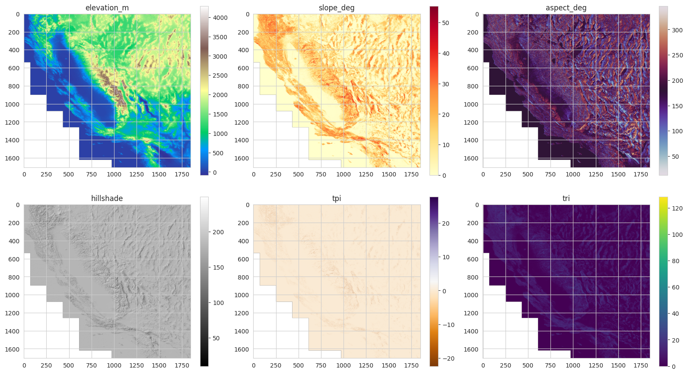

*Figure 7. All 6 Copernicus DEM terrain layers: elevation, slope, aspect, hillshade, TPI, and TRI.*

### 2.7 Cross-Dataset Coverage Timeline

Reusing file lists already fetched during per-source EDA (no additional downloads), years with confirmed data were plotted per source. This makes the binding constraint on the training window visually explicit.

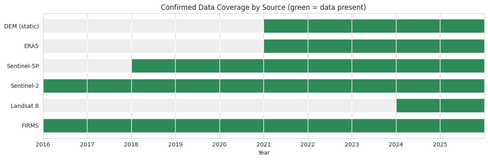

*Figure 8. Confirmed year-by-year data coverage across all 6 sources.*

Key constraint: if Landsat 8 is treated as a required channel, the usable joint training window shrinks to 2024–2025 only. If Landsat 8 is instead optional/droppable, the full 2018–2025 window (bounded by Sentinel-5P's 2018-06 start) becomes usable.

### 2.8 Spatial Clustering of Fire Detections

Across 11 sampled fire-season dates spanning 2018–2025 (chosen to keep this check cheap — FIRMS files are small), 14,814 total fire detections were collected and binned spatially.

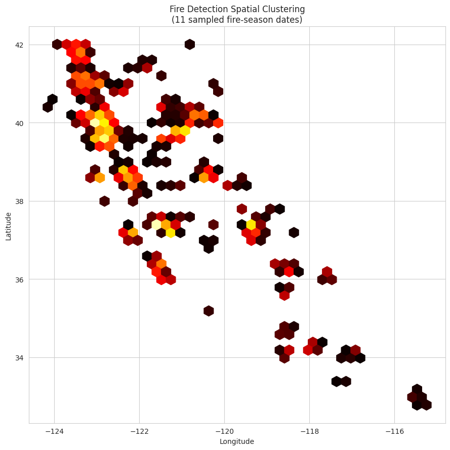

*Figure 9. Spatial density of FIRMS fire detections across the California AOI, aggregated over 11 sampled fire-season dates.*

Dense clusters indicate historically fire-prone sub-regions of the California AOI, worth cross-referencing against DEM/vegetation features in a later milestone.

### 2.9 Feature-vs-Label Validation (Core Premise Check)

The single most important EDA check is whether candidate input features actually separate fire pixels from no-fire pixels once everything is regridded onto FIRMS's coordinate grid. Using a real fused example (2024-08-15, Landsat 8 regridded onto the FIRMS grid, fire ratio 0.0128% after confidence≥30 filtering):

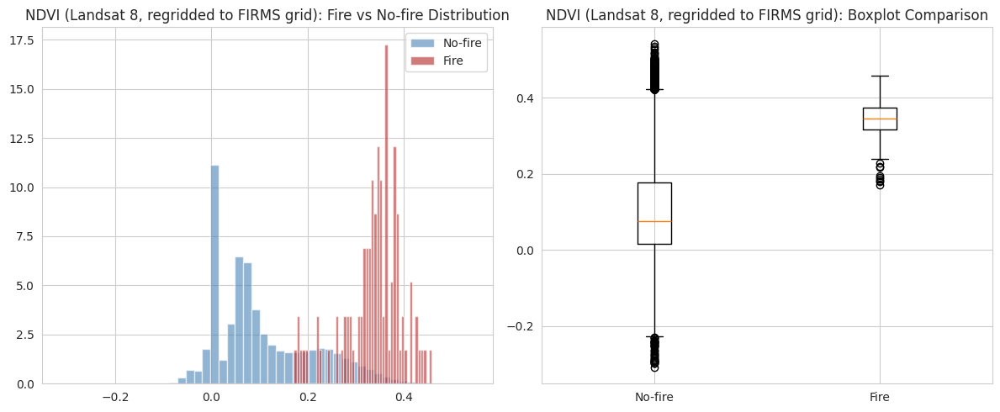

*Figure 10. NDVI distribution and boxplot, fire vs. no-fire pixels (2024-08-15). No-fire mean 0.107 vs. fire mean 0.337 (difference 0.230).*

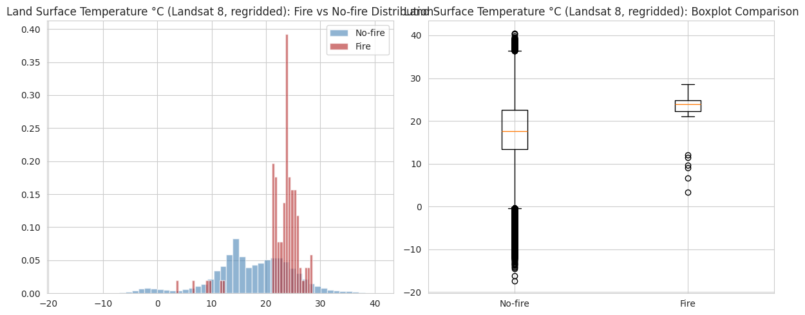

*Figure 11. Land Surface Temperature (°C) distribution and boxplot, fire vs. no-fire pixels (2024-08-15). No-fire mean 17.42°C vs. fire mean 23.07°C (difference 5.65°C).*

Both features separate in the expected direction — fire pixels run cooler-vegetation/hotter-surface than no-fire pixels — which is direct evidence, not a theoretical assumption, that NDVI and LST carry usable predictive signal.

#### 2.9.1 Cross-Feature Correlation

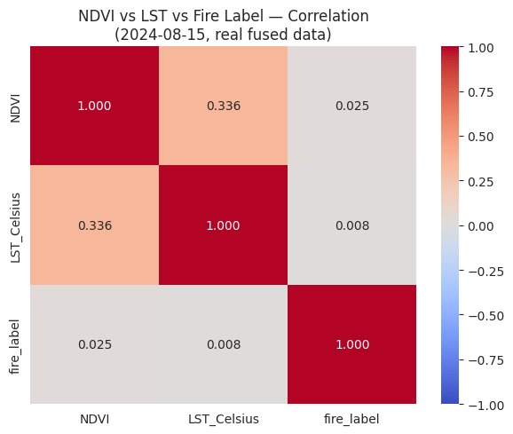

*Figure 12. Correlation matrix: NDVI, LST, and fire label (2024-08-15, real fused data).*

The computed correlations were NDVI–LST = 0.336, NDVI–fire_label = 0.025, and LST–fire_label = 0.008. The NDVI–LST relationship is positive rather than the negative relationship that would be expected under the simple “drier vegetation is both browner and hotter” hypothesis, and the correlation of either feature directly with the pixel-level fire label is very weak. This does not contradict the group-mean separation shown above (Figures 10–11) — mean differences between two very unevenly sized groups (a handful of fire pixels vs. a large no-fire background) can coexist with a near-zero pixel-level linear correlation across the whole image. It does mean NDVI and LST alone are weak individual linear predictors of the label at pixel level, and should be read as supporting evidence for feature relevance rather than proof of strong standalone predictive power — this nuance should be stated plainly in the submitted report rather than only citing the group-mean gap.

#### 2.9.2 Multi-Event Validation

The NDVI-vs-label check was repeated on two additional dates within the same forward-filled Landsat scene (no new tile download needed), to check the separation isn't a one-off result.

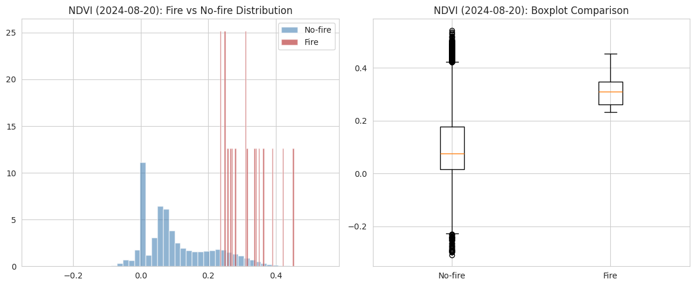

*Figure 13. NDVI fire vs. no-fire separation, 2024-08-20 (fire ratio 0.0071%). No-fire mean 0.107 vs. fire mean 0.313 (difference 0.206).*

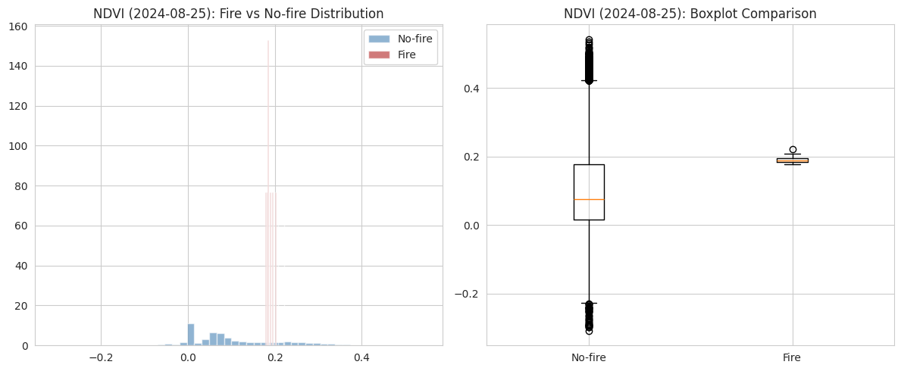

*Figure 14. NDVI fire vs. no-fire separation, 2024-08-25 (fire ratio 0.0023%). No-fire mean 0.107 vs. fire mean 0.191 (difference 0.085).*

The direction of separation (lower NDVI on fire pixels) holds across all three tested dates, though the size of the gap shrinks as the fire event ages and the fire-pixel count drops — consistent with a real, if noisy, signal rather than a single cherry-picked example.

## 3. Preprocessing

Preprocessing runs per-source first, then a fusion step aligns every source spatially and temporally onto a single reference grid. Order: FIRMS → binary label; Landsat 8 / Sentinel-2 → spectral indices; Sentinel-5P → regrid + broadcast; ERA5 → hourly-to-daily aggregation; DEM → direct load + regrid; then normalization; then fusion.

### 3.1 FIRMS → Binary Label

Justification: the raw label is a continuous confidence score plus a detection flag, not a clean binary target. A confidence threshold of 30 was chosen because it is validated on real data — on 2020-08-20 it removed 0.41% → 0.177% of “fire” pixels, i.e. over half of raw detections were low-confidence and would otherwise inject label noise into training.

### 3.2 Landsat 8 → NDVI + LST

NDVI = (nir − red) / (nir + red); LST is derived by converting the thermal_raw digital number to Kelvin (×0.00341802 + 149.0) then to Celsius. No NBR is computed for this source since it has no SWIR bands. Cloud masking is skipped because no QA_PIXEL band is available in this source — documented as a limitation rather than silently ignored.

### 3.3 Sentinel-2 → NDVI, NBR, NDWI

NDVI = (B8 − B4)/(B8 + B4); NBR = (B8 − B12)/(B8 + B12); NDWI = (B3 − B8)/(B3 + B8). These three indices were chosen because they respectively capture vegetation health, burn severity, and surface moisture — the three physical signals most associated with fire risk and fire scars. As with Landsat 8, cloud masking is skipped since no SCL band exists in this source.

### 3.4 Sentinel-5P → Regrid + Monthly Broadcast

The single confirmed aerosol_index band is reprojected onto the reference grid (rio.reproject_match, bilinear resampling) and then broadcast unchanged across every day within that month, since the source is a monthly composite. This is a deliberate, documented simplification: broadcasting removes any real day-to-day atmospheric variation within a month, which is a known limitation rather than an oversight.

### 3.5 ERA5 → Hourly-to-Daily Aggregation

Each ERA5 file arrives as a ZIP archive (despite the .nc extension) containing two inner NetCDF files — an “instant” file (t2m, d2m, sp, u10, v10, i10fg, soil/vegetation variables, blh) and an “accum” file (tp, accumulated precipitation) — which are opened and merged, with the time dimension renamed from valid_time to time. Aggregation to daily values uses a different, variable-appropriate rule per field rather than one blanket mean:

- Temperature/dewpoint/pressure/soil/vegetation/boundary-layer-height variables → daily mean (plus daily max/min for temperature).

- Wind gust (i10fg) → daily max.

- Precipitation (tp) → daily sum, converted from metres to millimetres.

- Wind direction (u10, v10) → vector-averaged (mean u and v components, then recombined into speed and sin/cos direction), never a naive mean of degrees, which would be physically meaningless across the 0°/360° boundary.

### 3.6 Copernicus DEM → Direct Load + Regrid

The 6 terrain layers under terrain/ are already precomputed (elevation, slope, aspect, hillshade, TPI, TRI), so no derivation step is needed — each file is downloaded at full resolution (required for accurate reprojection), reprojected onto the reference grid, and the local temp copy is deleted immediately afterward to respect disk quota (files are non-cloud-optimized GeoTIFFs, ~4–5 GB each).

### 3.7 Normalization

Channel-wise z-score normalization (subtract mean, divide by standard deviation) is computed once on the training split only, ignoring NaNs, and the same per-channel statistics are then applied to the validation and test splits — preventing information from val/test leaking into the normalization statistics. Final stacked feature set totals 32 channels across all sources (Sentinel-2 indices, Landsat 8 indices, ERA5 daily aggregates, DEM terrain layers, and Sentinel-5P aerosol index).

### 3.8 Spatial and Temporal Fusion Strategy

Two alignment problems have to be solved before the six sources can be stacked into one tensor:

#### Spatial alignment

FIRMS's grid (~1 km, 1,056 × 1,153) is used as the reference grid — not ERA5's coarser grid — because FIRMS is the label source and the goal is per-pixel risk prediction at the label's native resolution. Every other source is reprojected onto this grid with rio.reproject_match (bilinear resampling).

#### Temporal alignment

| **Source** | **Native frequency** | **Fusion rule** |
| --- | --- | --- |
| **FIRMS** | **Daily** | **Exact-day match (it is the daily label)** |
| **ERA5** | **Hourly → daily** | **Exact-day match (aggregated first)** |
| **Landsat 8** | **~16-day revisit** | **Forward-fill: most recent scene ≤ target date** |
| **Sentinel-2** | **~5-day revisit** | **Forward-fill: same rule as Landsat 8** |
| **Sentinel-5P** | **Monthly composite** | **Broadcast: same value for every day in the month** |
| **Copernicus DEM** | **Static** | **Broadcast: same value for every day** |

Forward-fill is a deliberate modeling choice, not a shortcut: optical NDVI/NBR genuinely changes slowly day-to-day, and using the most recent real observation instead of interpolating is standard practice in remote-sensing time series (the same principle used in datasets such as WildfireSpreadTS). A ForwardFillSourceCache class caches each regridded scene by acquisition date and serves the most recent one at or before any requested date, avoiding redundant downloads of the same scene.

### 3.9 Known Preprocessing Limitations

- Landsat 8 coverage is confirmed only for 2024–2025 despite a progress file claiming coverage since 2016 — unresolved with the data-source team as of this milestone.

- No cloud masking is applied to Landsat 8 or Sentinel-2 (no QA_PIXEL / SCL band available in this source), so some cloud contamination may remain in the vegetation/thermal indices.

- Sentinel-5P's monthly-to-daily broadcast removes real day-to-day atmospheric variation within a month.

- Pixel-level correlation between NDVI/LST and the fire label is weak (Section 2.9.1) even though group means separate clearly — these two features should be treated as contributing signal, not standalone strong predictors.

## 4. Train / Validation / Test Split

A temporal (not random) split is used, so that the model is always evaluated on dates strictly after its training window — appropriate for a forecasting task where random shuffling would leak future information into training.

### 4.1 Split Strategy

- Split fractions: 70% train / 15% validation / 15% test, applied to the sorted list of usable dates.

- Leakage check: an explicit assertion step confirms zero date overlap between the three sets before proceeding.

- Sample construction: a 7-day sliding history window is used per sample — each sample's input is the preceding 7 days of fused features, and its target is the fire label on the following day.

- Binding constraint: if Landsat 8 is required, the usable joint window shrinks to 2024–2025; if it is dropped, the full 2018-06–2025-12 window (bounded by Sentinel-5P's start) becomes usable. This must be finalized before the exact split date ranges are locked in.

### 4.2 Processed Dataset Folder Structure

The processed, fused, and normalized arrays are written to a fixed folder layout so downstream training code and the hosted Kaggle copy stay consistent:

processed/
  train/
    X_train.npy          # shape: [n_train_samples, 7, H, W, 32]
    y_train.npy          # shape: [n_train_samples, H, W]
  val/
    X_val.npy
    y_val.npy
  test/
    X_test.npy
    y_test.npy
  metadata/
    normalization_stats.json   # per-channel train mean/std
    dataset_metadata.json      # channel names, AOI bounds, confirmed source facts, split strategy

dataset_metadata.json records, per source, the confirmed structure facts established during EDA (band names, thermal conversion formula, confidence threshold used, coverage windows, and known caveats such as the missing Sentinel-5P CO channel and the Landsat coverage gap), so the processed dataset is self-documenting independent of this report.

### 4.3 Hosted Processed Dataset

Hosted processed dataset on Kaggle: [https://www.kaggle.com/datasets/lakshayiitmds/wildfire-processed-data](https://www.kaggle.com/datasets/lakshayiitmds/wildfire-processed-data)

## Signatures
|Member|Roll Number|Signature Commit|
|--|--|--|
|Ripunjay Kumar|21F3002511|✅|
|Lakshay Garg|21F3001076|✅|
|Roushan Kumar Singh|23F1002240|✅|
|Lakshmi Sruthi K|21F1005626|✅|
|R Aditya|21F1004839|✅|
