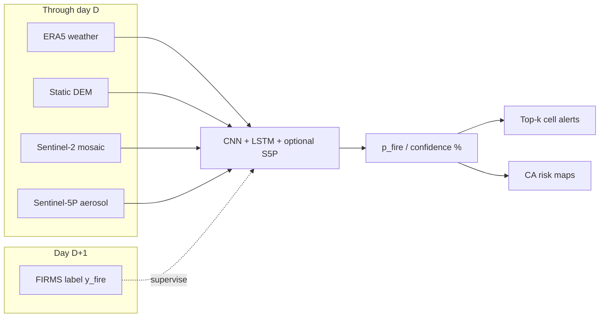
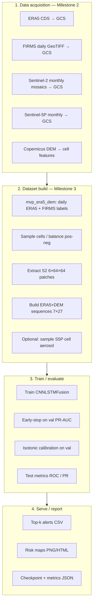
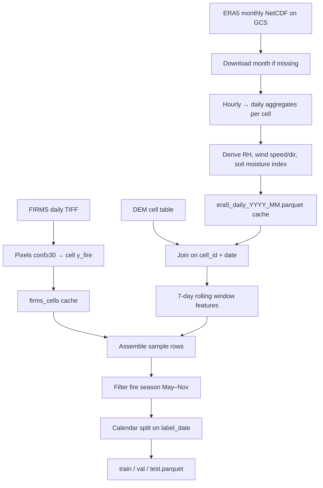
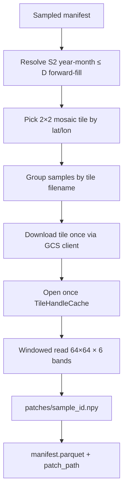
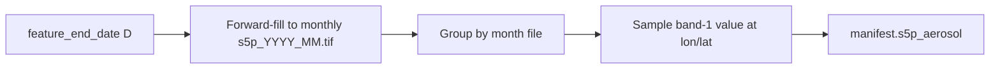
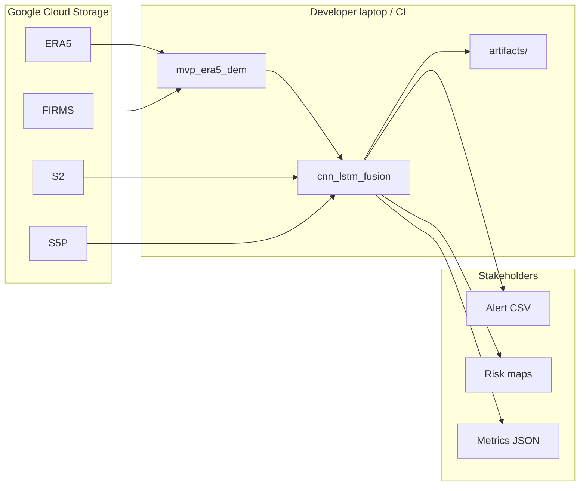

# Milestone 3 — Full ML Lifecycle Architecture

Audience: **developers** (reproduce / extend) and **stakeholders** (what the system does end-to-end).

This document covers data → labels → features → model → calibration → alerts/maps for the California **next-day wildfire risk** system.

---

## 1. Problem framing (shared by all M3 models)

| Item | Definition |
|------|------------|
| **Prediction unit** | ERA5 **0.25° cell × day** over California (~672 land cells) |
| **Features through day** | \(D\) (`feature_end_date`) |
| **Label day** | \(D+1\) (`label_date`) — next-day fire occurrence |
| **Label source** | FIRMS hotspots with confidence ≥ 30, aggregated to cells |
| **History** | 7 days: \(D-6 \ldots D\) |
| **Fire season filter** | May–November (config `fire_season_months`) |
| **Primary split (fusion)** | Train **2022–2023** / Val **2024** / Test **2025** |
| **Outputs** | Calibrated fire probability → **confidence %**, region/cell id, risk maps |



---

## 2. End-to-end ML lifecycle (stakeholder view)



**What lives where**

| Layer | Location | In git? |
|-------|----------|---------|
| Raw rasters / weather | GCS buckets | No (too large) |
| Code + DEM cell table | `Milestone 3/*` | Yes |
| Built patches / caches / checkpoints | `*/outputs/` | No by default |
| Released weights for teammates | `cnn_lstm_fusion/artifacts/` | Yes (small) |

---

## 3. Data sources & GCS layout

| Source | Role | Cadence | Path (typical) |
|--------|------|---------|----------------|
| **ERA5** | Weather drivers (T, RH, wind, precip, soil, LAI, …) | Hourly → daily | `gs://dsai-lab-project/wildfire_satellite/era5/raw/` |
| **FIRMS** | Fire labels | Daily GeoTIFF | `gs://wildfire-detection-first/firms_daily_geotiff/` |
| **Sentinel-2** | Optical context patch | Monthly 2×2 mosaic tiles | `gs://dsai-lab-project/wildfire_satellite/raw/sentinel2/` |
| **Sentinel-5P** | Aerosol context (optional) | Monthly mosaic | `gs://dsai-lab-project/wildfire_satellite/raw/sentinel5p/` |
| **DEM** | Elevation / slope / aspect / TRI / … | Static | Shipped as `mvp_era5_dem/data/era5_grid_dem_features.parquet` |

Anonymous GCS reads: `export GS_NO_SIGN_REQUEST=YES`.

---

## 4. Preprocessing logic (developer detail)

### 4.1 Tabular backbone — `mvp_era5_dem`



**ERA5 daily features (19)** used later in LSTM timesteps:

`t2m_mean/max/min`, `d2m_mean`, `rh_mean`, `sp_mean`, `wind_speed_mean`, `wind_dir_sin/cos`, `i10fg_max`, `tp_sum_mm`, `swvl1/2_mean`, `soil_moisture_index`, `cvh/cvl_mean`, `lai_hv/lv_mean`, `blh_mean`

**DEM features (8)** broadcast onto every timestep:

`elevation`, `slope`, `aspect_sin/cos`, `tri`, `tpi`, `orographic_index`, `hillshade`

**Window features (6)** — for sampling / LightGBM only (not LSTM inputs):

`t2m_max_7d`, `tp_sum_7d`, `wind_speed_max_7d`, `rh_min_7d`, `swvl1_mean_7d`, `i10fg_max_7d`

**Split rule (fusion defaults)**

```text
label_date ≤ 2023-12-31  → train   (years 2022, 2023)
2023-12-31 < label_date ≤ 2024-12-31 → val
label_date > 2024-12-31  → test    (2025)
```

### 4.2 Sampling — balanced + hard negatives

From full cell×day rows:

1. Keep **all positives** (`y_fire=1`).
2. Sample negatives at `neg_pos_ratio` (default 4.0).
3. Optional **hard negatives**: weight ∝ high `t2m_max` + low `rh_min_7d`.
4. Cap per split (`max_train/val/test`).
5. Assign `sample_id = {cell_id}_{feature_end_date:%Y%m%d}`.

### 4.3 Sentinel-2 patches — `build_dataset.py`



**Optimizations:** group-by-tile, single open handle, skip existing `.npy`, GCS Python download (avoids macOS `gsutil` fork crash).

**Train-time image scale:** if max > 2, clip to `[0,10000]` and `/10000`.

### 4.4 LSTM sequences — `build_sequences.py`

For each sample with `feature_end_date = D`:

```text
seq[t] = concat( ERA5_day(D-6+t), DEM(cell) )   for t = 0..6
shape  = [7, 27] float32
```

Missing any of the 7 days → sample dropped. Stored as `sequences/{sample_id}.npy`.

### 4.5 Sentinel-5P (optional) — `build_s5p_features.py`



Same tile-reuse / skip / download pattern as S2. Missing values filled with median.

---

## 5. Model architecture — `CNNLSTMFusion`

```mermaid
flowchart TB
  subgraph vision [Vision branch]
    IMG["S2 patch 6×64×64"] --> CNN[SmallCNN]
    CNN --> Zc["z_cnn 128-d"]
  end
  subgraph temporal [Temporal branch]
    SEQ["ERA5+DEM 7×27"] --> LSTM[Era5LSTM]
    LSTM --> Zl["z_lstm 64-d"]
  end
  subgraph atmos [Optional atmosphere]
    S5["s5p_aerosol scalar"] --> MLP[S5PMLP]
    MLP --> Zs["z_s5p 32-d"]
  end
  Zc --> CAT[Concat]
  Zl --> CAT
  Zs -.->|if enabled| CAT
  CAT --> HEAD["FC 64 → logit"]
  HEAD --> OUT[p_fire = σ(logit)]
```

| Branch | Layers (summary) | Embed |
|--------|------------------|-------|
| CNN | 3× Conv+BN+ReLU+MaxPool → AdaptiveAvgPool → Linear | 128 |
| LSTM | LSTM(hidden=64) → Linear | 64 |
| S5P | Linear 1→32→32 | 32 |
| Head | Linear(fused→64) → ReLU → Dropout → Linear→1 | — |

**Loss:** `BCEWithLogitsLoss` with `pos_weight = n_neg / n_pos`.  
**Optimizer:** Adam (`lr=1e-3`, `weight_decay=1e-4`).  
**Selection:** best **val PR-AUC**.  
**Calibration:** IsotonicRegression fit on val sigmoid scores → test confidence %.

---

## 6. Training / inference workflow (commands)

```bash
export GS_NO_SIGN_REQUEST=YES

# A. Tabular
cd Milestone\ 3/mvp_era5_dem
python build_dataset.py --start 2022-05-01 --end 2025-11-30 --fire-season

# B. Multimodal dataset
cd ../cnn_lstm_fusion
python build_dataset.py --download-tiles
python build_sequences.py
python build_s5p_features.py --download-tiles   # optional

# C. Train + maps
python train.py --use-sentinel5p               # or --no-sentinel5p
python map_predictions.py
# python map_predictions.py --all-dates
```

**Related baselines (same task, older/simpler stacks)**

- `mvp_era5_dem/train_baseline.py` — LightGBM on tabular features  
- `cnn_s2_mvp/` — Dual-branch CNN + MLP (no true LSTM sequence)

---

## 7. Outputs & artifacts

| Artifact | Path | Purpose |
|----------|------|---------|
| Manifest | `outputs/manifest.parquet` | Sample index + paths + labels |
| Patches | `outputs/patches/*.npy` | S2 tensors |
| Sequences | `outputs/sequences/*.npy` | LSTM inputs |
| Checkpoint | `outputs/model/best.pt` | Best weights |
| Calibrator | `outputs/model/calibrator.joblib` | Isotonic map |
| Metrics | `outputs/model/metrics.json` | Val/test ROC & PR |
| Predictions | `outputs/model/test_predictions.parquet` | Cell-level scores |
| Alerts | `outputs/model/test_alerts_topk.csv` | Top-k/day |
| Maps | `outputs/maps/risk_YYYY-MM-DD.png` | Stakeholder visuals |
| **Shared weights** | `artifacts/cnn_lstm_s5p_2022_2025/` | For teammates without retrain |

---

## 8. Example reported metrics (S5P on, 2022–2025)

From a local run (`train.py --use-sentinel5p`):

| Split | ROC-AUC | PR-AUC |
|-------|---------|--------|
| Val (best) | ~0.81 | ~0.53 |
| Test calibrated | ~0.80 | ~0.49 |

Best checkpoint typically early (e.g. epoch 5); later epochs can overfit.

---

## 9. System context diagram



---

## 10. Design decisions (short)

1. **Temporal split** (not random) — forecasting-safe evaluation.  
2. **Cell×day unit** — aligns weather grid with operational alerts.  
3. **True 7-day LSTM** — sequences, not only rolled scalars.  
4. **S5P toggle** — monthly aerosol without forcing a second CNN.  
5. **Calibrated %** — stakeholder-friendly confidence, not raw logits.  
6. **Gitignores on `outputs/`** — keep repo small; publish small `artifacts/` for inference.

For runbooks see [`README.md`](README.md) and [`cnn_lstm_fusion/README.md`](cnn_lstm_fusion/README.md).
