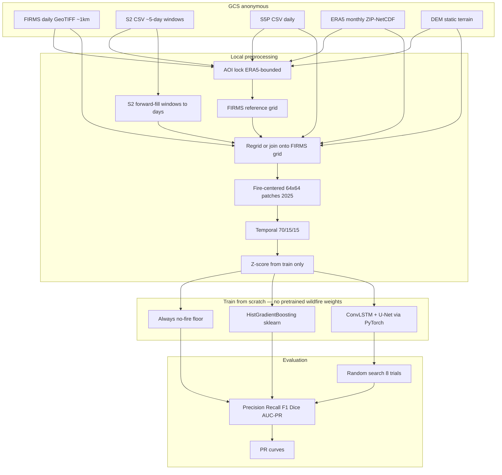
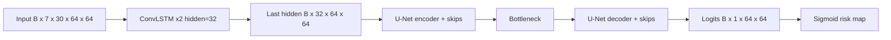

# Milestone 3 — Architecture Diagram

## End-to-end pipeline

## Primary model (defined in code, trained locally)

## Libraries vs downloaded models

| Piece | What you install | Pretrained wildfire weights? |
|---|---|---|
| Tree baseline | `sklearn` HistGradientBoosting | No — trains on our patches |
| ConvLSTM+U-Net | `pip install torch` + our `src/models/convlstm_unet.py` | No — architecture in repo, train from scratch |
| Checkpoints after train | Saved under `data/processed/checkpoints/` | Created by us, not downloaded |

## Loss / metrics

- Losses: **BCE + Dice** vs **Focal**
- Headline: precision, recall, F1, Dice, AUC-PR (fire class)
- Accuracy only as a caveated secondary number
