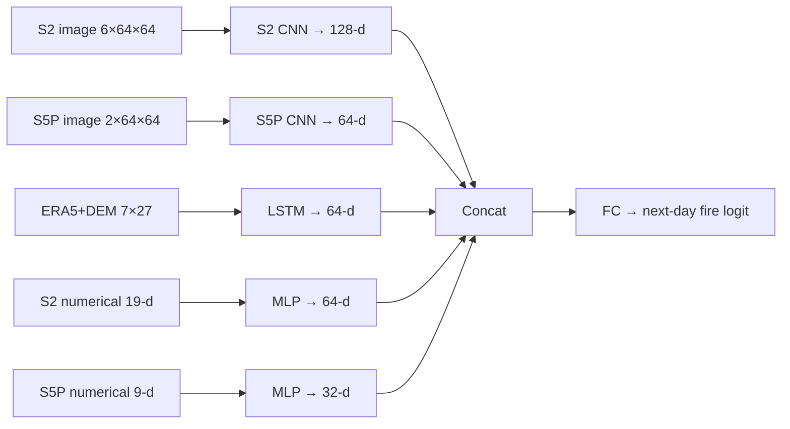

# Milestone 3 — Final Report

**AI-Powered Wildfire Early Detection and Alerting System**  
**Group 8 · IITM DS & AI Lab**

*Model architecture, training, baselines, released checkpoints, and complementary patch-segmentation experiments*

> **Primary stack (cell-day):** `multimodal_fusion/` + `cnn_lstm_fusion/` + `mvp_era5_dem/` — see `[ARCHITECTURE.md](ARCHITECTURE.md)`.  
> **Complementary stack (pixel patches):** `Experiments/` — full-year 2025 candidate

---

## 1. Problem framing


| Item                 | Primary (cell-day fusion)                               | Experiments (patch segmentation)                           |
| -------------------- | ------------------------------------------------------- | ---------------------------------------------------------- |
| **Prediction unit**  | ERA5 **0.25° cell × day** (~672 CA cells)               | **64×64** FIRMS ~~1 km pixels (~~64 km patch)              |
| **Features through** | Day D                                                   | 7-day window ending on sample day                          |
| **Label**            | Next-day FIRMS fire in cell (D+1, conf ≥ 30)            | Same-day per-pixel FIRMS fire map (conf ≥ 30)              |
| **History**          | 7-day ERA5+DEM sequence                                 | 7 × 30 fused channels                                      |
| **Primary split**    | Train **2022–2023** / Val **2024** / Test **2025**      | Temporal **70/15/15** within **2025** (Jan–Nov)            |
| **Outputs**          | Calibrated p_{\text{fire}} → confidence %, alerts, maps | Per-pixel logits / F1 · Dice · AUC-PR · confusion matrices |


Both stacks use California AOI weather/satellite data from Milestone 2 GCS buckets. They are **sibling experiments**, not drop-in replacements: different spatial unit, label timing, and evaluation protocol — **do not compare PR-AUC numbers 1:1**.

---


## 2. Architecture selection (primary stack)


### 2.1 Progressive model ladder


| Folder                                     | Model                                   | Role                             |
| ------------------------------------------ | --------------------------------------- | -------------------------------- |
| `[mvp_era5_dem/](mvp_era5_dem/)`           | LightGBM on ERA5 + DEM tabular features | Strong non-deep baseline         |
| `[cnn_s2_mvp/](cnn_s2_mvp/)`               | Dual-branch S2 CNN + MLP (ERA5/DEM)     | Optical + weather MVP            |
| `[cnn_lstm_fusion/](cnn_lstm_fusion/)`     | S2 CNN + true 7-day LSTM ± S5P scalar   | Temporal weather encoding        |
| `[multimodal_fusion/](multimodal_fusion/)` | **Full hybrid** (five branches)         | Primary Milestone 3 architecture |


**Why this ladder:** start from weather/terrain tabular risk, add Sentinel-2 context, then LSTM history, then full multimodal fusion with S5P and numerical EO summaries — each step is trainable and reproducible from GCS.

### 2.2 Primary model: `MultimodalFusion`

Five embeddings are concatenated into a dense binary head:




| Branch  | Input                     | Embedding | Toggle              |
| ------- | ------------------------- | --------- | ------------------- |
| S2 CNN  | Monthly mosaic patch      | 128       | `use_s2_patches`    |
| S5P CNN | Monthly mosaic (AAI/CO)   | 64        | `use_s5p_patches`   |
| LSTM    | 7-day ERA5+DEM            | 64        | always on           |
| S2 MLP  | Band means/stds + indices | 64        | `use_s2_numerical`  |
| S5P MLP | AAI/CO stats              | 32        | `use_s5p_numerical` |


**Training:** `BCEWithLogitsLoss` + `pos_weight`, Adam, early-stop / checkpoint on **val PR-AUC**, then **isotonic calibration** on validation. No pretrained wildfire weights — trained from scratch on project data.

**Design decisions:** temporal (not random) split; cell×day unit for operational alerts; true LSTM sequences; optional S5P; calibrated confidence % for stakeholders; large `outputs/` gitignored, small `artifacts/` released.

Full lifecycle diagrams: `[ARCHITECTURE.md](ARCHITECTURE.md)`.

---


## 3. Data and preprocessing (primary stack)


| Source      | Role                         | Typical GCS path                                     |
| ----------- | ---------------------------- | ---------------------------------------------------- |
| ERA5        | Weather drivers              | `gs://dsai-lab-project/wildfire_satellite/era5/raw/` |
| FIRMS       | Labels (conf ≥ 30)           | `gs://wildfire-detection-first/firms_daily_geotiff/` |
| Sentinel-2  | Optical patches + numerical  | mosaics + `sentinel2_features_v3/`                   |
| Sentinel-5P | Aerosol patches + numerical  | mosaics + `sentinel5p_features_daily/`               |
| DEM         | Static terrain per ERA5 cell | `mvp_era5_dem/data/era5_grid_dem_features.parquet`   |


**Pipeline stages:** build tabular backbone → download/extract S2/S5P patches → build 7-day sequences → join numerical features (nearest S2 window ≤ D; S5P forward-fill ≤ 7d) → train → calibrate → map/alerts.

Fire-season filter (May–November) applies in the primary fusion configs.

Anonymous reads: `export GS_NO_SIGN_REQUEST=YES`.

---


## 4. Training and released metrics (primary stack)


### 4.1 CNN + LSTM (+ S5P)

Released: `[cnn_lstm_fusion/artifacts/cnn_lstm_s5p_2022_2025/](cnn_lstm_fusion/artifacts/cnn_lstm_s5p_2022_2025/)`


| Split                | ROC-AUC | PR-AUC    |
| -------------------- | ------- | --------- |
| Val (raw, best ckpt) | 0.808   | 0.532     |
| Test calibrated      | 0.805   | **0.489** |


### 4.2 Full multimodal hybrid (primary headline)

Released: `[multimodal_fusion/artifacts/multimodal_full_2022_2025/](multimodal_fusion/artifacts/multimodal_full_2022_2025/)`  
All branches on. Best checkpoint by **val PR-AUC**.


| Split                | ROC-AUC   | PR-AUC    |
| -------------------- | --------- | --------- |
| Val (raw, best ckpt) | 0.832     | **0.569** |
| Val calibrated       | 0.834     | 0.559     |
| Test raw             | 0.832     | 0.546     |
| Test calibrated      | **0.831** | **0.531** |


Multimodal fusion improves test calibrated PR-AUC vs CNN+LSTM+S5P (**0.531** vs **0.489**) on the same cell-day forecasting task.

Artifacts include `best.pt`, isotonic calibrator, sequence / numerical norm stats, and `metrics.json`.

---


## 5. End-to-end pipeline (primary stack)

```
GCS (ERA5, FIRMS, S2, S5P, DEM)
  → mvp_era5_dem (daily cells + labels)
  → multimodal_fusion: patches + sequences + numerical
  → train (val PR-AUC) → isotonic calibration
  → metrics JSON + risk maps / top-k alerts
```

```bash
export GS_NO_SIGN_REQUEST=YES
cd "Milestone 3/mvp_era5_dem" && python build_dataset.py --start 2022-05-01 --end 2025-11-30 --fire-season
cd ../multimodal_fusion
python build_dataset.py --download-tiles
python build_s5p_patches.py --download-tiles
python build_sequences.py
python build_numerical_features.py
python train.py
python map_predictions.py
```

Or load published weights from `artifacts/multimodal_full_2022_2025/` after rebuilding inputs (see project README).

---


## 6.Experiments — patch segmentation (`Experiments/`)

This section documents the local stack under `[Experiments/](Experiments/)`. Same sensors in spirit (S2/S5P/ERA5/DEM/FIRMS), but **different encoding and task**: fused **30-channel** tensors on the FIRMS ~1 km grid → **per-pixel** fire / no-fire maps inside 64×64 patches.

### 6.1 Architecture


| Model                | Role                                                           |
| -------------------- | -------------------------------------------------------------- |
| HistGradientBoosting | Last-day 30-D per-pixel tree baseline (+ always-no-fire floor) |
| ConvLSTM + U-Net     | Primary DL: 7-day temporal encoder + dense segmentation head   |
| U-Net last-day       | Ablation without ConvLSTM                                      |
| Losses               | BCE+Dice and Focal                                             |


Trained from scratch on fused patches.

### 6.2 Dataset (full-year 2025 candidate)


| Item     | Value                                             |
| -------- | ------------------------------------------------- |
| Window   | `2025-01-01` → `2025-11-30`                       |
| Patches  | **1035** (train/val/test **716 / 157 / 162**)     |
| Tensor   | `X`: `(N, 7, 64, 64, 30)` · `y`: `(N, 64, 64, 1)` |
| Split    | Temporal 70/15/15 by date; train-only z-score     |
| Sampling | Fire-centered clusters + backgrounds              |


### 6.3 Multi-model results (A–D), 23 Jul 2026


| ID    | Model          | Loss     | Test F1   | Test AUC-PR | Test Prec | Test Rec |
| ----- | -------------- | -------- | --------- | ----------- | --------- | -------- |
| A     | HistGB         | —        | 0.029     | 0.009       | 0.046     | 0.021    |
| **B** | ConvLSTM+U-Net | BCE+Dice | **0.110** | 0.046       | 0.170     | 0.082    |
| C     | ConvLSTM+U-Net | Focal    | 0.025     | **0.065**   | 0.529     | 0.013    |
| D     | U-Net last-day | BCE+Dice | 0.086     | 0.040       | 0.181     | 0.057    |


**Takeaway:** ConvLSTM+BCE+Dice (**B**) wins test F1 vs baseline and last-day U-Net; Focal (**C**) has higher AUC-PR but very low recall at 0.5 threshold. Late-season test (Oct–Nov) is sparse (~0.44% fire pixels) — accuracy is not a headline metric. Confusion matrices: `Experiments/data/processed/figures/confusion/` in local.

Earlier 8-trial random search: best val AUC-PR = trial 8 (focal); best test F1 among trials ≈ **0.119** (trial 2).

### 6.4 Reproduce Experiments

```bash
cd "Milestone 3/Experiments"
source .venv/bin/activate
python scripts/run_experiments.py --epochs 15
# or: python scripts/train_models.py --model convlstm --loss bce_dice --epochs 15
```

Uses local `.npy` only after the dataset is built (no GCS needed to retrain).

---


## 7. Limitations and out of scope

**Primary stack**

- Fire-season focus; cell-day labels ≠ unique new ignitions  
- Monthly image mosaics / sampled training prevalence affect interpretation of PR metrics  
- Large rebuild outputs stay local (`outputs/`)  
- Live alerting / multi-year ops / transformers deferred

**Experiments**

- 2025-only candidate; late-season test F1 is low in absolute terms  
- Not spatially held out; not interchangeable with cell-day PR-AUC  
- No Swin-UNet / live infer path in this milestone

---


## 8. Deliverables checklist


| Deliverable                  | Location                                                 |
| ---------------------------- | -------------------------------------------------------- |
| Architecture lifecycle       | `[ARCHITECTURE.md](ARCHITECTURE.md)`                     |
| This report                  | `Report.md` (this file)                                  |
| Work log                     | `[Work Log.md](Work%20Log.md)`                           |
| Multimodal metrics / weights | `multimodal_fusion/artifacts/multimodal_full_2022_2025/` |
| CNN+LSTM metrics / weights   | `cnn_lstm_fusion/artifacts/cnn_lstm_s5p_2022_2025/`      |


---


## 9. Team sign-off


| Member              | Roll Number | Signature |
| ------------------- | ----------- | --------- |
| Ripunjay Kumar      | 21F3002511  |  ✅         |
| Lakshay Garg        | 21F3001076  |  ✅         |
| Roushan Kumar Singh | 23F1002240  |  ✅         |
| Lakshmi Sruthi K    | 21F1005626  |  ✅       |
| R Aditya            | 21F1004839  |  ✅        |


