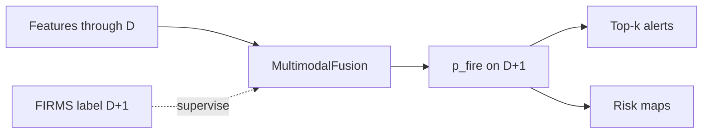
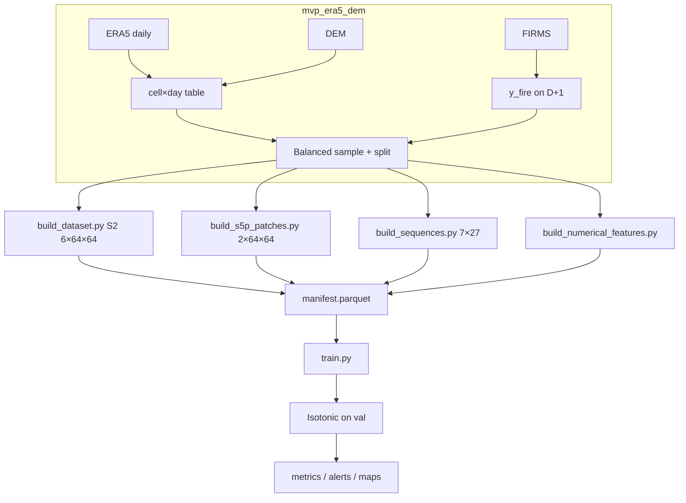
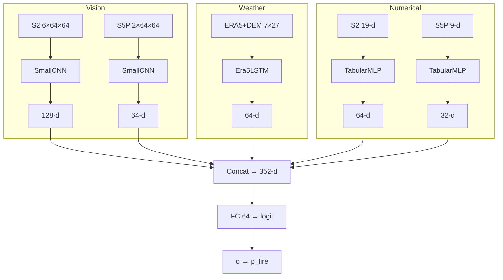

# Multimodal Fusion — Experiment Report

**Project:** Milestone 3 · `multimodal_fusion/`  
**Model:** `MultimodalFusion` (S2 CNN + S5P CNN + ERA5/DEM LSTM + S2/S5P numerical MLPs)  
**Task:** Next-day California wildfire risk at ERA5 0.25° cell × day  
**Report date:** July 2026  
**Released checkpoint:** `artifacts/multimodal_full_2022_2025/`

---

## 1. Executive summary

This experiment builds a **five-branch multimodal neural network** for next-day wildfire occurrence prediction over California. Features available through day \(D\) are used to predict FIRMS fire activity on day \(D+1\).

| Item | Result |
|------|--------|
| Best validation PR-AUC | **0.569** (epoch 2) |
| Best validation ROC-AUC | **0.832** |
| Test ROC-AUC (calibrated) | **0.831** |
| Test PR-AUC (calibrated) | **0.531** |
| Train / val / test size | 17 070 / 7 795 / 6 865 |
| Positive rate (sampled) | ~20% (4:1 neg:pos design) |

Relative to the earlier `cnn_lstm_fusion` release (test calibrated ≈ ROC 0.80 / PR 0.49), this full hybrid improves discrimination and precision–recall on the held-out 2025 fire season. Gains should be interpreted alongside known **temporal alignment caveats** for monthly mosaics and 5-day numerical windows (Section 9). A leakage-safer sibling lives in `../multimodal_fusion_causal/`.

---

## 2. Problem formulation

| Dimension | Definition |
|-----------|------------|
| Prediction unit | ERA5 **0.25° land cell × calendar day** (~672 CA cells) |
| Feature horizon | Through day \(D\) (`feature_end_date`) |
| Label | \(y_{\mathrm{fire}}\) on day \(D+1\) (`label_date`) |
| Label source | FIRMS hotspots, confidence ≥ 30, aggregated to cells |
| History for weather | 7 days: \(D-6,\ldots,D\) |
| Season filter | May–November only |
| Geography | California (land mask via ERA5 grid + CA boundary) |

**Decision products:** calibrated fire probability, confidence %, top-\(k\) cell alerts per day, and California risk maps.



---

## 3. Experimental design

### 3.1 Temporal split (forecasting-safe)

| Split | `label_date` rule | Fire years |
|-------|-------------------|------------|
| Train | ≤ 2023-12-31 | 2022–2023 |
| Val | 2024-01-01 … 2024-12-31 | 2024 |
| Test | > 2024-12-31 | 2025 |

Config window: `2022-05-01` → `2025-11-30`, fire season months `[5…11]`.

### 3.2 Sampling

From the tabular backbone (`mvp_era5_dem`):

1. Keep **all positives**.
2. Sample negatives at `neg_pos_ratio = 4.0` (target ~20% positives).
3. **Hard negatives** enabled (weight toward hot/dry conditions).
4. Caps: `max_train=25000`, `max_val=8000`, `max_test=8000`.
5. `sample_id = {cell_id}_{feature_end_date:%Y%m%d}`.

### 3.3 Realized dataset (this run)

| Split | N | Positives | Pos. rate |
|-------|---|-----------|-----------|
| Train | 17 070 | 3 414 | 0.20 |
| Val | 7 795 | 1 559 | 0.20 |
| Test | 6 865 | 1 373 | 0.20 |
| **Total** | **31 730** | **6 346** | **0.20** |

S2 numerical features available on 31 568 / 31 730 rows (~99.5%).  
S5P numerical available on **6 838 / 31 730** (~22%) — predominantly **2025** coverage in the current GCS tables (train/val often zero-filled).

---

## 4. Data sources

| Modality | Role | Cadence | GCS / path |
|----------|------|---------|------------|
| ERA5 | Weather drivers | Daily aggregates from hourly | `gs://dsai-lab-project/wildfire_satellite/era5/raw/` |
| DEM | Static terrain | Once | `mvp_era5_dem/data/era5_grid_dem_features.parquet` |
| FIRMS | Labels | Daily GeoTIFF | `gs://wildfire-detection-first/firms_daily_geotiff/` |
| Sentinel-2 mosaics | Optical **image** patch | **Monthly** 2×2 tiles | `gs://dsai-lab-project/wildfire_satellite/raw/sentinel2/` |
| Sentinel-5P mosaics | Aerosol **image** patch | **Monthly** | `gs://dsai-lab-project/wildfire_satellite/raw/sentinel5p/` |
| S2 numerical | Spectral / indices vector | **5-day** windows | `gs://sentinel-2-data-2016-2025/sentinel2_features_v3/` |
| S5P numerical | AAI / CO stats | Daily (sparse years) | `gs://sentinel-2-2016-2025/sentinel5p_features_daily/` |

**Honest wording:** CNN patches are **monthly composites**, not daily imagery. The **5-day** signal enters only through S2 **numerical** tables.

Auth: `GS_NO_SIGN_REQUEST=YES` for public mosaics; numerical buckets may need `gcloud auth application-default login`.

---

## 5. Preprocessing pipeline



### 5.1 Tabular backbone

- Hourly ERA5 → daily cell features (T, RH, wind, precip, soil, LAI, …).
- Join DEM (`elevation`, `slope`, `aspect_sin/cos`, `tri`, `tpi`, …).
- FIRMS pixels with conf ≥ 30 → cell-level `y_fire` on the **label** day.
- Fire-season filter; calendar split on `label_date`.

### 5.2 Sentinel-2 image patches (`build_dataset.py`)

1. Resolve mosaic **year-month** for `feature_end_date` \(D\): latest available month with `(year, month) ≤ (D.year, D.month)` (same-month allowed).
2. Pick 2×2 mosaic tile by lon/lat; download once per tile; windowed read **64×64 × 6 bands**.
3. Store `outputs/patches/{sample_id}.npy`.
4. Train-time scale: if max > 2, clip to \([0,10000]\) and `/10000`.

Optimizations: group-by-tile, skip existing `.npy`, GCS Python client (avoids macOS `gsutil` fork issues).

### 5.3 Sentinel-5P image patches (`build_s5p_patches.py`)

Same month-resolution rule as S2; extract **2×64×64** from monthly S5P GeoTIFFs → `outputs/s5p_patches/`.

### 5.4 ERA5 + DEM sequences (`build_sequences.py`)

For each sample with `feature_end_date = D`:

\[
\mathrm{seq}[t] = \mathrm{concat}\big(\mathrm{ERA5}(D-6+t),\;\mathrm{DEM}(\mathrm{cell})\big),\quad t=0..6
\]

Shape `[7, 27]` float32. Incomplete 7-day windows are dropped.

### 5.5 Numerical features (`build_numerical_features.py`)

1. Index GCS `year=/month=/window=/features.csv`.
2. Cache to parquet under `outputs/cache/`.
3. Map ERA5 `cell_id` ↔ feature `grid_id` via `data/era5_to_feature_grid.parquet`.
4. Aggregate grid means to cell; attach to samples:

| Family | Prefix | Dim | Attach rule (this experiment) |
|--------|--------|-----|-------------------------------|
| S2 | `s2n_` | 19 | Prefer window covering \(D\); else latest `window_end ≤ D` |
| S5P | `s5n_` | 9 | Same + `forward_fill_max_days=7` |

S2 columns: band means/stds (B2–B12), NDVI, NDMI, NBR, NDWI, EVI, cloud %, valid fraction.  
S5P columns: AAI/CO mean/max/std, valid fractions, availability flag.

Missing S2 values filled with **global** median (all splits); missing S5P filled with 0.

---

## 6. Model architecture

### 6.1 High-level fusion



All five branches were **enabled** in the reported run (`config.yaml` flags all `true`).

### 6.2 Branch specifications

| Branch | Network | Input | Embed |
|--------|---------|-------|-------|
| S2 CNN | 3× Conv–BN–ReLU–MaxPool → AdaptiveAvgPool → Linear | `6×64×64` | 128 |
| S5P CNN | Same `SmallCNN`, 2 input channels | `2×64×64` | 64 |
| LSTM | 1-layer LSTM(hidden=64) → Linear+ReLU+Dropout | `7×27` | 64 |
| S2 MLP | Linear → ReLU → Dropout → Linear | 19 | 64 |
| S5P MLP | Same pattern | 9 | 32 |
| Head | Linear(352→64) → ReLU → Dropout(0.2) → Linear→1 | fused | logit |

Implementation: `src/model.py` (`MultimodalFusion`).

### 6.3 Normalization (fit on train only)

| Tensor | File | Method |
|--------|------|--------|
| Sequences | `seq_norm_stats.npz` | Per-feature mean/std over train sequences |
| S2 numerical | `s2_num_norm.npz` | Column mean/std (+ column names) |
| S5P numerical | `s5p_num_norm.npz` | Same |

Applied in `MultimodalDataset` before batching.

---

## 7. Training protocol

| Hyperparameter | Value |
|----------------|-------|
| Loss | `BCEWithLogitsLoss` with `pos_weight = n_neg / n_pos` |
| Optimizer | Adam (`lr=1e-3`, `weight_decay=1e-4`) |
| Batch size | 32 |
| Epochs | 15 |
| Device (this run) | Apple MPS |
| Checkpoint rule | Maximize **validation PR-AUC** |
| Calibration | `IsotonicRegression` on val sigmoid scores → test |

### 7.1 Epoch log (this run)

| Epoch | Train loss | Val PR-AUC | Val ROC-AUC |
|------:|-----------:|-----------:|------------:|
| 1 | 0.768 | 0.522 | 0.809 |
| **2** | **0.685** | **0.569** | **0.832** |
| 3 | 0.650 | 0.550 | 0.824 |
| 4 | 0.621 | 0.562 | 0.827 |
| 5 | 0.604 | 0.557 | 0.826 |
| 6 | 0.579 | 0.551 | 0.823 |
| 7 | 0.565 | 0.555 | 0.826 |
| 8 | 0.541 | 0.522 | 0.807 |
| 9 | 0.527 | 0.544 | 0.816 |
| 10 | 0.514 | 0.512 | 0.807 |
| 11 | 0.505 | 0.528 | 0.802 |
| 12 | 0.483 | 0.530 | 0.812 |
| 13 | 0.472 | 0.537 | 0.814 |
| 14 | 0.452 | 0.522 | 0.809 |
| 15 | 0.446 | 0.537 | 0.815 |

Train loss fell monotonically while validation peaked early (**epoch 2**) and then drifted — classic mild overfitting. The saved `best.pt` is the epoch-2 checkpoint.

---

## 8. Results

### 8.1 Discrimination metrics

From `artifacts/multimodal_full_2022_2025/metrics.json` (and matching `outputs/model/`):

| Split | ROC-AUC | PR-AUC |
|-------|--------:|-------:|
| Val (raw, best ckpt) | 0.832 | 0.569 |
| Val (calibrated) | 0.834 | 0.559 |
| Test (raw) | 0.832 | 0.546 |
| **Test (calibrated)** | **0.831** | **0.531** |

Calibration barely changes ranking metrics (expected for isotonic on scores) but maps probabilities to better-calibrated **confidence %** for stakeholders.

### 8.2 Comparison to prior Milestone 3 models

| Model | Test ROC (cal.) | Test PR (cal.) | Notes |
|-------|----------------:|---------------:|-------|
| `cnn_lstm_fusion` (+ S5P scalar) | ~0.80 | ~0.49 | CNN + LSTM + optional aerosol scalar |
| **`multimodal_fusion` (this)** | **0.83** | **0.53** | + S5P CNN + S2/S5P numerical |

Absolute PR levels remain moderate: wildfires are rare and spatially sparse; PR-AUC ~0.53 with ~20% sampled positives is meaningful but not saturating.

### 8.3 Operational outputs

| Artifact | Location | Description |
|----------|----------|-------------|
| Checkpoint | `outputs/model/best.pt` / `artifacts/.../best.pt` | Weights + flags + dims |
| Calibrator | `calibrator.joblib` | Isotonic map |
| Norm stats | `*_norm*.npz` | Train scalers |
| Metrics | `metrics.json` | Val/test ROC & PR |
| Predictions | `test_predictions.parquet` | Cell-level `p_fire`, `confidence_pct` |
| Alerts | `test_alerts_topk.csv` | Top-25 cells/day (4 989 rows, 214 test dates) |
| Maps | `outputs/maps/risk_YYYY-MM-DD.png` | e.g. `risk_2025-10-21.png` |

Example map selection: day with strongest signal among test positives / mean risk (default `map_predictions.py` heuristic).

---

## 9. Limitations and temporal leakage notes

This report documents the **as-run** experiment honestly.

### 9.1 Same-month monthly mosaics

Patch month resolution uses `(year, month) ≤ D’s month`. For **1 August**, the model uses the **August** mosaic, not July. If monthly composites include pixels from later days in August, that is **within-month look-ahead** relative to next-day prediction on 2 August.

### 9.2 Numerical covering windows

S2/S5P numerical attach preferred windows with `start ≤ D ≤ end`. When `window_end > D`, window statistics can include days after \(D\) (observed as **negative** `s2n_lag_days` on many rows).

### 9.3 S5P numerical coverage

Only ~22% of samples have non-missing S5P numerical features (mostly 2025). The S5P MLP branch is weakly supervised on train/val; test may benefit disproportionately from availability — interpret branch ablation carefully.

### 9.4 Imputation

S2 NaNs filled with median over the **entire** manifest (includes val/test) — mild distribution leakage into filled values.

### 9.5 Mitigations (sibling project)

`../multimodal_fusion_causal/` enforces:

- previous **completed** month for mosaics (Aug 1 → July),
- numerical `window_end ≤ D` only,
- train-only median fill.

Use that directory for a leakage-safer retrain when comparing “fair” operational performance.

---

## 10. Reproducibility

### 10.1 Environment

- Python **3.11 or 3.12**
- `pip install -r requirements.txt`
- `export GS_NO_SIGN_REQUEST=YES`

### 10.2 Commands

```bash
cd "Milestone 3/mvp_era5_dem"
python build_dataset.py --start 2022-05-01 --end 2025-11-30 --fire-season

cd ../multimodal_fusion
python build_dataset.py --download-tiles
python build_s5p_patches.py --download-tiles
python build_sequences.py
python build_numerical_features.py
python train.py
python map_predictions.py
```

Optional: symlink `patches` / `sequences` from `cnn_lstm_fusion` if already built for the same split (S5P patches + numerical still required here).

### 10.3 Using released weights without retraining

Copy `artifacts/multimodal_full_2022_2025/*` → `outputs/model/`, rebuild matching inputs, then evaluate / map. Loading sketch is in `README.md`.

### 10.4 Repository layout

```text
multimodal_fusion/
  REPORT.md                     # this document
  README.md                     # runbook
  config.yaml
  build_*.py / train.py / map_predictions.py
  src/model.py, dataset.py, …
  data/california.geojson
  data/era5_to_feature_grid.parquet
  artifacts/multimodal_full_2022_2025/   # tracked weights (~1.1 MB)
  outputs/                               # gitignored rebuild cache
```

Broader lifecycle diagrams: [`../ARCHITECTURE.md`](../ARCHITECTURE.md) §11.

---

## 11. Design decisions (summary)

1. **Late fusion** of specialized encoders rather than a single giant network — easier ablations via config flags.  
2. **Calendar split** — no random leakage across years.  
3. **True 7-day LSTM** — sequences, not only rolled scalars.  
4. **Dual S2 pathways** — spatial texture (CNN) + 5-day spectral summary (MLP).  
5. **Dual S5P pathways** — spatial aerosol context (CNN) + tabular AAI/CO (MLP).  
6. **PR-AUC selection** — prioritizes ranking of rare positives over accuracy.  
7. **Isotonic calibration** — stakeholder-facing confidence percentages.  
8. **Publish small artifacts, not patches** — keep git small; rebuild from GCS.

---

## 12. Conclusions

The full multimodal hybrid is a viable next-day wildfire risk model on the 2022–2025 California setup, with **test calibrated ROC ≈ 0.83 and PR ≈ 0.53**, outperforming the prior CNN+LSTM(+scalar S5P) baseline under the same split. Training dynamics show an early optimum (epoch 2); longer training mainly overfit.

Reported numbers apply to the **original temporal alignment** (same-month mosaics / covering numerical windows). For operational claims and fairer comparison, retrain and evaluate with `multimodal_fusion_causal` and report both side by side.

---

## Appendix A — Hyperparameter dump (`config.yaml` model block)

```yaml
cnn_embed_dim: 128
s5p_cnn_embed_dim: 64
lstm_embed_dim: 64
lstm_hidden: 64
s2_num_embed_dim: 64
s5p_num_embed_dim: 32
dropout: 0.2
epochs: 15
batch_size: 32
lr: 0.001
weight_decay: 0.0001
use_s2_patches: true
use_s5p_patches: true
use_s2_numerical: true
use_s5p_numerical: true
```

## Appendix B — Related directories

| Path | Role |
|------|------|
| `../mvp_era5_dem/` | Tabular ERA5+DEM+FIRMS backbone |
| `../cnn_lstm_fusion/` | Earlier CNN+LSTM (+ optional S5P scalar) |
| `../cnn_s2_mvp/` | Dual-branch CNN+MLP baseline (older years) |
| `../multimodal_fusion_causal/` | Causal temporal rules, same architecture |
| `../ARCHITECTURE.md` | End-to-end ML lifecycle diagrams |
