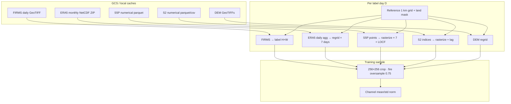
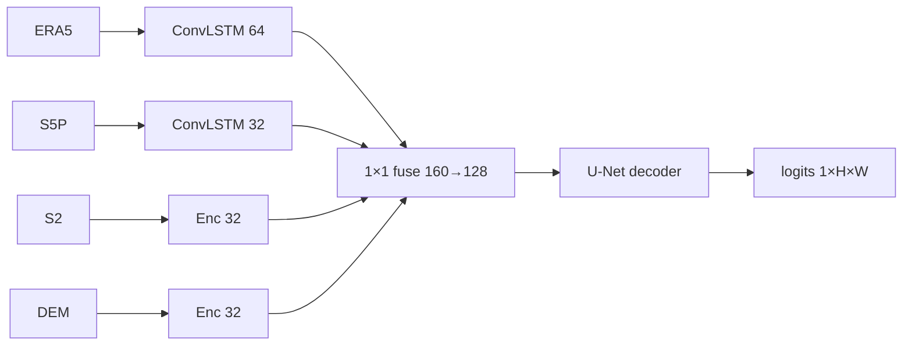
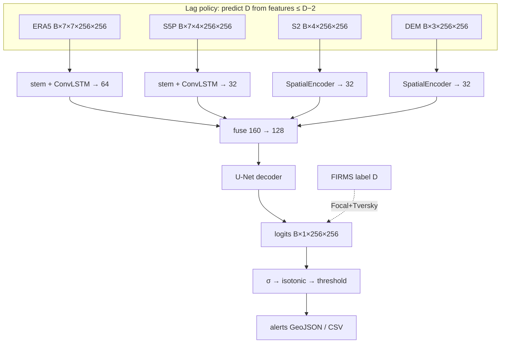

# LagFireNet — Live-Ready CA Wildfire Alert Model

**Model name:** **LagFireNet**  
**Code package:** `Milestone 3/wildfire_pipeline` (implementation only — not the model name)  
**Report generated:** 2026-07-30 20:43 IST  
**Authors / context:** Group 8 DS & AI Lab — Milestone 3 shift from research **MultimodalFusion** (cell risk) to **LagFireNet** (lag-consistent 1 km dense alerts).

---

## 1. Executive summary

Milestone 3 originally delivered strong **cell-level next-day risk** under **MultimodalFusion** / CNN–LSTM fusion (ERA5 0.25° cells, monthly mosaics, PR-AUC-focused training). Those models are **not deployment-shaped** for a daily California alert product that must:

1. Operate at **FIRMS ~1 km** (not ERA5 cells),  
2. Respect **satellite / weather latency** (features only as of **D−2**),  
3. Emit **spatial alert maps** (dense logits), not only cell scores,  
4. Optimize for **precision-first alerts**, not only PR-AUC.

**LagFireNet** is the new model that addresses those constraints. It reuses the same GCS modalities (ERA5, FIRMS, S2 numerical, S5P numerical, DEM) but **rebuilds labels, lag policy, tensors, architecture, loss, and inference path**. Training code lives under `wildfire_pipeline/live/`.

| | **MultimodalFusion** (prior) | **LagFireNet** (current) |
|--|--|--|
| Goal | Research next-day cell risk | Live-ready 1 km alert maps |
| Spatial unit | ERA5 **0.25° cell** | FIRMS **~1 km** grid (1056×1145 CA) |
| Target | Fire on **D+1** from features through **D** | Fire on **D** from features ≤ **D−2** |
| Output | Scalar logit / cell | Dense **H×W** logit map |
| Architecture | Hybrid CNN + LSTM + MLPs | ConvLSTM branches + U-Net decoder |
| Primary metric | Val **PR-AUC** | Val **precision @ 0.5** + deploy thr for prec ≥ 0.4 |
| Released prior result | Test cal. ROC ≈ 0.83, PR ≈ 0.53 | Training **in progress** (see §8) |

---

## 2. Why we shifted

### 2.1 Limitations of MultimodalFusion for “live”

| Issue | Detail |
|-------|--------|
| **Latency honesty** | Features through day D for label D+1 assumes same-day availability of ERA5/S2/S5P — not true for operational cron. |
| **Resolution mismatch** | Cell model (~25 km) cannot place **local** alerts; FIRMS products and ops want ~1 km. |
| **Mosaic lag** | S2/S5P **monthly mosaics** / 64×64 patches are strong for research but awkward for daily refresh without heavy mosaic rebuild. |
| **Scalar head** | One score per cell; no native spatial clustering for geojson alerts. |
| **Objective** | PR-AUC is good for ranking cells; ops need **precision-controlled** maps and thresholds. |

### 2.2 What we kept from MultimodalFusion

- Same **calendar split** spirit: train 2022–2023 / val 2024 / test 2025.  
- Same **fire season** filter (May–Nov) for primary runs.  
- Same **modality family**: ERA5 weather, DEM terrain, S2 indices, S5P AAI/CO, FIRMS labels.  
- **Local-first caches**: reuse teammate ERA5 / S2 / S5P caches when present.  
- **Isotonic calibration** + thresholded deploy scores.

### 2.3 What changed conceptually

```text
MultimodalFusion                           LagFireNet
────────────────                           ──────────
Cell × day risk                            Pixel map risk (1 km)
Features ≤ D  → label D+1                  Features ≤ D−2 → label D
Prebuild patches/sequences on disk         On-demand day stacks + 256² crops
Embed → FC → scalar                        Encode → fuse → U-Net → dense logits
PR-AUC checkpoint                          Precision@0.5 + early stop Δ
```

---

## 3. Prior model — MultimodalFusion (reference)

### 3.1 Problem framing

| Item | Definition |
|------|------------|
| Prediction unit | ERA5 **0.25° land cell × day** (~672 CA cells) |
| Features | Through day **D** |
| Label | FIRMS fire on **D+1** (conf ≥ 30), aggregated to cell |
| History | 7 days: D−6 … D |
| Split | Train 2022–2023 / Val 2024 / Test 2025 (May–Nov) |

### 3.2 Data preparation

1. Tabular backbone: hourly ERA5 → daily cell parquet; DEM join; FIRMS → `y_fire`.  
2. **Sampling**: all positives + hard negatives (capped).  
3. **S2 image patches**: monthly mosaics → `6×64×64` around cell.  
4. **S5P image patches**: monthly mosaics → `2×64×64` (optional).  
5. **Sequences**: ERA5+DEM → `[7, 27]`.  
6. **Numerical tables**: S2 5-day windows (19-d); S5P AAI/CO vectors (9-d).

Precompute-heavy: patches and sequences written before train.

### 3.3 How data entered MultimodalFusion

```text
seq        [B, 7, 27]     → LSTM → z_lstm
s2_image   [B, 6, 64, 64] → CNN  → z_s2_cnn
s5p_image  [B, 2, 64, 64] → CNN  → z_s5p_cnn   (flag)
s2_num     [B, 19]        → MLP  → z_s2_num
s5p_num    [B, 9]         → MLP  → z_s5p_num   (flag)

concat embeddings → FC → scalar logit → σ → isotonic → confidence %
```

### 3.4 Training & reported performance

- Loss: BCE with positive class weight.  
- Checkpoint: best **val PR-AUC**.  
- Released MultimodalFusion artifact:  
  - Test calibrated **ROC-AUC ≈ 0.831**, **PR-AUC ≈ 0.531**.

---

## 4. Current model — LagFireNet

### 4.1 Problem framing

| Item | Definition |
|------|------------|
| Prediction unit | FIRMS **~1 km pixel** over CA AOI |
| Reference grid | **1056 × 1145** from FIRMS GeoTIFF `2024-08-15` |
| Features newest day | **D−2** (`FEATURE_LAG_DAYS = 2`) |
| History window | **D−8 … D−2** (7 days) |
| Label | FIRMS fire mask on day **D** (conf ≥ 30), land-masked |
| Train crops | Random / fire-centered **256×256** tiles |
| Infer | Sliding window, overlap 32, average logits |

### 4.2 Implementation layout (code only)

```text
wildfire_pipeline/          # package root (not the model name)
  live/
    config.py
    gcs_fetch.py
    regrid.py
    labels.py
    features.py
    dataset.py
    model.py            # LagFireNet
    losses.py
    train.py
    evaluate_alerts.py
    infer_live.py
  data/cache/
  artifacts/
  REPORT.md
  README.md
```

### 4.3 Lag-consistent feature policy

```text
Label day D
    │
    ├─ ERA5  : daily maps for D−8 … D−2  → stack (T=7, C=7, H, W)
    ├─ S5P   : AAI/CO for D−8 … D−2 + LOCF ≤ 3d + valid/age channels
    ├─ S2    : last numerical window with window_end ≤ D−2 (+ lag_days channel)
    ├─ DEM   : static elev / slope / aspect
    └─ FIRMS : label mask on day D only (supervision; not a model input)
```

**Why D−2:** operational buffer so morning inference for “today = D” does not assume same-day S5P/S2/ERA5 finals.

### 4.4 Data preparation (end-to-end)



**Caching strategy**

| Layer | Strategy |
|-------|----------|
| Labels | Compact `data/cache/firms/labels/*.npy` on disk |
| Full-day features | **Not** dumped for all days (disk blow-up) |
| RAM | LRU of recent full-day stacks (`mem_days=8`) |
| Raw inputs | Local-first teammate caches → else GCS |

**S5P year → bucket map**

| Years | Bucket / prefix |
|-------|-----------------|
| 2019, 2021 | `plated-mechanic-s5p-2016-2025` / `sentinel5p_features_daily` |
| 2020, 2022 | `sentinel-5p` / `sentinel5p_features` |
| 2023–2025 | `sentinel-2-2016-2025` / `sentinel5p_features_daily` |

### 4.5 How tensors are fed into LagFireNet

Forward call:

```python
logits = model(era5, s5p, s2, dem)   # LagFireNet → [B, 1, 256, 256]
```

| Tensor | Shape | Contents | Branch |
|--------|-------|----------|--------|
| `era5` | `B×7×7×256×256` | T×C: t2m, d2m, u10, v10, tp, swvl1, blh | stem → **ConvLSTM×2** → 64ch |
| `s5p` | `B×7×4×256×256` | AAI, CO, valid, age/3 | stem → **ConvLSTM×2** → 32ch |
| `s2` | `B×4×256×256` | NDVI, NBR, NDWI, lag_days | **SpatialEncoder** → 32ch |
| `dem` | `B×3×256×256` | elevation, slope, aspect | **SpatialEncoder** → 32ch |
| `label` | `B×1×256×256` | FIRMS fire (train only) | loss vs logits |



Fusion: concat → 128-ch → U-Net (2 down / bottleneck / 2 up with skips) → 1×1 head.

### 4.6 Loss, metrics, early stopping

| Component | Setting |
|-----------|---------|
| Focal | α=0.75 on positives, 1−α on negatives; γ=2 |
| Tversky | α=0.3 (FN), β=0.7 (FP) — **precision-first**; **spatial means** (not sums) |
| Checkpoint | Best **val precision @ 0.5** |
| Early stop | patience **5**, min_delta **0.005**, min_epochs **5** |
| Deploy | Isotonic on val; smallest thr with precision ≥ **0.4** |
| Other | Grad clip 1.0; CosineAnnealingLR; fire oversample 0.75 |

**Important numerical fix:** Tversky previously used **pixel sums** on 256² → loss stuck ≈ 1.0 with vanishing grads. Now uses **means** so early loss sits ~0.1–0.3 and can move.

### 4.7 Train / val / test dates (current config)

| Split | Dates | Fire-season days (May–Nov) |
|-------|-------|----------------------------|
| Train | 2022-01-01 → 2023-12-31 | **428** days |
| Val | 2024-01-01 → 2024-12-31 | **214** days |
| Test | 2025-01-01 → 2025-11-30 | (eval via `evaluate_alerts`) |

With `--crops-per-day 4`: **1712** train tiles / epoch, **428** val tiles.

---

## 5. Side-by-side comparison (data & model)

| Dimension | MultimodalFusion | LagFireNet |
|-----------|------------------|------------|
| Grid | ERA5 cells | FIRMS 1 km (1056×1145) |
| Lag | Features ≤ D, label D+1 | Features ≤ D−2, label D |
| S2 form | Monthly mosaic patch + numerical MLP | Numerical indices **rasterized** to 1 km + lag channel |
| S5P form | Monthly mosaic patch + numerical MLP | Daily AAI/CO **rasterized** + valid/age |
| ERA5 form | Tabular 7×27 sequence | Dense 7×7×H×W ConvLSTM |
| DEM | 8 tabular feats in sequence | 3-channel spatial map |
| Sample | Cell rows | Spatial tiles |
| Head | Scalar | Dense U-Net |
| Loss | BCE + pos_weight | Focal + Tversky |
| Select | PR-AUC | Precision@0.5 |
| Serve | Cell ranked alerts / maps | GeoJSON/CSV pixel/cluster alerts |

---

## 6. Implementation issues found during LagFireNet training

| # | Issue | Impact | Fix |
|---|-------|--------|-----|
| 1 | Land mask built with rasterize-style `(geom, 1)` passed to `geometry_mask` | Mask all-False → **all modalities zeroed** | Pass bare geometries; `invert=True`; rebuild `land_mask.npy` |
| 2 | S5P “7 bad days” spam | Symptom of (1), not missing buckets | Fixed with land mask |
| 3 | Full-day `.npy` feature cache | Disk full (~80GB+) | Label-only index + RAM LRU |
| 4 | Tversky **sum** reduction | Loss stuck ~1.0, weak grads | **Mean** reduction |
| 5 | Focal α applied uniformly | Weak class balance | α_t = α on fire, 1−α on bg |
| 6 | Tversky α/β | Was recall-leaning | β=0.7 FP (precision-first) |

---

## 7. Training commands

```bash
cd "Milestone 3/wildfire_pipeline"
source .venv/bin/activate
export GS_NO_SIGN_REQUEST=YES

python -m live.train --fire-season --epochs 40 --patience 5 --min-delta 0.005

# After training:
python -m live.evaluate_alerts --split test
python -m live.infer_live --date 2025-08-15
```

Artifacts expected under `artifacts/`:

- `best.pt` — best val precision@0.5  
- `norm_stats.npz`  
- `calibrator.joblib`  
- `threshold.json`  
- `history.json`  

---

## 8. Current training status (live snapshot)

> **Report timestamp:** 2026-07-30 **20:43 IST**  
> Status is from the **active** process in the local training terminal. Epoch 1 has **not finished** on the corrected loss/land-mask run; no new epoch-end `history.json` yet.

### 8.1 Active run (post-fix stack)

| Field | Value |
|-------|--------|
| Model | **LagFireNet** |
| Command | `python -m live.train --fire-season --epochs 40 --patience 5 --min-delta 0.005` |
| Device | **MPS** |
| Run start (log) | **2026-07-30 19:19:17** (local) |
| Norm stats done | **2026-07-30 19:23:10** |
| Early-stop config logged | patience=5, min_delta=0.005, min_epochs=5 |
| Train / val size | 1712 tiles (428 days) / 428 tiles (214 days) |
| **Epoch** | **1 / 40 — in progress** |
| Progress at report time | ≈ **92 / 428** steps (~21%) |
| Running train loss | ≈ **0.1130** |
| Focal / Tversky (running) | fl ≈ **0.004**, tv ≈ **0.109** |
| Batch fire fraction (last seen) | often **0.0000** (empty batch crops; oversample still active globally) |
| Step time (steady) | ~**11–12 s/it** (feature rebuild dominated); cold-start steps much slower |
| ETA (rough) | ~**1.3–1.5 h** per epoch at steady rate |
| Epoch-end val metrics | **Not yet available** for this run |

Interpretation: loss is in the **healthy ~0.11 range** (not stuck at ~1.0), so the Tversky/land-mask fixes are behaving as intended mid-epoch. **Model quality** still requires completed epoch-1 `val_precision@0.5`.

### 8.2 Prior interrupted / obsolete runs (for audit)

| When (local) | What happened | Notes |
|--------------|---------------|-------|
| ~17:42–19:14 | Epoch 1 completed under **old Tversky-sum** loss; val interrupted during S5P download | End train postfix `loss≈0.9996` after **1:23:22**; not comparable to current loss scale |
| Stale `artifacts/history.json` (mtime **2026-07-30 15:09**) | Epoch 1–2 with train/val loss ≈ 1.05–1.03, **val_precision@0.5 = 0.0** | From **broken land-mask / early** experiment — **do not treat as current LagFireNet result** |
| Stale `artifacts/best.pt` (15:08) | Checkpoint from obsolete run | Replace when new best is saved |

### 8.3 Snapshot table (fill after each epoch)

| Epoch | Timestamp (IST) | train_loss | val_loss | val_prec@0.5 | Notes |
|------:|-----------------|------------|----------|--------------|-------|
| 1 (in progress) | 2026-07-30 20:43 | ~0.113 (running) | — | — | Active fixed-loss run @ ~92/428 |
| 1 (complete) | *TBD* | | | | Update when epoch finishes |
| 2+ | *TBD* | | | | From `artifacts/history.json` |

---

## 9. Architecture diagram (LagFireNet data → model)



---

## 10. Open risks & next work

1. **Finish epoch 1+** under fixed loss; record val precision in §8.3.  
2. **Fire pixel rate in batches** — many `fire=0.0000` steps; monitor epoch-average positive rate; raise oversample further if needed.  
3. **Throughput** — ~12 s/step from on-demand ERA5 regrid + S5P rasterize; optional day-level feature cache or date-grouped loader.  
4. **Stale artifacts** — delete or overwrite obsolete `best.pt` / `history.json` from the broken land-mask era before publishing.  
5. **Test 2025** — `evaluate_alerts` + backtests after a trustworthy LagFireNet checkpoint.  

---

## 11. Bottom line

We moved from **MultimodalFusion** (strong research cell-level risk) to **LagFireNet** (operations-oriented 1 km dense alerts) with explicit **D−2 lag**, rasterized numerical S2/S5P, ConvLSTM+U-Net maps, and precision-first training. Data sources are continuous; **representation, lag, head, and objective are new**.

As of **2026-07-30 20:43 IST**, LagFireNet epoch **1/40** is **in progress** (~21% of steps, running loss ≈ **0.113**). Epoch-end validation metrics for this run are **pending**; prior `history.json` numbers reflect an obsolete broken run and should not be cited as LagFireNet performance.
