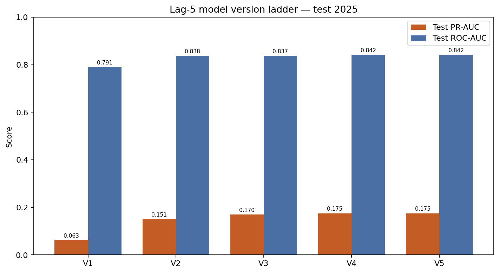
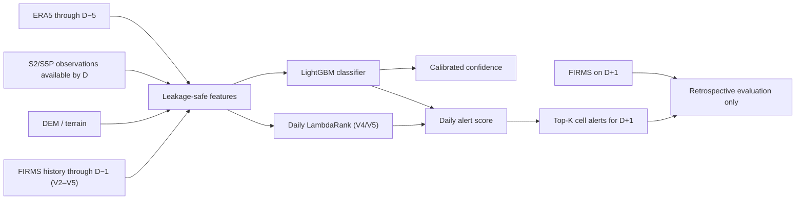
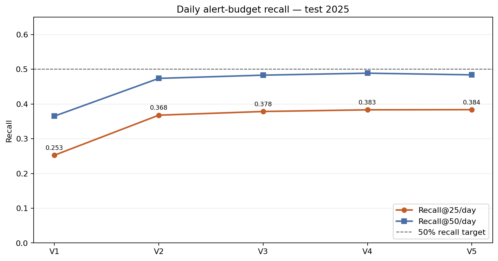
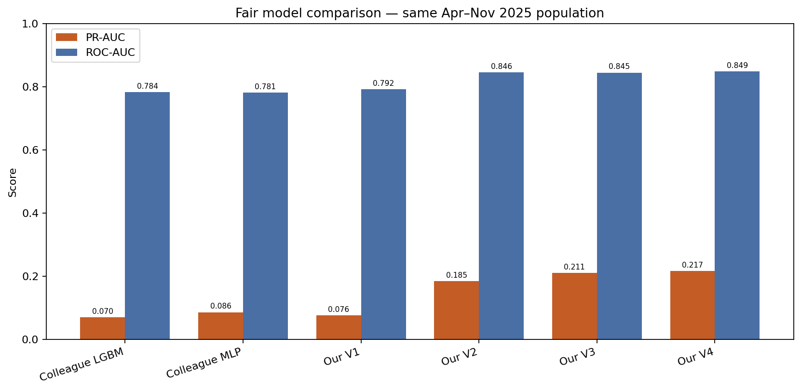
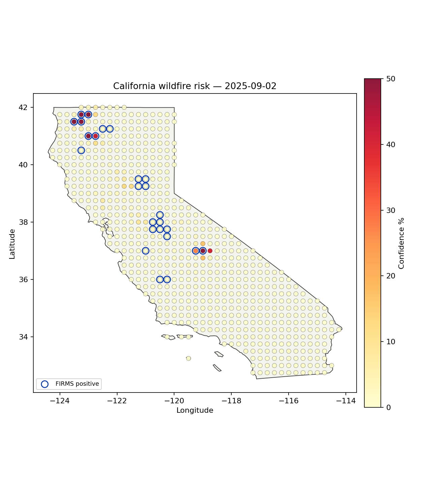
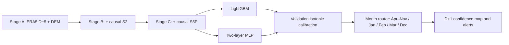
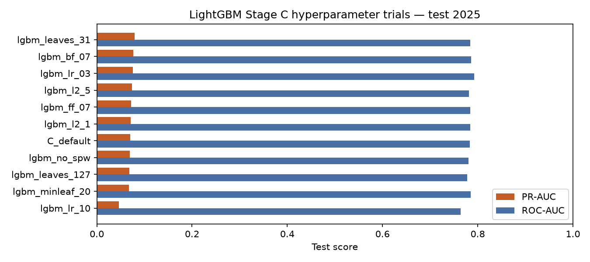
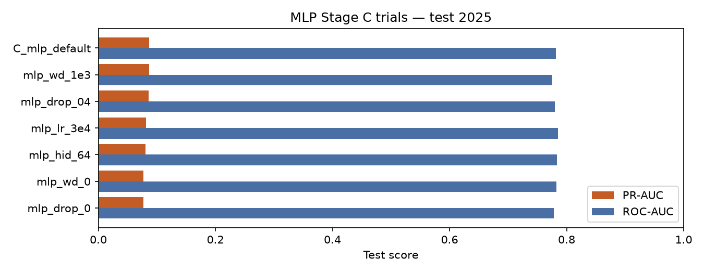
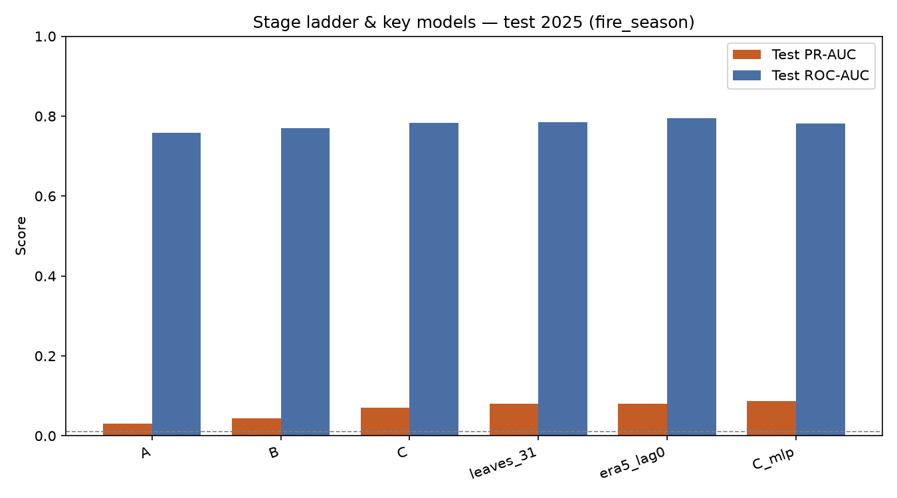
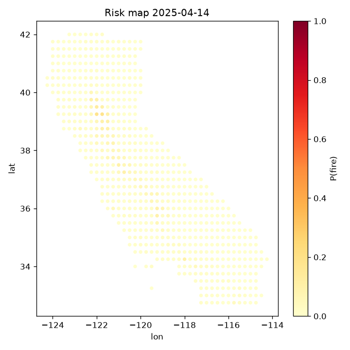

# Milestone 4 Report — Numerical Next-Day Wildfire Forecasting


**Project:** AI-powered wildfire early detection and alerting

**Presentation:** [Milestone 4 Presentation](Milestone%204%20Presentation.pdf)

**Scope:** Combined Milestone 4 numerical submission:
`numerical_nextday` Stage A/B/C models and archive lag-5 V1–V5 experiments

**Submission deadline:** 30 July 2026

**Dataset:** `california_numerical_nextday_wildfire_lag5`

**Recommended model:** **V4 Recall@25 classifier–ranker blend**, provided
D−1 FIRMS history is available at serving time

**Data readiness:** **Complete for 2019–2025 training and evaluation**

> **Forecast contract:** `y_fire` is the FIRMS outcome on **D+1**; ERA5
> predictors end at **D−5**.

## 1. Submission checklist

| Requirement | Status | Evidence |
|---|---|---|
| Full model training completed | Complete | V1–V5 model bundles, predictions, metrics and manifests were generated |
| Fully working input-to-output pipeline | Complete | Archive audit → feature building → training → calibration → evaluation → maps |
| Hyperparameter tuning completed | Complete | Feature ablations, LightGBM grids, ranker grids, blend tests and MLP comparison |
| Quantitative and qualitative outputs | Complete | PR-AUC/ROC-AUC/Recall@K tables, calibration plots and 365 daily risk maps |
| Reproducible code and logs | Complete | Training scripts, JSON/CSV metrics, SHA-256 manifests and 30 passing tests |

## 2. Executive summary

This report combines the two numerical next-day forecasting implementations
committed to the repository:

1. **Lakshay Garg's `numerical_nextday` track** builds the source data from
   GCS/Milestone 3 inputs, progressively adds ERA5+DEM (Stage A), Sentinel-2
   (Stage B) and Sentinel-5P (Stage C), and compares routed LightGBM and MLP
   models under an operational ERA5 D−5 cutoff.
2. **Roushan Kumar Singh's archive lag-5 track** starts from the prepared
   train/validation/test tables and develops five isolated versions focused on
   causal feature engineering and daily top-K alert recall.

Both implementations predict `y_fire` on **D+1** using ERA5 no later than
**D−5**, use the same chronological split, include runnable source and tests,
and intentionally exclude downloaded inputs and trained weights from Git.
Section 19 documents Lakshay's pipeline in full; Section 20 gives the
controlled side-by-side comparison.

Five isolated versions were trained from the supplied local archive without
repeating GCS downloads:

1. **V1** established Stage A/B/C LightGBM and MLP baselines.
2. **V2** added strictly lagged weather, fire-recurrence and neighborhood
   histories. This produced the largest improvement.
3. **V3** added direction- and distance-aware spread features and tested a
   continuation/ignition mixture and LambdaRank.
4. **V4** optimized the operational objective directly: daily Recall@25. It
   combined a regularized classifier and daily LambdaRank score.
5. **V5** reranked V4's top candidates using hard negatives. Its incremental
   gain did not justify the added complexity.

The retained model is **V4**. On the current 2025 prediction table it achieved:

- calibrated PR-AUC **0.1751**;
- ROC-AUC **0.8420**;
- Brier score **0.00831**;
- Precision@25/day **9.56%**;
- Recall@25/day **38.33%**;
- Recall@50/day **48.88%**.

The requested Recall@25 target of 50% was not reached. V4 crosses 50% recall
at **53 alerts per day**, so the evidence supports approximately
**Recall@53 = 50%**, not Recall@25 = 50%.



## 3. Task and real-time serving contract

The task is binary risk prediction for every California land grid cell:

- **Forecast day:** `eo_asof_date = D`
- **Target day:** `label_date = D+1`
- **Target:** `y_fire = 1` when at least one qualifying FIRMS pixel occurs in
  that cell on D+1
- **ERA5 cutoff:** `feature_end_date = D−5`
- **V2–V5 FIRMS-history cutoff:** T−2 = D−1
- **Grid:** 672 California land cells at 0.25° resolution

V2–V5 are operationally valid only if the FIRMS feed through D−1 is available
when the D+1 forecast is issued on D. If that feed has a longer real-world
delay, these history features must be rebuilt using the actual cutoff.



## 4. Datasets

### 4.1 Data sources and progressive stages

| Source/stage | Main variables | Use |
|---|---|---|
| ERA5 | temperature, dew point, humidity, precipitation, wind, gust, soil moisture, cloud/vegetation and boundary-layer variables | Weather state and lagged dryness |
| DEM/terrain | elevation, slope, aspect, TRI, TPI, hillshade and orographic index | Static geographic susceptibility |
| Sentinel-2 | reflectance bands, NDVI, NDMI, NBR, NDWI, EVI, cloud and valid-coverage indicators | Vegetation/fuel condition |
| Sentinel-5P | aerosol index, CO summaries, coverage and availability | Atmospheric context |
| FIRMS | qualifying fire pixels and confidence | D+1 target; causal history in V2–V5 |

The supplied archive contains three progressive tables:

| Stage | Feature family | Audited features |
|---|---|---:|
| A | ERA5 + terrain | 33 |
| B | Stage A + Sentinel-2 | 53 |
| C | Stage B + Sentinel-5P | 63 |

After cleanup, V1 Stage C retained 61 features because two S5P standard
deviation columns were constant. V2 expanded the selected set to 99 features,
V3/V4 used 113, and V5 used 119 after adding six retrieval meta-features.

### 4.2 Coverage and chronological split

| Split | Label years | Rows | Positives | Positive rate |
|---|---|---:|---:|---:|
| Train | 2019–2022 | 981,792 | 13,804 | 1.406% |
| Validation | 2023–2024 | 491,232 | 5,536 | 1.127% |
| Test | 2025 | 245,280 | 2,275 | 0.928% |
| **Total** | **2019–2025** | **1,718,304** | **21,615** | **1.258%** |

Coverage is complete for 2,557 calendar days. Every day contains exactly 672
unique cells. All Stage C modalities, including Sentinel-5P, are treated as
available across the complete 2019–2025 coverage period. The audit found:

- no duplicate `(cell_id, label_date)` keys;
- no coordinate conflicts;
- no overlap between train, validation and test years;
- identical keys and labels across Stages A, B and C;
- binary labels only;
- no NaN or infinity in the Stage C feature allowlist.

The 1.72 million rows must not be interpreted as 1.72 million independent
examples. Cells on the same day are spatially correlated, consecutive days
are temporally correlated, and a single wildfire can create several positive
cell-days.

### 4.3 Data-quality controls

The archive audit identified a small number of observation-level quality
conditions handled during preprocessing:

- 7,392 late-2025 S2 rows were older than the documented 15-day limit;
- 6,720 S5P rows in 2020 exceeded the two-day freshness limit;
- 3,360 early-2019 S2 rows were marked unavailable but contained values;
- small negative ERA5 soil values were numerical artifacts;
- `s5n_s5p_aai_std` and `s5n_s5p_co_std` were constant zero.

The training builders mask stale/unavailable EO observations, clip small
negative soil values to zero and remove constant features.

## 5. Preprocessing and feature engineering

### 5.1 Common preprocessing

1. Read only an explicit feature allowlist.
2. Exclude labels, FIRMS outcome counts, identifiers and all date columns from
   direct model inputs.
3. Convert features to numeric and fit medians on the training portion only.
4. Median-fill non-finite values.
5. Keep raw numeric scale for LightGBM.
6. Standardize features for the MLP using a training-fitted
   `StandardScaler`.
7. Apply stale-sensor masking and availability flags.
8. Fit probability calibration on label year 2024.

The following columns are explicitly forbidden as features:

`y_fire`, `firms_n_pixels`, `firms_max_confidence`, `label_date`,
`eo_asof_date`, `feature_end_date`, `cell_id`, and `region`.

Using "all numeric columns except `y_fire`" would leak the target through the
FIRMS outcome columns. The exact allowlist is mandatory.

### 5.2 V2 causal features

V2 adds:

- cyclical day-of-year and month;
- vapour pressure deficit (VPD);
- VPD×wind, dryness×wind and heat×soil-deficit interactions;
- 14- and 30-day weather histories and anomalies;
- same-cell fire lag, 7/30-day counts, recency and expanding historical rate;
- neighboring-cell lag/count/any-fire summaries;
- statewide seven-day fire-cell count.

For target T=D+1, every fire-history feature is shifted so it ends at
T−2=D−1. Mutation tests confirm that changing future labels cannot alter
earlier features.

### 5.3 V3 direction-aware features

V3 adds 14 features:

- upwind, downwind and crosswind fire context;
- inverse-distance-weighted neighbor fire counts;
- wind-spread potential;
- fire-context×VPD and fire-context×dry/windy interactions;
- ignition dry/windy and fuel-dryness indices;
- short-versus-long VPD trend;
- a causal recent-fire-context router.

The wind used by these interactions is still the available D−5 ERA5 wind, not
future weather.

### 5.4 V5 retrieval meta-features

The two-stage reranker adds:

- V4 classifier score;
- V4 ranker score;
- V4 blended retrieval score;
- within-day percentile of each of those three scores.

Forward-only base predictions are used during reranker training to prevent a
model from learning from its own in-sample predictions.

## 6. Model architectures

| Version | Selected architecture | Features | Selected rounds | Calibration |
|---|---|---:|---|---|
| V1 | Global Stage C LightGBM | 61 | 84 | Isotonic |
| V2 | Leakage-safe global LightGBM | 99 | 128 | Isotonic |
| V3 | Global direction-aware LightGBM | 113 | 73 | Platt |
| V4 | Regularized classifier + LambdaRank; 50/50 percentile blend | 113 | 248 + 221 | Platt for confidence |
| V5 | Frozen V4 top-75 retrieval + hard-negative LambdaRank | 119 | 82 reranker rounds | Inherited V4 confidence |

### 6.1 V1–V3 classifier

The main classifier is a gradient-boosted decision-tree ensemble with a binary
objective. Each tree corrects the previous ensemble. LightGBM is appropriate
for heterogeneous tabular predictors, non-linear interactions, missingness
indicators and a highly imbalanced target.

### 6.2 MLP baseline

The V1 neural baseline is:

```text
Standardized input (61)
  → Dense 128, ReLU
  → Dense 64, ReLU
  → Binary probability output
```

It uses scikit-learn's `MLPClassifier`, binary log-loss, Adam, batch size
1,024, learning rate 0.001, L2 coefficient 0.0001, at most 20 epochs and
five-epoch early-stopping patience with a 10% internal validation fraction.

### 6.3 V4 classifier–ranker blend

V4 has two heads:

- a calibrated binary LightGBM classifier for probability and PR-AUC;
- a LambdaRank model grouped by day for operational ordering.

Raw classifier and ranker scores are converted to within-day percentiles. The
selected alert score is:

```text
alert_score = 0.50 × classifier_percentile
            + 0.50 × ranker_percentile
```

This separates calibrated confidence (`p_fire`) from the score used to choose
the daily alert budget (`alert_score`).

### 6.4 V5 two-stage model

V5 first retrieves the top 75 cells/day using frozen V4, then applies a
hard-negative LambdaRank reranker. It was intended to spend model capacity
only on the difficult boundary between the top 25 and nearby candidates.

## 7. Full training configuration

### 7.1 Common configuration

| Item | Configuration |
|---|---|
| Random seed | 42 |
| Primary selection metric | PR-AUC for V1–V3; Recall@25 for V4–V5 |
| Secondary metrics | ROC-AUC, Brier, log-loss, ECE, Precision@K, Recall@K and false alerts/day |
| LightGBM classifier loss | Binary objective |
| Ranker loss | LambdaRank, daily query groups, binary label gain `[0, 1]` |
| V1–V3 maximum rounds | 400 |
| V1–V3 early stopping | 40 rounds |
| V4 maximum rounds | 1,200 |
| V4 early stopping | 100 rounds on Recall@25 |
| V5 reranker maximum rounds | 700 |
| V5 early stopping | 80 rounds |
| Tune protocol | Chronological/forward validation, never random row split |
| Calibration | 2024; isotonic in V1/V2, Platt in V3/V4 |
| Test | 2025 |
| Execution | CPU, LightGBM multithreaded; no GPU required |

### 7.2 Selected LightGBM parameters

| Version | Learning rate | Leaves | Min leaf | Feature fraction | Bagging fraction | L1 | L2 | Positive weight |
|---|---:|---:|---:|---:|---:|---:|---:|---:|
| V1 | 0.050 | 63 | 50 | 0.85 | 0.85 | 0.0 | 0.0 | 70.12 |
| V2 | 0.050 | 31 | 50 | 0.85 | 0.85 | 0.0 | 0.0 | 71.90 |
| V3 | 0.050 | 31 | 50 | 0.85 | 0.85 | 0.0 | 0.0 | 1.0 |
| V4 classifier | 0.025 | 31 | 75 | 0.90 | 0.90 | 0.2 | 3.0 | 1.0 |
| V4 ranker | 0.030 | 63 | 100 | 0.85 | 0.85 | 0.0 | 8.0 | n/a |
| V5 reranker | 0.040 | 31 | 30 | 0.85 | 0.85 | 0.0 | 2.0 | n/a |

The V4 ranker used LambdaRank truncation level 100. The selected V5 reranker
used truncation level 25 and a top-75 candidate pool.

### 7.3 Software and hardware

The run manifests record:

- Python 3.13.11;
- LightGBM 4.6.0;
- NumPy 2.4.4;
- pandas 2.3.3;
- scikit-learn 1.8.0.

Training ran CPU-only on macOS arm64 with 14 logical CPU cores visible to the
runtime. Exact RAM consumption was not instrumented. The local archive occupied
approximately 1.6 GB, derived V2/V3 tables approximately 0.8 GB combined, and
training artifacts approximately 0.18 GB including maps. The exact minimum
memory was not benchmarked; **16 GB system RAM and at least 4 GB free working
disk are recommended** for the complete experiment track. GPU hardware is not
required. After caches exist, the operator-observed complete experiment cycle
was approximately 13–14 minutes on this workstation.

## 8. Evaluation metrics

Because positives are below 1% in 2025, **PR-AUC is the primary global
metric**. ROC-AUC can remain high even when alert precision is weak.

| Metric | Interpretation |
|---|---|
| PR-AUC / average precision | Ranking quality focused on the rare positive class |
| ROC-AUC | Overall ranking/separation quality |
| Brier score | Mean squared error of calibrated probabilities; lower is better |
| ECE (10 bins) | Difference between confidence and observed frequency |
| Precision@K/day | Fraction of the K daily alerts that are positive |
| Recall@K/day | Fraction of all positive cell-days captured by K alerts/day |
| False alerts/day | Operational alert burden after correct alerts are removed |

Recall@25 is the main operational target because it imposes a fixed daily
review budget.

## 9. Experiments and hyperparameter tuning

### 9.1 V1 — progressive modality and MLP baseline

V1 compared Stage A, B and C LightGBM with a Stage C MLP. Selection used raw
2023 PR-AUC; 2024 was reserved for calibration.

| Candidate | Features | 2023 PR-AUC | 2023 ROC-AUC | 2024 calibrated Brier |
|---|---:|---:|---:|---:|
| LightGBM Stage A | 33 | 0.062455 | 0.795147 | 0.009882 |
| LightGBM Stage B | 53 | 0.068002 | 0.802198 | 0.009779 |
| **LightGBM Stage C** | **61** | **0.097380** | **0.817251** | **0.009665** |
| MLP Stage C | 61 | 0.068074 | 0.789699 | 0.009784 |

**Learning:** Sentinel features improved the baseline, but the MLP did not
outperform the boosted-tree model on this tabular, imbalanced dataset.

### 9.2 V2 — feature ablation

V2 used walk-forward validation on 2022, 2023 and 2024.

| Feature set | Features | Mean PR-AUC | Minimum PR-AUC |
|---|---:|---:|---:|
| V1 cleaned base | 61 | 0.090312 | 0.078468 |
| V2 full | 100 | 0.179762 | 0.160913 |
| V2 without fire history | 90 | 0.095849 | 0.091519 |
| V2 without S5P | 92 | 0.174741 | 0.155209 |
| **V2 without S5P availability flag** | **99** | **0.181318** | **0.161200** |

Removing fire history erased most of the improvement. Removing S5P caused only
a small reduction. Therefore, causal recent-fire context was the dominant new
signal, and the model remained robust when the atmospheric feature family was
excluded.

### 9.3 V2 — LightGBM parameter and architecture search

| Configuration | Main change | Mean PR-AUC | Minimum PR-AUC | Median rounds |
|---|---|---:|---:|---:|
| Default | 63 leaves | 0.181318 | 0.161200 | 77 |
| **Leaves 31** | Smaller trees | **0.182239** | 0.161495 | 128 |
| No class weight | `scale_pos_weight=1` | 0.181489 | **0.171105** | 69 |
| Regularized | lr=.03, leaves=31, min leaf=100, fractions=.70, L2=5 | 0.181964 | 0.162013 | 143 |

The selected global model slightly exceeded a seasonal router:

| Architecture | Mean PR-AUC |
|---|---:|
| **Global** | **0.182239** |
| Fire-season/winter router | 0.178234 |

### 9.4 V3 — classifier architecture experiments

| Candidate | Architecture | Features | Mean PR-AUC | Minimum PR-AUC | Mean P@25 |
|---|---|---:|---:|---:|---:|
| Global directional, weighted | Global | 113 | 0.183407 | 0.167203 | 12.2203% |
| **Global directional, unweighted** | **Global** | **113** | **0.193298** | **0.183773** | **12.3298%** |
| Directional continuation/ignition mixture | Mixture | 113 | 0.192672 | 0.175520 | 12.2969% |
| Mixture without S5P | Mixture | 106 | 0.178957 | 0.164794 | 12.0854% |
| Daily LambdaRank | Ranker | 113 | 0.180420 | — | 12.0523% |

The mixture was more complex without a consistent gain. Unweighted binary
training worked better than the original class-weighted setup after strong
history features were introduced.

### 9.5 V4 — classifier tuning for Recall@25

Each candidate could train for up to 1,200 rounds with 100-round early stopping
on walk-forward Recall@25.

| Candidate | Mean R@25 | Worst R@25 | Mean R@50 | Mean PR-AUC | Median rounds |
|---|---:|---:|---:|---:|---:|
| V3 recall baseline | 42.43% | 39.73% | 54.49% | 0.191120 | 75 |
| **31-leaf long regularized** | **42.84%** | 40.13% | **55.05%** | 0.197967 | 248 |
| 63-leaf regularized | 42.44% | 40.09% | 54.81% | 0.198093 | 132 |
| 127-leaf regularized | 42.41% | 40.09% | 55.03% | 0.196744 | 121 |
| Soft positive weight 2 | 42.53% | 40.33% | 54.57% | 0.197564 | 137 |
| Extra Trees 63 | 42.59% | 39.89% | 55.01% | **0.200190** | 262 |
| GOSS 63 | 42.65% | **40.41%** | 54.50% | 0.198472 | 139 |

Extra Trees produced the best PR-AUC but not the best Recall@25. It was not
selected because the milestone objective was a fixed alert-budget recall.

### 9.6 V4 — ranker and blend tuning

| Ranker | Mean R@25 | Worst R@25 | Mean R@50 | Mean PR-AUC | Median rounds |
|---|---:|---:|---:|---:|---:|
| Rank31, truncation 25 | 41.83% | 39.73% | 53.50% | 0.182450 | 126 |
| Rank63, truncation 50 | 42.49% | **40.29%** | 53.62% | 0.186530 | 168 |
| **Rank63, truncation 100** | **42.56%** | 40.09% | 54.27% | **0.187684** | 221 |
| Rank127, truncation 100 | 42.27% | 40.29% | **54.65%** | 0.185425 | 201 |

| Alert head | Mean R@25 | Worst R@25 | Mean R@50 |
|---|---:|---:|---:|
| Classifier only | 42.84% | 40.13% | **55.05%** |
| Ranker only | 42.56% | 40.09% | 54.27% |
| 25% classifier / 75% ranker | 42.70% | **40.33%** | 54.74% |
| **50% classifier / 50% ranker** | **42.85%** | 40.25% | 55.00% |
| 75% classifier / 25% ranker | 42.82% | 40.21% | 55.02% |

The 50/50 blend was selected by mean Recall@25. The improvement over the
classifier alone was small, indicating that both heads learned similar
ordering.

### 9.7 V5 — hard-negative reranking

| Candidate | Pool | Mean pool recall | Mean R@25 | Worst R@25 | Mean R@50 | Rounds |
|---|---:|---:|---:|---:|---:|---:|
| **Rank31 pool75** | **75** | 62.73% | **42.97%** | 40.69% | 54.58% | 82 |
| Rank63 pool75 | 75 | 62.73% | 42.54% | 40.45% | 54.95% | 61 |
| Rank31 pool100 | 100 | 68.63% | 42.92% | **40.81%** | 54.68% | 6 |
| Rank63 pool100 | 100 | 68.63% | 42.78% | 40.41% | 54.73% | 31 |
| Rank127 pool100 | 100 | 68.63% | 42.86% | 40.29% | 54.52% | 32 |
| Rank63 pool150 | 150 | **77.02%** | 42.80% | 40.25% | 54.11% | 22 |
| Binary63 pool100 | 100 | 68.63% | 42.34% | 40.01% | 54.95% | 87 |

Larger pools improved the theoretical retrieval ceiling but made the
top-25 reranking task harder. V5 did not materially improve the selected
operating point.

## 10. Quantitative results

### 10.1 Forward-validation comparison

| Version | Protocol | Mean PR-AUC | Minimum PR-AUC | Mean R@25 | Worst R@25 | Mean R@50 |
|---|---|---:|---:|---:|---:|---:|
| V1 | Single 2023 tune year | 0.097380 | 0.097380 | 29.88% | 29.88% | — |
| V2 | Walk-forward 2022–2024 | 0.182239 | 0.161495 | 41.58% | 39.13% | — |
| V3 | Walk-forward 2022–2024 | 0.193298 | 0.183773 | 42.03% | 39.57% | — |
| **V4** | Recall@25 walk-forward 2022–2024 | **0.197967** | **0.181969** | 42.85% | 40.25% | **55.00%** |
| V5 | Forward-stacked reranking 2022–2024 | 0.168388 | 0.142395 | **42.97%** | **40.69%** | 54.58% |

V1 used only a single tune year and is not directly comparable with the later
three-year means.

### 10.2 2025 descriptive comparison

All values in this table were recomputed from the current saved prediction
parquets. These values supersede minor one-cell differences in early
intermediate reports caused by tied daily rank scores.

| Version | Calibrated PR-AUC | ROC-AUC | Brier | P@25 | Recall@25 | Recall@50 | K for 50% recall |
|---|---:|---:|---:|---:|---:|---:|---:|
| V1 | 0.062542 | 0.790728 | 0.008945 | 6.3014% | 25.2747% | 36.5275% | 99 |
| V2 | 0.150528 | 0.838086 | 0.008396 | 9.1726% | 36.7912% | 47.3846% | 59 |
| V3 | 0.170424 | 0.837402 | 0.008330 | 9.4356% | 37.8462% | 48.3077% | 56 |
| **V4** | **0.175139** | **0.841983** | **0.008307** | 9.5562% | 38.3297% | **48.8791%** | **53** |
| V5 | 0.175139* | 0.841983* | 0.008307* | **9.5671%** | **38.3736%** | 48.3956% | 56 |

\*V5 inherits the V4 calibrated classifier probability. Its reranking AP is
0.167756; the probability metrics are not newly improved.

V4 captures 872 of 2,275 positive cell-days at 25 alerts/day. Reaching 50%
requires 1,138 captures. At K=53, V4 captures 1,138 positives from 19,345
annual alerts: 5.88% precision and 49.88 false alerts/day.



### 10.3 Fair fire-season context

For contextual comparison, models were recomputed on the same Apr–Nov 2025
population: 163,968 cell-days and 1,624 positives.

| Model | PR-AUC | ROC-AUC |
|---|---:|---:|
| Lakshay Stage C default LightGBM | 0.070167 | 0.783829 |
| Lakshay Stage C default MLP | 0.086500 | 0.781300 |
| Our V1 classifier | 0.076443 | 0.792097 |
| Our V2 classifier | 0.184619 | 0.845922 |
| Our V3 classifier | 0.210718 | 0.845143 |
| **Our V4 classifier** | **0.216727** | **0.848589** |

V4's PR-AUC is 2.51× Lakshay's MLP on this identical population.
However, this is a best-system comparison, not a pure architecture comparison:
V2–V5 use causal D−1 FIRMS history while Lakshay's pipeline does not. If
explicit FIRMS history is disallowed, V1 is the closest comparison and the
Stage C MLP is better by 0.0101 absolute PR-AUC.



## 11. Generalization and training stability

| Technique | Purpose | Observed impact |
|---|---|---|
| Strict chronological splits | Avoid future-to-past contamination | More realistic year-shift estimates than random row splits |
| Walk-forward 2022–2024 validation | Measure stability across seasons | Exposed worst-year behavior and discouraged single-year tuning |
| Early stopping | Prevent excessive boosting | Selected 73–248 rounds instead of always using the maximum |
| Smaller trees/minimum leaf size | Reduce variance | V2 31-leaf and V4 min-leaf 75 models were selected |
| Feature/bagging fractions | Stochastic regularization | Used 0.70–0.90 fractions in tuned candidates |
| L1/L2 regularization | Constrain V4 complexity | V4 selected L1=0.2 and L2=3 |
| Isotonic/Platt calibration | Improve confidence quality | Brier improved to 0.00831 in V4 |
| Feature ablation | Test dependence on sensors/history | Identified causal fire history as dominant and S5P as non-essential |
| Predeclared blend weights | Limit search degrees of freedom | Only 0.25/0.50/0.75 classifier weights were tested |
| Forward base predictions in V5 | Prevent stacking leakage | Reranker saw only out-of-sample base scores |
| Worst-year eligibility checks | Discourage average-only overfit | V4 retained worst R@25 above 40% |

The score improvement from V4 to V5 is effectively flat, a sign that further
search within the same feature family is reaching diminishing returns.

## 12. Qualitative results and sample prediction

Daily risk maps use:

- California outline from `data/california.geojson`;
- cell dots colored by calibrated Confidence % with YlOrRd;
- a fixed 0–50% color scale for cross-day comparability;
- blue rings for retrospective FIRMS positives;
- the title `California wildfire risk — YYYY-MM-DD`.

Blue rings are ground-truth overlays used after the event for evaluation. They
are not input to the displayed prediction.



On 2 September 2025, the test table contained 25 positive cells. The first
seven V4 alerts below were all positive:

| Cell | Latitude | Longitude | Confidence | Alert score | FIRMS positive |
|---|---:|---:|---:|---:|---:|
| 37.00_-119.00 | 37.00 | -119.00 | 89.70% | 1.000000 | 1 |
| 41.75_-123.25 | 41.75 | -123.25 | 80.80% | 0.998512 | 1 |
| 41.50_-123.25 | 41.50 | -123.25 | 70.17% | 0.996280 | 1 |
| 41.50_-123.50 | 41.50 | -123.50 | 71.34% | 0.996280 | 1 |
| 41.75_-123.00 | 41.75 | -123.00 | 64.71% | 0.994048 | 1 |
| 41.00_-122.75 | 41.00 | -122.75 | 42.21% | 0.991815 | 1 |
| 41.00_-123.00 | 41.00 | -123.00 | 54.60% | 0.991815 | 1 |

This is a useful qualitative success case, but a high-activity day should not
be treated as representative of every day.

## 13. Leakage assessment and validity of claims

| Risk | Assessment | Status |
|---|---|---|
| Direct target leakage | Outcome columns, labels, dates and IDs excluded from feature allowlists | Controlled |
| Weather look-ahead | ERA5 and weather windows end D−5 | Controlled |
| Fire-history look-ahead | Histories end D−1, excluding D and D+1 | Controlled under stated serving contract |
| Rolling-boundary leakage | Full-grid and mutation tests verify causal histories | Controlled |
| Calibration leakage | Calibrators fit on 2024, not 2025 | Controlled; 2024 calibration metrics are in-sample |
| Sensor quality flags | Availability indicators may encode acquisition conditions | Retained as explicit quality features and monitored |
| Spatial/temporal correlation | Cell-days are not independent incidents | Statistical limitation |
| Repeated 2025 inspection | Later versions were designed after previous 2025 results were known | Evaluation leakage for V2–V5 comparisons |

There is no detected feature/label leakage under the D−5 weather and D−1
FIRMS serving contract. The principal validity limitation is repeated use of
2025 during the experiment series. Therefore:

- V1's first 2025 result is the only fully untouched test result;
- V2–V5 2025 metrics are descriptive;
- forward 2022–2024 validation is the primary evidence for model selection;
- a frozen 2026 season or external geography is required for a fresh
  production claim.

## 14. Artifacts generated

### 14.1 Training artifacts

Each version has an isolated local directory:

```text
local_artifacts/archive_training/
  lag5_full_year/          # V1
  lag5_v2/
  lag5_v3/
  lag5_v4_recall25/
  lag5_v5_two_stage/
```

| Version | Saved weights/bundle | Other outputs |
|---|---|---|
| V1 | Stage A/B/C LightGBM and Stage C MLP `.joblib` | candidate metrics, test parquet, calibration/PR plot, risk map, feature importance |
| V2 | global, fire-season and winter `.joblib` | ablations, parameter search, seasonal CV, test parquet and explanations |
| V3 | classifier and ranker `.joblib` | classifier/ranker experiment logs, test parquet and explanations |
| V4 | classifier, ranker and `v4_alert_bundle.joblib` | OOF predictions, grids, blend log, test parquet, maps and explanations |
| V5 | reranker and `v5_two_stage_bundle.joblib` | forward base predictions, OOF reranker predictions, grid and test parquet |

Every version also contains:

- `metrics.json`;
- `TRAINING_REPORT.md`;
- `run_manifest.json` with SHA-256 hashes;
- `plots/calibration_and_pr_2025.png`;
- `plots/risk_map_peak_day_2025.png`.

The V4 visualization set contains 365 daily PNGs plus a manifest. Large
parquets, model bundles, derived datasets, caches and `.venv` directories are
intentionally ignored by Git.

### 14.2 Repository artifacts

The Git repository contains:

- V1–V5 training and feature-building scripts;
- inference/model bundle classes;
- tests;
- dataset metadata and data audit;
- consolidated CSV/JSON/Markdown results;
- lightweight report figures and sample maps;
- requirements and configuration files.

## 15. Reproducibility

From `Milestone 4/numerical_nextday/experiments/archive_lag5_v1_v5`:

```bash
python -m venv .venv
source .venv/bin/activate
python -m pip install -r requirements.txt
export PYTHONPATH=src
```

Place the untracked archive under `local_data/archive`, then run:

```bash
# Verify data
python scripts/audit_archive.py local_data/archive

# V1
python scripts/train_archive.py \
  --archive local_data/archive \
  --output local_artifacts/archive_training/lag5_full_year

# V2
python scripts/build_archive_v2.py \
  --archive local_data/archive \
  --output local_data/archive_v2
python scripts/train_archive_v2.py \
  --data local_data/archive_v2 \
  --output local_artifacts/archive_training/lag5_v2 \
  --baseline-metrics local_artifacts/archive_training/lag5_full_year/metrics.json

# V3
python scripts/build_archive_v3.py \
  --v2-data local_data/archive_v2 \
  --output local_data/archive_v3
python scripts/train_archive_v3.py \
  --data local_data/archive_v3 \
  --output local_artifacts/archive_training/lag5_v3 \
  --v1-metrics local_artifacts/archive_training/lag5_full_year/metrics.json \
  --v2-metrics local_artifacts/archive_training/lag5_v2/metrics.json

# V4
python scripts/train_archive_v4.py \
  --data local_data/archive_v3 \
  --output local_artifacts/archive_training/lag5_v4_recall25 \
  --v3-metrics local_artifacts/archive_training/lag5_v3/metrics.json

# V5
python scripts/train_archive_v5.py \
  --data local_data/archive_v3 \
  --output local_artifacts/archive_training/lag5_v5_two_stage \
  --v4-output local_artifacts/archive_training/lag5_v4_recall25
```

Generate figures from saved tables and predictions:

```bash
python scripts/generate_experiment_metrics_charts.py \
  --artifact-root local_artifacts/archive_training

python scripts/generate_experiment_risk_maps.py \
  --predictions local_artifacts/archive_training/lag5_v4_recall25/test_predictions.parquet \
  --date 2025-10-21 --date 2025-09-02 --date 2025-04-14
```

Run the test suite:

```bash
PYTHONPATH=src python -m pytest -q
```

Verification on 30 July 2026: **30 tests passed**. One pandas future warning
was emitted by the synthetic dataset concatenation test; it does not affect
the current results.

## 16. Key findings

### What worked well

1. **Causal fire history was the largest improvement.** V2 more than doubled
   calibrated 2025 PR-AUC compared with V1.
2. **Direction-aware features added incremental value.** V3 improved PR-AUC
   and Recall@25 without requiring a mixture model.
3. **Direct optimization of Recall@25 helped.** Longer, regularized V4
   training and score blending produced the best practical balance.
4. **Calibration was effective.** V4 Brier score reached 0.00831 despite
   severe class imbalance.
5. **The system is robust to S5P ablation.** The no-S5P experiment remained
   strong, although the complete Stage C model retains the atmospheric signal.
6. **CPU training is sufficient.** The complete pipeline does not require a
   GPU.

### What did not work as expected

1. The Stage C MLP underperformed the LightGBM baseline.
2. A seasonal router did not improve over a global V2 model.
3. The continuation/ignition mixture added complexity without a stable gain.
4. Pure LambdaRank underperformed the best classifier.
5. Larger trees, aggressive class weighting, GOSS and Extra Trees did not
   improve the target metric enough to be selected.
6. V5 hard-negative reranking captured only one additional 2025 positive at
   K=25 and reduced Recall@50.
7. Recall@25 did not approach the desired 50% target; tuning alone could not
   close the remaining gap.

### Bottlenecks

- only four training seasons and two validation seasons;
- spatial and temporal correlation between cell-day rows;
- D−5 ERA5 latency;
- limited ignition-specific predictors;
- an operational alert budget much smaller than the number of plausible
  high-risk cells;
- no fresh holdout after iterative 2025 inspection.

## 17. Recommended next steps

1. **Retain V4**, not V5, as the deployable experiment bundle.
2. Freeze architecture and thresholds before evaluating a 2026 or
   external-geography holdout.
3. Add deterministic `cell_id` tie-breaking to every top-K computation.
4. Validate real FIRMS availability latency before depending on D−1 history.
5. Add new information rather than only expanding the tuning grid:
   - forecast-day and target-day numerical weather forecasts;
   - lightning;
   - roads, powerlines, human access and wildland–urban interface;
   - live fuel moisture and drought trajectories;
   - explicit incident-onset labels separating ignition from continuation.
6. Evaluate incident-level and region-level metrics in addition to cell-day
   metrics.
7. Define an operational cost function for missed fires versus false alerts
   and select K from that cost, rather than targeting Recall@25 in isolation.
8. Monitor PR-AUC, Recall@K, calibration drift, sensor availability and
   false-alert burden after deployment.

## 18. Archive V1–V5 conclusion

Milestone 4 is complete as a training and experimentation milestone. The work
includes a fully executable lag-aware pipeline, five isolated model versions,
feature and architecture ablations, extensive hyperparameter tuning,
regularization, calibration, operational Recall@K optimization, model
artifacts, manifests, tests and qualitative outputs.

V4 is clearly better than the original baseline and is the most defensible
model to retain. It is a strong experiment under the available data, but it
should not yet be called production-grade: the 50% Recall@25 target was not
met, D−1 FIRMS availability must be confirmed, and a fresh independent
holdout is still required.

## 19. Lakshay Garg track — progressive Stage A/B/C numerical pipeline

This section incorporates the complete `numerical_nextday` work contributed
by **Lakshay Garg (21F3001076)**. Its code, tests, released metrics and figures
are committed under [`numerical_nextday/`](numerical_nextday/). The V1–V5
archive track remains separately runnable under
[`numerical_nextday/experiments/archive_lag5_v1_v5/`](numerical_nextday/experiments/archive_lag5_v1_v5/).

### 19.1 Dataset and preprocessing

| Item | Stage A/B/C pipeline setting |
|---|---|
| Prediction unit | Approximately 672 California ERA5 land cells at 0.25° × day |
| Label | FIRMS fire on `label_date = D+1`, confidence ≥30 |
| ERA5 window | Seven daily observations ending D−5 |
| EO cutoff | Latest S2/S5P window with `window_end ≤ D` |
| Split | Train 2019–2022 / validation 2023–2024 / test 2025 |
| Train rows | 981,792 |
| Validation rows | 491,232 |
| Test rows | 245,280 |
| Total rows / positives | 1,718,304 / 21,615 (approximately 1.26%) |
| Fire-season test | 163,968 rows / 1,624 positives |

The source pipeline reads ERA5, FIRMS, Copernicus DEM and causal numerical
summaries from Sentinel-2 and Sentinel-5P. FIRMS pixels are thresholded and
aggregated to a cell-day label. Weather is converted to daily statistics and
seven-day rollups; terrain is joined statically; satellite features are
aggregated to the ERA5 grid.

The progressive feature design is:

| Stage | Approximate feature count | Contents |
|---|---:|---|
| A | 33 | ERA5 weather, seven-day rollups and DEM/terrain |
| B | 53 | Stage A plus S2 bands, indices, cloud/validity and availability |
| C | 63 | Stage B plus S5P AAI/CO statistics and availability |

S2 values are processed with medians learned from the training split where
observation-level masking is required. Sentinel-5P values are included
throughout 2019–2025; quality and availability flags are retained for
ordinary observation-level filtering rather than annual omission.

### 19.2 Architecture and training configuration

The implementation contains two tabular learners and a calendar router:



| Component | Configuration |
|---|---|
| LightGBM objective | Binary log-loss |
| Imbalance | `scale_pos_weight = n_negative / n_positive` |
| Boosting rounds | 400 maximum |
| Early stopping | 40 rounds on validation |
| Default learning rate | 0.05 |
| Default leaves / min leaf | 63 / 50 |
| Feature / bagging fraction | 0.85 / 0.85 |
| Seed | 42 |
| MLP | Input → 128 hidden units → dropout 0.2 → binary output |
| MLP loss | `BCEWithLogitsLoss` with positive-class weighting |
| MLP optimizer | AdamW, learning rate 0.001, weight decay 0.0001 |
| MLP training | Batch 1,024, maximum 20 epochs, patience 5 |
| Calibration | Isotonic regression fitted on validation scores only |
| Model selection | Highest validation PR-AUC |
| Hardware | CPU sufficient; GPU optional for the MLP |

Separate LightGBM models are routed by the label month: a main Apr–Nov
`fire_season` model and Jan, Feb, Mar and Dec models, with a fire-season
fallback when a winter bucket is too sparse.

### 19.3 Hyperparameter experiments

The Stage C fire-season LightGBM one-factor sweep produced:

| Experiment | Changed setting | Val PR-AUC | Test PR-AUC | Test ROC-AUC |
|---|---|---:|---:|---:|
| `C_default` | Defaults | 0.0894 | 0.0702 | 0.7838 |
| `lgbm_lr_03` | Learning rate 0.03 | **0.1021** | 0.0757 | **0.7925** |
| `lgbm_lr_10` | Learning rate 0.10 | 0.0710 | 0.0464 | 0.7636 |
| `lgbm_leaves_31` | 31 leaves | 0.0965 | **0.0796** | 0.7846 |
| `lgbm_leaves_127` | 127 leaves | 0.0907 | 0.0679 | 0.7780 |
| `lgbm_minleaf_20` | Minimum leaf 20 | 0.0953 | 0.0676 | 0.7853 |
| `lgbm_ff_07` | Feature fraction 0.70 | 0.0925 | 0.0715 | 0.7847 |
| `lgbm_bf_07` | Bagging fraction 0.70 | 0.0955 | 0.0767 | 0.7862 |
| `lgbm_l2_1` | L2 = 1 | 0.0943 | 0.0710 | 0.7847 |
| `lgbm_l2_5` | L2 = 5 | 0.0953 | 0.0735 | 0.7811 |
| `lgbm_no_spw` | No positive-class weight | 0.1005 | 0.0691 | 0.7804 |

The defensible selection is `lgbm_lr_03`, because it won on validation.
`lgbm_leaves_31` is identified separately as the highest test result and was
not selected retrospectively.

The Stage C MLP sweep produced:

| Experiment | Changed setting | Val PR-AUC | Test PR-AUC | Test ROC-AUC |
|---|---|---:|---:|---:|
| `C_mlp_default` | Hidden 128, dropout 0.2 | 0.1003 | **0.0865** | 0.7813 |
| `mlp_drop_0` | Dropout 0.0 | 0.0999 | 0.0770 | 0.7778 |
| `mlp_drop_04` | Dropout 0.4 | 0.1006 | 0.0861 | 0.7800 |
| `mlp_wd_0` | Weight decay 0 | 0.0960 | 0.0773 | 0.7829 |
| `mlp_wd_1e3` | Weight decay 0.001 | **0.1019** | 0.0865 | 0.7752 |
| `mlp_lr_3e4` | Learning rate 0.0003 | 0.0980 | 0.0815 | **0.7851** |
| `mlp_hid_64` | Hidden 64 | 0.1016 | 0.0804 | 0.7832 |

The MLP gains are small and inconsistent across validation and test. Dropout
and weight decay improve stability, but architecture tuning does not replace
the larger benefit from adding the EO feature stages.





### 19.4 Quantitative and qualitative results

The progressive feature ladder on the Apr–Nov 2025 test population is:

| Model | Features | Test PR-AUC | Test ROC-AUC |
|---|---|---:|---:|
| Stage A LightGBM | ERA5 + DEM | 0.0302 | 0.7580 |
| Stage B LightGBM | Stage A + S2 | 0.0433 | 0.7698 |
| Stage C default LightGBM | Stage B + S5P | 0.0702 | 0.7838 |
| Stage C `leaves_31` | Best observed test LightGBM | 0.0796 | 0.7846 |
| Stage C default MLP | Full Stage C | **0.0865** | 0.7813 |
| Chance PR-AUC | Approximate prevalence | approximately 0.0100 | — |

The Stage C MLP reaches approximately **8.65 times chance PR-AUC**. The
Stage A→B improvement is 0.0132 absolute PR-AUC, and Stage B→C adds a further
0.0268, demonstrating that numerical EO context adds useful signal when ERA5
is stale.



The routed default Stage C LightGBM results are:

| Bucket | Test PR-AUC | Test ROC-AUC | Positives |
|---|---:|---:|---:|
| Apr–Nov fire season | 0.0702 | 0.7838 | 1,624 |
| January | 0.0246 | 0.7172 | 260 |
| February | 0.0139 | 0.7315 | 115 |
| March | 0.0279 | 0.7592 | 158 |
| December | 0.0083 | 0.6383 | 118 |

July is the strongest individual fire-season month (PR-AUC 0.2076,
ROC-AUC 0.8315). The sparse winter models are much less reliable. A lag-0
oracle LightGBM reaches PR-AUC 0.0797 and ROC-AUC 0.7943, only a small
improvement over the best lag-5 LightGBM. This suggests that weather latency
is a constraint but not the only performance bottleneck.

The released sample maps show calibrated confidence for every California cell
and blue FIRMS rings for retrospective positives:



### 19.5 Generalization, stability and leakage controls

| Control | Effect |
|---|---|
| Split by `label_date` | Prevents random future-to-past row leakage |
| Assert `label_date − feature_end_date = 6 days` | Enforces D−5 ERA5 for D+1 labels |
| Require EO `window_end ≤ D` | Prevents future satellite observations |
| Fit S2 medians on train only | Prevents validation/test distribution leakage |
| Early stopping | Limits unnecessary boosting rounds |
| Bagging and feature subsampling | Regularizes LightGBM |
| MLP dropout and weight decay | Stabilizes the neural baseline |
| Validation-only calibration | Keeps 2025 labels out of probability fitting |
| Month routing | Reduces seasonal regime mixing |
| Availability flags | Represents observation-level sensor quality consistently |

The main limitations are the small number of independent fire seasons, coarse
0.25° spatial cells, severe class imbalance, correlation between nearby
cell-days and repeated inspection of 2025. Lakshay's
artifacts do not report daily Recall@25/Recall@50, so they cannot support a
fair top-K comparison with V4 without regenerating prediction-level metrics.

### 19.6 Stage A/B/C artifacts and reproducibility

| Deliverable | Repository path |
|---|---|
| Pipeline source | `Milestone 4/numerical_nextday/src/` |
| Data/train/eval entry point | `Milestone 4/numerical_nextday/scripts/run_pipeline.py` |
| Configuration | `Milestone 4/numerical_nextday/config.yaml` |
| Causal/lag tests | `Milestone 4/numerical_nextday/tests/` |
| Experiment log | `Milestone 4/numerical_nextday/artifacts/experiments_log.csv` |
| Evaluation metrics | `Milestone 4/numerical_nextday/artifacts/eval_metrics.json` |
| Feature importance | `Milestone 4/numerical_nextday/artifacts/feature_importance_C_default.json` |
| Metric charts and sample maps | `Milestone 4/numerical_nextday/artifacts/figures/` |
| Sample alerts | `Milestone 4/numerical_nextday/artifacts/sample_topk_alerts.csv` |

From `Milestone 4/numerical_nextday`:

```bash
python -m venv .venv
source .venv/bin/activate
python -m pip install -r requirements.txt
export PYTHONPATH=src GS_NO_SIGN_REQUEST=YES MPLBACKEND=Agg OMP_NUM_THREADS=1

# Build the source cache when it has not been shared locally.
python scripts/run_pipeline.py run --stage build_data \
  --years 2019-2025 --months 1-12 --worker local

# Train LightGBM stages, month models and evaluate.
python scripts/run_pipeline.py run --stage train_all

# Optional MLP and lag-0 experiments.
bash scripts/run_complete_architecture.sh
```

Model weights, downloaded GCS data, the large shared cache and local virtual
environments are intentionally excluded from Git. The committed source and
small metrics/figures are sufficient to inspect the implementation and
recreate the outputs when the data cache is available.

## 20. Combined comparison and decision

The fair comparison below uses the identical Apr–Nov 2025 population of
163,968 cell-days and 1,624 positives:

| Model | Extra causal FIRMS predictors? | PR-AUC | ROC-AUC |
|---|---|---:|---:|
| Lakshay Stage C default LightGBM | No | 0.070167 | 0.783829 |
| Lakshay validation-selected LightGBM | No | 0.075698 | 0.792498 |
| Lakshay highest-test LightGBM | No | 0.079564 | 0.784619 |
| **Lakshay Stage C default MLP** | **No** | **0.086500** | 0.781300 |
| Archive V1 classifier | No | 0.076443 | 0.792097 |
| Archive V2 classifier | D−1 history | 0.184619 | 0.845922 |
| Archive V3 classifier | D−1 history | 0.210718 | 0.845143 |
| **Archive V4 classifier** | **D−1 history** | **0.216727** | **0.848589** |

There are two valid conclusions:

1. **Best-system comparison:** if D−1 FIRMS is available when forecasting on
   D, V4 improves PR-AUC over Lakshay's MLP by **0.1302 absolute**,
   **150.6% relative**, or **2.51×**. ROC-AUC improves by 0.0673.
2. **No-fire-history comparison:** V1 is the closest archive baseline to the
   Stage A/B/C inputs. Lakshay's MLP is better than V1 by **0.0101 absolute
   PR-AUC**, or **13.2% relative**.

Therefore V4 is the strongest current alert-ranking system, but it is not
evidence that its classifier architecture alone is 2.51× better. Most of the
gain arrives when causal fire-history and neighborhood features are added.
Lakshay's MLP is the stronger choice among the compared models that do
not use FIRMS as a predictor.

Neither track is yet production-grade. A final claim needs a frozen 2026 or
external-geography holdout, verified real-world FIRMS latency, incident-level
evaluation, calibrated false-alert costs and monitoring for sensor/data drift.


## 21. Team sign-off

The signature state below mirrors the Milestone 4 work log. Blank entries are
left for the respective members; this report does not sign on anyone's behalf.

| Member | Roll Number | Signature Commit |
|---|---|---|
| Ripunjay Kumar | 21F3002511 | ✅ |
| Lakshay Garg | 21F3001076 | ✅ |
| Roushan Kumar Singh | 23F1002240 |✅ |
| Lakshmi Sruthi K | 21F1005626 | |
| R Aditya | 21F1004839 | |
