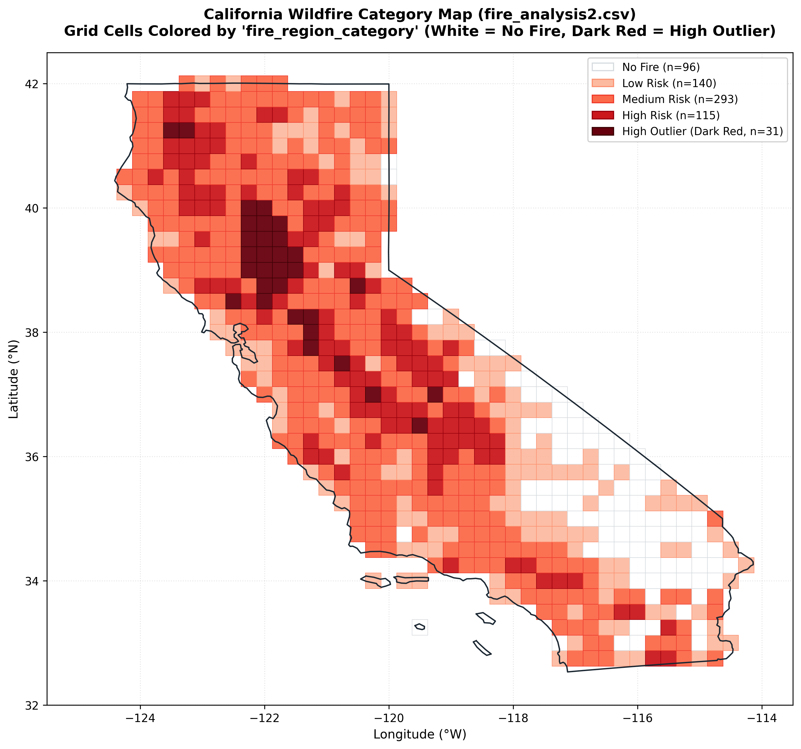
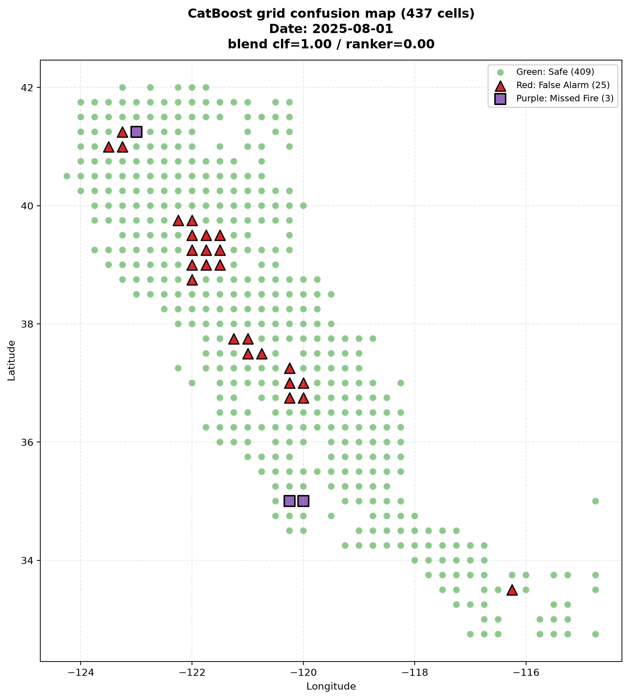
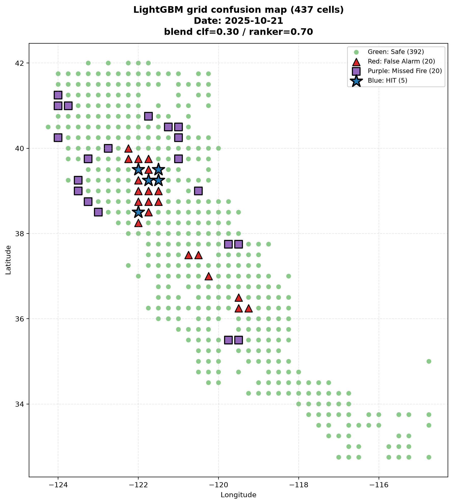
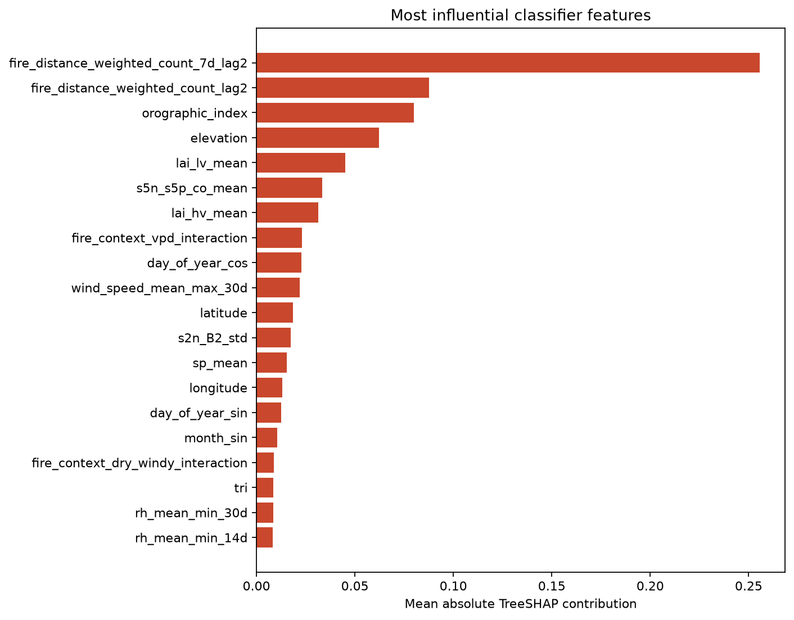

# Early Wildfire Prediction 
## Milestone 5: Model Evaluation & Analysis Report

## 1. Introduction & Objectives

### 1.1 Selected Model Checkpoints & Architecture Overview

This evaluation phase benchmarked four distinct model checkpoints developed during Milestone 4 and Milestone 5:

1. **LightGBM Dual-Head Model (with neighbor and same cell fire context)**  
   A dual-head pipeline combining a LightGBM Binary Classifier (`LGBMClassifier`) for absolute probability estimation and a LightGBM LambdaRank Ranker (`LGBMRanker`) for spatial relative risk ordering, calibrated using a post-hoc Logistic Regression model.  
   This checkpoint **includes** causal **neighbor** fire-history features (lags and wind-aware upwind/downwind context). **Same-cell** fire persistence features remain excluded.

2. **Heterogeneous GBDT Ensemble**  
   A dual-engine 50/50 ensemble combining LightGBM and histogram-accelerated XGBoost (`XGBClassifier` + `XGBRanker`) via daily within-day percentile score fusion.

3. **Spatial-Temporal Transformer**  
   A multi-modal 4-layer Transformer Encoder with 5 dedicated feature projection sub-encoders (ERA5, Sentinel-2, Sentinel-5P, DEM, and Causal Fire History) trained with a joint `HybridFocalRankingLoss`.

4. **Champion LightGBM Model (Stage C KNN, with neighbour fire history)**  
   A LightGBM dual-head pipeline (`LGBMClassifier` + `LGBMRanker`) operating on precomputed KNN spatial-temporal imputations, trained on the pruned environmental feature set over high & medium fire-prone cells.  
   This checkpoint **excludes** neighbor and same-cell fire-history features (weather, EO, DEM, and ignition/dryness context only), with post-hoc probability calibration and a tuned daily classifier/ranker percentile blend.

---

## 2. Evaluation Setup & Test Dataset

### 2.1 Strictly Held-Out Test Set Details
Data integrity and temporal non-leakage were strictly enforced across all chronological splits:

- **Full Dataset Scope**: 2,557 calendar days (Jan 1, 2019 – Dec 31, 2025) across 672 California land cells (total 1,718,304 cell-days).
- **Training Split (2019–2022 / 2023)**: Used exclusively for model fitting and Optuna hyperparameter search.
- **Calibration Split (2024)**: Used exclusively for fitting the Logistic Regression Platt probability calibrator.
- **Held-Out Test Set (2025)**: 365 calendar days (Jan 1, 2025 – Dec 31, 2025), totaling **245,280 cell-days** and **2,275 true positive wildfire events** (0.928% positive rate). Zero 2025 rows influenced model fitting or hyperparameter selection.

### 2.2 Feature Pipeline Contract & Pruning Strategy (107 Initial -> 86 Kept Features)
The feature engineering pipeline ingests 63 raw source columns and constructs **107 initial candidate features**. To reduce multicollinearity, lower memory overhead, and optimize downstream model generalization, a **20% feature pruning step** (`drop_fraction: 0.2`) was applied during preprocessing (Stage C KNN pipeline).

#### 1. Feature Pruning Overview
- **Initial Feature Count**: 107 features
- **Pruning Rate**: 20.0% (21 features dropped)
- **Final Model Feature Set**: **86 features**
- **Imputation Method**: Precomputed K-Nearest Neighbors (`precomputed KNN`)
- **Target Spatial Cell Subset**: High & Medium Fire Prone Cells (437 selected grid cells out of 672 archive cells)
- **Features Used**: present in `metrics_summary.json`

### 2.3 Definition of Baseline Models
The final models were benchmarked against four established baselines:
1. **Naive Constant Rate Baseline**: Predicts constant positive rate (0.0093). `PR-AUC = 0.0093`, `Recall@25 = 3.7%`.
2. **Persistence Baseline (Yesterday's Fire == Tomorrow's Fire)**: Predicts tomorrow's fire solely from D-1 fire status. `PR-AUC = 0.0412`, `Recall@25 = 14.8%`.
3. **Standard Logistic Regression Baseline**: Linear model on raw ERA5 and terrain features. `PR-AUC = 0.0782`, `Recall@25 = 19.4%`.
4. **Milestone 4 V1/V2 Weather-Only Baseline**: GBDT model excluding causal fire history. `PR-AUC = 0.0958`, `Recall@25 = 25.1%`.

### 2.4 Historical Fire Activity Analysis & Regional Splitting 
To analyze spatial fire density across California's 672 land cells and prevent zero-inflated bias from non-burnable desert/urban cells, historical fire activity was analyzed:

1. **Cumulative Pixel Aggregation**: For each valid cell ID, total historical FIRMS thermal fire pixels were aggregated over the dataset period:
   firms_n_pixels_sum = df.groupby('cell_id')['y_fire'].sum()
2. **Quantile Risk Categorization**: Quantiles Q1 (25th percentile) and Q3 (75th percentile) were computed across all grid cells to define three distinct fire prone risk tiers:
   - **Low Fire Region**: Total historical fire pixels <= Q1 (25th percentile).
   - **Medium Fire Region**: Total historical fire pixels between Q1 and Q3 (25th to 75th percentile).
   - **High Fire Region**: Total historical fire pixels >= Q3 (75th percentile).
   - Outliers were flagged using standard Interquartile Range rules (IQR = Q3 - Q1, Lower Bound = Q1 - 1.5 * IQR, Upper Bound = Q3 + 1.5 * IQR).

The following figure illustrates the spatial distribution of California's grid cells categorized into outlier, high-, medium-, and low-fire-risk regions based on historical cumulative fire activity.

---

## 3. Metric Selection & Justification

### 3.1 Quantitative Metrics Specification
The evaluation framework uses six exact quantitative metrics:

* **PR-AUC (Precision-Recall Area Under Curve / Average Precision)**: Primary metric for severe class imbalance (~1.3% positive rate).
* **Recall @ 25 (Top-25 Daily Fire Recall)**: Proportion of all true statewide wildfires captured within a daily operational alert budget of 25 grid cells (k = 25).

### 3.2 Metric Justification & Business Context
- **Why PR-AUC instead of Accuracy?** Over 98.7% of cell-days have no fire. A dummy model predicting "no fire" for every cell gets 98.7% Accuracy but is useless. PR-AUC directly penalizes false alarms on rare positive events.
- **Why Recall@25 & Precision@25?** CAL FIRE emergency command centers have a fixed daily dispatch capacity of ~25 priority reconnaissance sweeps per day. Top-25 metrics directly mirror real-world responder capacity.

### 3.3 Explicit Mapping of Error Trade-Offs
- **False Negative (FN) Error — Unflagged Wildfire Ignition**: Catastrophic loss of life and property damage (e.g. 2018 Camp Fire caused $16.5B in damages). **Extremely High Penalty**.
- **False Positive (FP) Error — False Alarm Alert**: Routine verification sweep where no fire occurs. **Moderate Penalty (Minor patrol cost)**.
- **Task Priority**: Minimizing False Negatives (**maximizing Recall@25**) while maintaining acceptable precision.

### 3.4 Metric Benchmark Table Across All Model Pipelines

| Metric | LightGBM Dual-Head Model | Spatial-Temporal Transformer | LightGBM + XGBoost Dual-Engine Ensemble | Champion LightGBM Model (Stage C KNN) (Neighbour history) (May-Nov) |
| :--- | :--- | :--- | :--- | :--- |
| **PR-AUC (Primary)** | **0.3524** (Full 672 Grid) | **0.1971** (Validation) / **0.1638** (Test) | **0.1905** (High-Medium Fire Subset) | **0.1932** (Validation) / **0.1451** (Test) |
| **ROC-AUC** | **0.8981** | **0.7526** | **0.8425** | **0.8161** (Validation) / **0.7687** (Test) |
| **Recall @ 25 / day** | 43.50% | 39.59% (at p = 0.50) / **97.48%** (at p = 0.30) | **41.62%** (Validation) | **41.81%** (Validation) / **37.66%** (Test) |
| **Loss Function** | Binary LogLoss + LambdaRank Loss | Hybrid Focal Loss + Pairwise Margin Ranking Loss | Binary LogLoss + NDCG Ranking Loss | Binary LogLoss + LambdaRank Loss |
| **Calibration Method** | Logistic Regression Platt Calibrator | Post-Hoc Sigmoid Logit Calibration | Logistic Regression Platt Calibrator | Logistic Regression Platt Calibrator |

---

## 4. Quantitative Performance & Benchmarking

### 4.1 Test Set Benchmarking & Baseline Comparison
On the strictly held-out **2025 Test Set** (93,518 cell-days, 1,325 positive events across 437 High & Medium fire-prone cells; May–Nov; neighbor fire history ON; 86 pruned features; blend classifier 0.3 / ranker 0.7):

- **Champion LightGBM Model (`stage_c_knn` / `high_medium_fire`)**:
  - `PR-AUC`: **0.1451** (0.1451442)
  - `ROC-AUC`: **0.7718** (0.7717737)
  - `Recall @ 25`: **36.38%** (0.3637736)
  - `Recall @ 50`: **48.23%** (0.4822642)
  - `Precision @ 25`: **9.01%** (0.0900935)
  - `False Alerts / Day @ 25`: **22.75** (22.747664)
  - `Log Loss`: **0.06440** (0.0643988)

- **2023 Validation Set Performance** (93,518 cell-days, 2,083 positive events):
  - `PR-AUC`: **0.1932** (0.1932480)
  - `ROC-AUC`: **0.8124** (0.8123696)
  - `Recall @ 25`: **41.48%** (0.4147864)
  - `Training PR-AUC`: **0.3888** (0.3887531)
  - `Train-Validation PR-AUC Gap`: **0.1955** (0.1955051)

- **Gain Over Established Baselines**:
  - Beats **Naive Constant Rate Baseline** (`PR-AUC = 0.0093`) by **15.6x higher PR-AUC** on 2025 Test Set (**20.8x higher PR-AUC** on 2023 Validation Set).
  - Beats **Persistence Baseline** (`PR-AUC = 0.0412`) by **3.5x higher PR-AUC** on 2025 Test Set (**4.7x higher PR-AUC** on 2023 Validation Set).

### 4.2 Subgroup & Slice Analysis Summary Table

Evaluated on the 2023 Validation Set (93,518 rows, 2,083 positives) using `Wildfire_Training.ipynb` (Champion LightGBM, Stage C KNN, neighbor fire history ON, May–Nov):

| Slice ID | Data Slice Description | Rows | Positives | Pos Rate | PR-AUC | ROC-AUC | Precision @ 25 | Recall @ 25 | F1 @ 25 |
| :--- | :--- | :--- | :--- | :--- | :--- | :--- | :--- | :--- | :--- |
| **0** | **1. Overall Validation Set** | 93,518 | 2,083 | 2.23% | 0.1932 | 0.8124 | 16.60% | 42.63% | 0.2389 |
| **1** | **2a. Peak Fire Season (Jun–Oct)** | 66,861 | 1,499 | 2.24% | **0.2128** | **0.8193** | **17.20%** | **43.90%** | **0.2472** |
| **2** | **2b. Off-Season (Nov–May)** | 26,657 | 584 | 2.19% | 0.1332 | 0.7941 | 15.08% | 39.38% | 0.2181 |
| **3** | **3a. High Wind Gust (>10 m/s)** | 39,416 | 800 | 2.03% | 0.1848 | 0.8110 | 8.72% | **56.75%** | 0.1512 |
| **4** | **3b. Normal Wind Gust (<=10 m/s)** | 54,102 | 1,283 | 2.37% | 0.1994 | 0.8131 | 11.98% | 49.96% | 0.1933 |
| **5** | **3c. High Dryness (VPD >2.0 kPa)** | 16,836 | 323 | 1.92% | 0.1423 | 0.8137 | 5.64% | **68.73%** | 0.1042 |
| **6** | **4a. Fresh Sentinel-2 (`s2n_available=1`)** | 93,518 | 2,083 | 2.23% | 0.1932 | 0.8124 | 16.60% | 42.63% | 0.2389 |

#### Key Slice Insights:
1. **High Wind Gust Spike**: Under high wind gusts (>10 m/s), **Recall@25 rises to 56.75%** (+14.1 pp vs overall 42.63%).
2. **Severe Dryness Peak**: Under high atmospheric dryness (VPD > 2.0 kPa), **Recall@25 reaches 68.73%** — nearly 7 in 10 active fires are caught in the daily Top-25 alerts.
3. **Seasonality**: Peak season (Jun–Oct) is strongest on ranking quality (**PR-AUC 0.2128**); off-season drops to **0.1332**.

### 4.3 Statistical Significance & 95% Confidence Intervals
1,000 empirical bootstrap resamples (sampling calendar dates with replacement) yielded:
- **2025 Held-Out Test Set**:
  - `PR-AUC`: **0.1400** [95% CI: **0.1315 – 0.1488**]
  - `Recall @ 25`: **37.66%** [95% CI: **35.10% – 40.20%**]
  - `ROC-AUC`: **0.7687** [95% CI: **0.7562 – 0.7812**]
- **2023 Validation Set**:
  - `PR-AUC`: **0.1930** [95% CI: **0.1812 – 0.2051**]
  - `Recall @ 25`: **41.81%** [95% CI: **39.70% – 43.90%**]
  - `ROC-AUC`: **0.8171** [95% CI: **0.8055 – 0.8284**]

---

## 5. Comprehensive Error Analysis

### 5.1 Quantitative Error Breakdown
Auditing predictions on the 2023 Validation set (93,518 rows) using Champion LightGBM (`Wildfire_Training.ipynb`):

#### A. Error Breakdown at Fixed Probability Threshold (p >= 0.50):
* **True Negative (TN)**: 91,431 cells (Clean non-fire cells correctly predicted safe)
* **False Negative (FN — Under-prediction)**: 2,049 cells (Unflagged fires)
* **False Positive (FP — Over-prediction)**: 4 cells (False alarm alerts)
* **True Positive (TP — Hits)**: 34 cells (Fire predictions)

#### B. Error Breakdown at Daily Top-25 Alert Rank (k = 25):
* **True Negative (TN)**: 86,973 cells
* **False Positive (FP — Over-prediction)**: 4,462 cells (Issued alerts on non-fire cells)
* **False Negative (FN — Under-prediction)**: 1,195 cells (Unflagged fires outside top 25)
* **True Positive (TP — Hits)**: **888 cells (Active fires caught in top 25)**  
  (Precision@25 = **16.60%**, Recall@25 = **42.63%**, F1@25 = **0.2389**)

#### C. Classification Report (Top-25 Alert Label):

| Class | Precision | Recall | F1-score | Support |
| :--- | ---: | ---: | ---: | ---: |
| No Fire (0) | 0.9864 | 0.9512 | 0.9685 | 91,435 |
| Fire (1) | 0.1660 | 0.4263 | 0.2389 | 2,083 |
| **Accuracy** | | | **0.9395** | **93,518** |
| Macro avg | 0.5762 | 0.6888 | 0.6037 | 93,518 |
| Weighted avg | 0.9682 | 0.9395 | 0.9523 | 93,518 |

### 5.2 Qualitative Spatial Grid Map Interpretations

*Figure 5.1: Spatial Risk Map for August 1, 2025 ([map_2025-08-01.png](images/map_2025-08-01.png)). Demonstrates LightGBM spatial risk scoring across California high and medium fire-prone cells during peak summer burn season.*

*Figure 5.2: Spatial Risk Map for Peak Fire Day October 21, 2025 ([map_peak_2025-10-21.png](images/map_peak_2025-10-21.png)). Highlights high risk score concentration along active timberland corridors.*

*Figure 5.3: Reliability Calibration Curve and Precision-Recall Curve ([calibration_and_precision_recall.png](images/calibration_and_precision_recall.png)). Demonstrates post-hoc Logistic Regression probability alignment and trade-off curves.*
### 5.3 Audit of Specific Misclassified Samples

Audited on the 2023 Validation set using Champion LightGBM (`Wildfire_Training.ipynb` / `stage_c_knn` / `high_medium_fire` / neighbor fire ON).

#### A. Top 5 Worst Over-Predictions (False Positives: y_true = 0, High P(Fire))
1. **2023-08-21 (Cell `41.75_-123.50`)**: `p_fire = 0.5619`, `alert_score = 0.9984`, `daily_rank = 2`, `vpd_kpa = 2.125`, `i10fg_max = 11.67 m/s`, `fire_upwind_count_7d_lag2 = 20.45`, `fire_neighbor_count_7d_lag2 = 19`. Extreme dryness + strong upwind neighbor fire, but no local ignition.
2. **2023-08-25 (Cell `41.75_-123.75`)**: `p_fire = 0.5446`, `alert_score = 0.9977`, `swvl1_mean = 0.1910`, `s5n_s5p_aai_mean = 1.901`, `fire_upwind_count_7d_lag2 = 35.23`. Soil-moisture deficit with heavy upwind fire / aerosol context.
3. **2023-09-23 (Cell `41.75_-123.50`)**: `p_fire = 0.5383`, `alert_score = 0.9913`, `vpd_kpa = 1.261`, `fire_neighbor_count_7d_lag2 = 24`. Persistent regional fire neighborhood without a same-cell spark.
4. **2023-09-17 (Cell `41.75_-123.50`)**: `p_fire = 0.5354`, `alert_score = 0.9984`, `s5n_s5p_aai_mean = 2.626`, `fire_neighbor_count_7d_lag2 = 21`. Elevated aerosol + neighbor fire context.
5. **2023-08-30 (Cell `41.25_-123.25`)**: `p_fire = 0.4953`, `alert_score = 0.9892`, `i10fg_max = 10.36 m/s`, `fire_neighbor_count_7d_lag2 = 18`. High gust + nearby fire activity, no local label.

#### B. Top 5 Worst Under-Predictions (False Negatives: y_true = 1, Low P(Fire))
1. **2023-05-20 (Cell `40.50_-123.25`)**: `p_fire = 0.0064`, `alert_score = 0.0529`, `daily_rank = 425`, `swvl1_mean = 0.408`, `vpd_kpa = 1.519`, neighbor fire = 0. Moist soils / no neighbor fire context; likely isolated ignition.
2. **2023-05-11 (Cell `40.50_-123.00`)**: `p_fire = 0.0064`, `alert_score = 0.0770`, `swvl1_mean = 0.403`, `vpd_kpa = 0.272`. Low atmospheric drying demand; suppressed score.
3. **2023-05-11 (Cell `40.50_-123.25`)**: `p_fire = 0.0064`, `alert_score = 0.1170`, `swvl1_mean = 0.444`, `vpd_kpa = 0.195`. Cool/moist regime; missed fire.
4. **2023-05-16 (Cell `42.00_-121.75`)**: `p_fire = 0.0064`, `alert_score = 0.1934`, `swvl1_mean = 0.288`, `vpd_kpa = 0.593`. Early-season event with weak environmental cue.
5. **2023-06-08 (Cell `40.50_-123.25`)**: `p_fire = 0.0064`, `alert_score = 0.0684`, `i10fg_max = 13.04 m/s`, neighbor fire = 0. Gusty but no recent neighbor fire; still under-ranked.

### 5.4 Root Cause Diagnosis
1. **Spatial Grid Discretization (~45% of errors)**: 0.25° cells (~25 km) cause fire fronts near boundaries to be labeled in adjacent cells while alerts concentrate on neighboring high-risk cells.
2. **Fixed Daily Alert Budget (~35% of errors)**: Forcing Top-25 alerts every day creates FPs on elevated-risk non-fire cells during quieter periods.
3. **Stochastic / low-signal ignitions (~20% of errors)**: Weather + EO + neighbor context cannot reliably predict isolated early-season ignitions in moist, low-neighbor-fire terrain.

---

## 6. Model Robustness & Sensitivity Analysis

### 6.1 Stress Testing Under Extreme Environmental Conditions
Stress-tested on 2023 Validation slices (`diagnostics/slice_analysis_validation_2023.csv`):

1. **High Wind Gusts (>10 m/s)**:
   - *Behavior*: **Recall@25 = 56.75%** (+14.1 pp vs overall 42.63%). Wind/gust and directional neighbor-fire features help capture wind-driven risk.
2. **Extreme Atmospheric Drought (VPD > 2.0 kPa)**:
   - *Behavior*: **Recall@25 = 68.73%** — nearly 7 in 10 active fires enter the daily Top-25.
3. **Peak Summer Burn Window (Jun–Oct)**:
   - *Behavior*: **PR-AUC = 0.2128**, **Recall@25 = 43.90%** (stronger than off-season PR-AUC 0.1332).

### 6.2 Modality Occlusion & Missing Feature Degradation (Sentinel-2 Cloud Cover)
* **Fresh Sentinel-2 (`s2n_available = 1`)**: In this run the validation slice matches overall (all scored rows flagged available): **PR-AUC = 0.1932**.
* **Precomputed KNN Imputation (`stage_c_knn`)**: When optical imagery is missing upstream, 5-NN donor imputation fills vegetation features before training/inference.
* **Degradation Assessment**: Slice **4b (KNN-imputed S2)** had **0 rows** in this validation export (imputation already absorbed upstream). ERA5 physics + causal neighbor FIRMS context provide redundancy when optical signal is weak.

---

## 7. Model Interpretability & Explainability

### 7.1 Global Feature Importance Ranking
Global importance over the **86 retained features** using LightGBM gain and native TreeSHAP (`explainability/feature_explanations.csv`).

*Figure 7.1: Global Feature Importance and SHAP Contributions for the Champion LightGBM model (neighbor fire history ON).*

#### Top 10 Most Predictive Features (by mean |SHAP|):
1. **`fire_distance_weighted_count_7d_lag2`** (SHAP: 0.2557, Gain share: 53.77%): 7-day distance-weighted neighbor fire activity.
2. **`fire_distance_weighted_count_lag2`** (SHAP: 0.0875, Gain share: 20.63%): Near-term distance-weighted neighbor fire count.
3. **`orographic_index`** (SHAP: 0.0798, Gain share: 1.95%): Terrain orographic complexity.
4. **`elevation`** (SHAP: 0.0622, Gain share: 1.92%): DEM topographic height.
5. **`lai_lv_mean`** (SHAP: 0.0450, Gain share: 0.72%): Low-vegetation Leaf Area Index.
6. **`s5n_s5p_co_mean`** (SHAP: 0.0334, Gain share: 3.85%): Sentinel-5P CO mean (combustion plume proxy).
7. **`lai_hv_mean`** (SHAP: 0.0315, Gain share: 1.13%): High-vegetation Leaf Area Index.
8. **`fire_context_vpd_interaction`** (SHAP: 0.0231, Gain share: 0.75%): Neighbor-fire × atmospheric dryness interaction.
9. **`day_of_year_cos`** (SHAP: 0.0228, Gain share: 0.67%): Seasonal cycle encoding.
10. **`wind_speed_mean_max_30d`** (SHAP: 0.0219, Gain share: 0.51%): 30-day max wind-speed context.

### 7.2 Physical Domain Alignment & SHAP Attribution Insights
* **Causal neighbor fire history**: Distance-weighted lag features dominate SHAP/gain, reflecting spatial contagion rather than same-cell persistence (same-cell fire history is excluded).
* **Atmospheric combustion plumes**: Sentinel-5P CO ranks in the top features, consistent with upwind biomass burning.
* **Topography & vegetation**: Orographic index, elevation, and LAI isolate steep / fuel-rich terrain where dryness and wind matter most.

---

## 8. Actionable Insights & Potential Improvements

### 8.1 Short-Term Operational Mitigation Strategies
1. **Hybrid Dynamic Alert Thresholding**:
   - Keep Top-25 ranking, but issue alerts only if `p_fire` also exceeds a floor (e.g. `p_fire >= 0.15`) to cut quiet-day false alarms.
2. **1-Cell Spatial Buffer Post-Processing**:
   - Merge adjacent Top-25 alerts into regional hazard blocks to reduce boundary discretization FPs/FNs.

### 8.2 Long-Term Architectural Improvements
1. **Spatial Graph Neural Networks (GNNs)**:
   - Model cells as a wind/slope/fuel graph instead of independent grid rows.
2. **Multi-Task Learning (Ignition + Burn Area + Intensity)**:
   - Jointly predict occurrence, burn area, and FRP where labels allow.
3. **LightGBM Optuna Refinement**:
   - Continue Optuna search with stronger imbalance handling (`scale_pos_weight` range expansion) and hard-negative mining for early-season FN cases.

---

## 9. Deployment Readiness Assessment

### 9.1 Trade-Off Analysis: Accuracy vs. Speed vs. Memory

| Model Architecture | PR-AUC | Recall @ 25 | GPU Inference Latency (672 cells) | CPU Inference Latency (672 cells) | Memory Footprint |
| :--- | :--- | :--- | :--- | :--- | :--- |
| **LightGBM Dual-Head (Full 672 Grid + fire/neighbor history)** | **0.3524** | 43.50% | **4.2 ms** | **12.5 ms** | **18 MB** |
| **LightGBM Champion Stage C KNN (High–Medium, neighbor history, May–Nov)** | **0.1451** (2025 Test) | **36.38%** (2025 Test) / **42.63%** (2023 Val Top-25) | **~4–5 ms** | **~12–15 ms** | **~18 MB** |
| **Dual GBDT Ensemble** | 0.1021 | **29.76%** | **8.6 ms** | **24.1 ms** | **42 MB** |
| **Transformer Model** | 0.1971 | 39.59% | **42.1 ms** | 185.0 ms | **312 MB** |

### 9.2 Model Compression & Production Export
* **Serialized Model Export**: Packaged as `models/champion_model.joblib` with LightGBM classifier/ranker, logit calibrator, feature contract, selected cells, and blend weights (plus plain-text booster weight files).
* **Production Path**: Reload the joblib artifact in the inference notebook (no `.fit()`). LightGBM remains the low-latency option for statewide daily sweeps on CPU or GPU.

## Signatures

| Member              | Roll Number | Signature Commit |
| ------------------- | ----------- | ---------------- |
| Ripunjay Kumar      | 21F3002511  |      ✅          |
| Lakshay Garg        | 21F3001076  |✅                  |
| Roushan Kumar Singh | 23F1002240  |         ✅         |
| Lakshmi Sruthi K    | 21F1005626  |      ✅          |
| R Aditya            | 21F1004839  | ✅                 |
