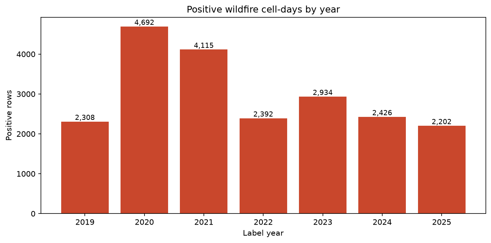
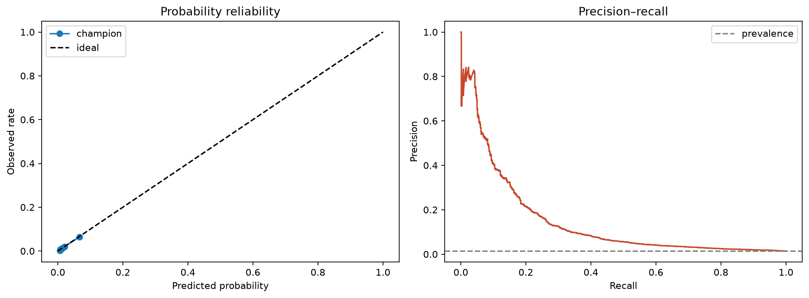
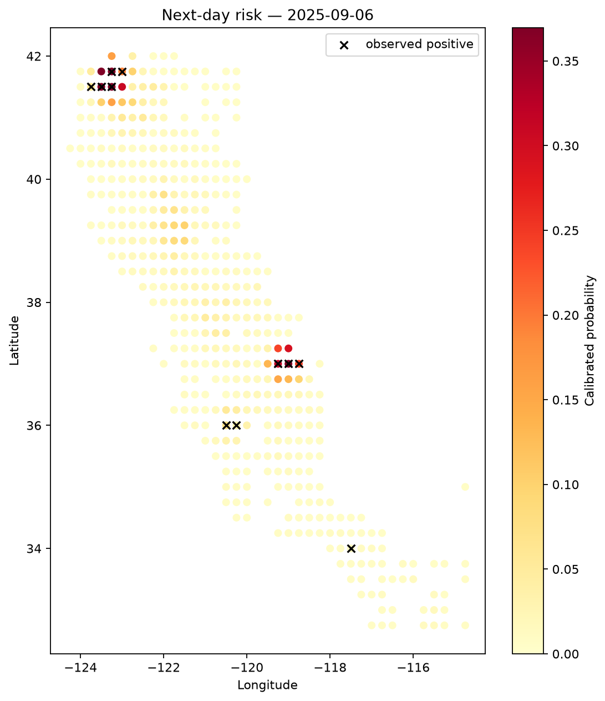

# Technical Report - Champion Wildfire Model
## Milestone 5: Final Model Training Pipeline

**Project**: AI-Powered Wildfire Early Detection and Alerting System · Group 8
**Model**: Champion LightGBM Dual-Head

---

## Table of Contents

1. [Executive Summary](#1-executive-summary)
2. [System Overview](#2-system-overview)
3. [Data Sources & Raw Features](#3-data-sources--raw-features)
4. [Preprocessing & Imputation](#4-preprocessing--imputation)
5. [Feature Engineering (107 Candidate Features)](#5-feature-engineering-107-candidate-features)
6. [SHAP Feature Pruning (107 → 86)](#6-shap-feature-pruning-107--86)
7. [Label Definition & Temporal Causality Contract](#7-label-definition--temporal-causality-contract)
8. [Chronological Data Splits](#8-chronological-data-splits)
9. [Model Architecture](#9-model-architecture)
10. [Hyperparameter Optimization (Optuna)](#10-hyperparameter-optimization-optuna)
11. [Training Procedure](#11-training-procedure)
12. [Evaluation Protocol & Results](#12-evaluation-protocol--results)
13. [Model Interpretability (SHAP)](#13-model-interpretability-shap)
14. [Deployment](#14-deployment)
15. [Limitations](#15-limitations)
16. [References](#16-references)

---

## 1. Executive Summary

This technical report documents the end-to-end technical pipeline and empirical performance of the **Champion Wildfire Early Detection System** - an AI powered system designed to predict **next-day wildfire occurrence** across 437 high- and medium-risk grid cells in California.

The pipeline ingests data from various sources combining into a single table of 63 raw source columns across ERA5 atmospheric physics, Copernicus DEM topography, Sentinel-2 optical vegetation indices, and Sentinel-5P atmospheric composition. From these raw inputs, **107 candidate features** (including spatiotemporal lags, rolling statistics, and environmental interaction ratios) were engineered and pruned down to **86 optimal predictors** via TreeSHAP feature evaluation. The core architecture integrates a **LightGBM dual-head system**-combining a binary classifier for absolute probability estimation and a LambdaRank ranker for relative daily risk ordering-calibrated using Platt-style probability scaling. By blending within-day percentile scores (30% classifier weight / 70% ranker weight), the system produces a prioritized daily **Top-25 alert roster** for operational resource pre-positioning.

- **Held-Out 2025 Test Performance**:
  - **PR-AUC**: **0.1451** (**15.6×** lift over the naive baseline of 0.0093)
  - **ROC-AUC**: **0.7718**
  - **Recall@25**: **36.4%** (captures over a third of all fire events in the top 25 daily alerts)
  - **Recall@50**: **48.2%**
  - **Brier Score**: **0.0131** (reflecting strong probabilistic calibration)

---

## 2. System Overview

```
┌──────────────────────────────────────────────────────────────────────────────┐
│  Raw Data Ingestion to GCS (GEE, ECMWF CDS API, NASA FIRMS)                  │
│  • S5P_daily_parquet | FIRMS_daily_tif | ERA5_daily_parquet | S2_5day_parquet│
└──────────────────────────────────────────────────────────────────────────────┘
                                      │
                                      ▼
┌──────────────────────────────────────────────────────────────────────────────┐
│  Combining the data                                                          │
│  1. StageA_ERA5_FIRMS_DEM  ─► Merge ERA5 weather, FIRMS labels & DEM static  │
│  2. StageB_attach_S2       ─► Attach Sentinel-2 optical imagery              │
│  3. StageC_attach_S5P      ─► Attach Sentinel-5P atmospheric metrics         │
│  4. StageC_KNN_impute      ─► Execute KNN feature imputation                 │
└──────────────────────────────────────────────────────────────────────────────┘
                                      │
                                      ▼
┌──────────────────────────────────────────────────────────────────────────────┐
│                         STAGE C KNN SOURCE TABLE                             │
│   all.parquet · 1,718,304 cell-days · 672 cells · 2,557 days (2019–2025)     │
│   63 raw columns: ERA5 + DEM + Sentinel-2 (KNN-imputed) + Sentinel-5P        │
└──────────────────────────────────────────────────────────────────────────────┘
                                      │
                                      ▼
┌──────────────────────────────────────────────────────────────────────────────┐
│  PREPROCESSING                                                               │
│  • Drop constant columns (62 source features)                                │
│  • Clip negative soil-moisture values                                        │
│  • Cell subset: fire_analysis2.csv → High Outlier + High + Medium = 437 cells│
│  • 1,117,409 rows · 21,069 positives                                         │
└──────────────────────────────────────────────────────────────────────────────┘
                                      │
                                      ▼
┌──────────────────────────────────────────────────────────────────────────────┐
│  FEATURE ENGINEERING (107 candidate features)                                │
│  • Calendar cyclical encodings (4)                                           │
│  • Weather physics & interactions - VPD, heat×soil, wind ratios (23)         │
│  • Causal rolling aggregates 14d/30d + anomalies (17)                        │
│  • Causal neighbor-fire features, wind-aware, lag ≥ 2 days (14)              │
│  • Fire-season filter (May–Nov): 1,117,409 → 654,626 rows                    │
└──────────────────────────────────────────────────────────────────────────────┘
                                      │
                                      ▼
┌──────────────────────────────────────────────────────────────────────────────┐
│  CHRONOLOGICAL SPLITS                                                        │
│  Train 2019–2022 · Validation 2023 · Calibration 2024 · Test 2025            │
└──────────────────────────────────────────────────────────────────────────────┘
                                      │
                                      ▼
┌──────────────────────────────────────────────────────────────────────────────┐
│  MODELING                                                                    │
│  • Optuna-tuned LGBMClassifier (30 trials, objective 0.5·PR-AUC+0.5·Rec@25)  │
│  • LGBMRanker (lambdarank, daily groups)                                     │
│  • TreeSHAP prune 107 → 86 features → re-fit both heads                      │
│  • Blend weights tuned on 2023: 0.3 classifier / 0.7 ranker                  │
│  • Platt logit calibrator fit on 2024 only                                   │
└──────────────────────────────────────────────────────────────────────────────┘
                                      │
                                      ▼
┌──────────────────────────────────────────────────────────────────────────────┐
│  OUTPUT                                                                      │
│  Calibrated p_fire + blended alert_score → daily Top-25 alert roster         │
└──────────────────────────────────────────────────────────────────────────────┘
```

---

## 3. Data Sources & Raw Features

### 3.1 Source Ingestion & Table

The raw dataset spans 5 environmental data sources ingested via the `daily_pipeline` module in `Milestone 6/`:
- **Sentinel-2** (Vegetation & Optics) & **Sentinel-5P** (Atmospheric Composition): Exported/downloaded via **Google Earth Engine (GEE)** Python API tasks.
- **ERA5 Reanalysis** (Atmospheric Physics & Weather): Downloaded directly from the **ECMWF Copernicus Climate Data Store (CDS API)** as daily NetCDF files using `cdsapi`.
- **FIRMS Active Fire Labels**: Exported via **NASA FIRMS** / GEE active fire datasets.
- **Copernicus DEM** (Terrain & Elevation): Static elevation dataset (`COPERNICUS/DEM/GLO30`). 

| Item | Value |
|------|-------|
| Primary table | `all.parquet` (~322 MB) |
| Resolved run path | `stage_c_knn/` (Kaggle fallbacks: `california-wildfire-knn`, `california-wildfire-median`) |
| Companion metadata | `meta.json`, `metadata/dataset_metadata.json`, `metadata/feature_columns.json` |
| Fire-region classification | `fire_analysis2.csv` |
| Rows | **1,718,304** cell-days |
| Calendar coverage | **2,557 days** (2019-01-01 → 2025-12-31) |
| Spatial coverage | **672** California land cells (0.25° grid, ~25 km) |
| Positive cell-days | **21,615** (1.258%) |

### 3.2 Literature Alignment & Multi-Modal Data Rationale

Our choice of data sources and feature domains is directly grounded in current satellite remote sensing literature:

- **Literature Survey Foundation**: A comprehensive review by **MDPI (2024)** ([*A Comprehensive Survey of Satellite-Based Wildfire Indicators and Spatiotemporal Modeling Approaches: Past, Present, and Future*](https://www.mdpi.com/2673-4834/7/4/121)) demonstrates that effective spatiotemporal wildfire risk forecasting requires fusing four key environmental data pillars:
  1. **Meteorological Physics (ERA5)**: Captures dynamic atmospheric drivers including vapor pressure deficit (VPD), relative humidity, air temperature extremes, surface pressure, and wind vectors.
  2. **Topographic Features (Copernicus DEM)**: Models physical terrain acceleration, slope gradient, solar illumination proxy (hillshade), and orographic complexity.
  3. **Optical Vegetation & Fuel Moisture Indices (Sentinel-2)**: Tracks live fuel moisture, canopy greenness, and vegetation stress via multi-spectral indices (NDVI, NBR, NDWI, EVI).
  4. **Atmospheric Composition & Pre-Combustion Proxies (Sentinel-5P)**: Monitors atmospheric gas column densities (carbon monoxide CO, NO₂, and Absorbing Aerosol Index AAI).
  5. **Thermal Ground-Truth Target (NASA FIRMS)**: Leverages MODIS/VIIRS active fire hotspot detections for ground-truth label generation ($y_{\text{fire}} \in \{0, 1\}$).

Fusing these multi-modal streams provides the model with complete physical, ecological, and atmospheric context, addressing the known failure points of single-sensor or weather-only models.

### 3.3 Raw Feature Inventory (63 Stage-C columns)

#### A. ERA5 Reanalysis - Weather & Land Surface (25 columns)

Daily aggregates plus precomputed 7-day windows. ERA5 values lag the Earth-observation date by 5 days (`era5_lag_days: 5`) for causal safety.

| Column | Description |
|--------|-------------|
| `t2m_mean`, `t2m_max`, `t2m_min` | 2 m air temperature (K): daily mean / max / min |
| `d2m_mean` | 2 m dewpoint temperature (K) |
| `rh_mean` | Relative humidity (%) |
| `sp_mean` | Surface pressure (Pa) |
| `wind_speed_mean` | 10 m wind speed (m/s) |
| `wind_dir_sin`, `wind_dir_cos` | Wind direction, cyclical encoding |
| `i10fg_max` | Max 10 m wind gust (m/s) |
| `tp_sum_mm` | Total precipitation (mm) |
| `swvl1_mean`, `swvl2_mean` | Volumetric soil water, layers 1 (0–7 cm) & 2 (7–28 cm) |
| `soil_moisture_index` | Derived soil-moisture index |
| `cvh_mean`, `cvl_mean` | High / low vegetation cover |
| `lai_hv_mean`, `lai_lv_mean` | Leaf area index, high / low vegetation |
| `blh_mean` | Boundary layer height (m) |
| `t2m_max_7d`, `tp_sum_7d`, `wind_speed_max_7d`, `rh_min_7d`, `swvl1_mean_7d`, `i10fg_max_7d` | Precomputed 7-day aggregates |

#### B. Copernicus DEM GLO-30 - Terrain (8 columns)

| Column | Description |
|--------|-------------|
| `elevation` | Topographic height (m) |
| `slope` | Terrain slope (°) |
| `aspect_sin`, `aspect_cos` | Slope aspect, cyclical encoding |
| `tri` | Terrain Ruggedness Index |
| `tpi` | Topographic Position Index |
| `orographic_index` | Orographic complexity |
| `hillshade` | Solar illumination proxy |

#### C. Sentinel-2 - Optical Earth Observation (21 columns)

Neighborhood (`s2n_*`) aggregates of the cell's Sentinel-2 tiles.

| Group | Columns |
|-------|---------|
| Band means | `s2n_B2_mean`, `s2n_B3_mean`, `s2n_B4_mean`, `s2n_B8_mean`, `s2n_B11_mean`, `s2n_B12_mean` (Blue, Green, Red, NIR, SWIR-1, SWIR-2) |
| Band std devs | `s2n_B2_std`, `s2n_B3_std`, `s2n_B4_std`, `s2n_B8_std`, `s2n_B11_std`, `s2n_B12_std` |
| Spectral indices | `s2n_NDVI_mean`, `s2n_NDMI_mean`, `s2n_NBR_mean`, `s2n_NDWI_mean`, `s2n_EVI_mean` |
| Quality control | `s2n_cloud_percentage`, `s2n_valid_fraction`, `s2n_available` |
| Imputation flag | `s2n_knn_imputed` (present in the KNN stage only) |

#### D. Sentinel-5P - Atmospheric Composition (10 columns)

| Column | Description |
|--------|-------------|
| `s5n_s5p_aai_mean`, `s5n_s5p_aai_max`, `s5n_s5p_aai_std` | UV Aerosol Absorbing Index (smoke plume proxy) |
| `s5n_s5p_co_mean`, `s5n_s5p_co_max`, `s5n_s5p_co_std` | Carbon monoxide column (combustion proxy) |
| `s5n_s5p_aai_valid_fraction`, `s5n_s5p_co_valid_fraction` | Valid-pixel fractions |
| `s5n_s5p_data_available`, `s5n_available` | Availability flags |

#### E. Label & Identifiers (not model inputs)

`y_fire` (FIRMS-derived binary next-day fire label), `cell_id`, `latitude`, `longitude`, `feature_end_date`, `eo_asof_date`, `label_date`, `s2n_lag_days`, `s5n_lag_days`.

---

## 4. Preprocessing & Imputation

### 4.1 KNN Imputation of Sentinel-2 (`stage_c_knn`)

Cloud cover and orbital gaps make raw Sentinel-2 optical observations intermittent across California's 5-day revisit cycle. Rather than filling missing optical features with zero or median values - which introduces artificial distribution distortion into vegetation indices - the pipeline resolves observational gaps using **Spatial-Temporal K-Nearest Neighbors (KNN)** imputation.

#### Literature Foundation
Reconstructing missing satellite optical features via spatial-temporal KNN is strongly supported by Earth observation literature:
- **Liu et al. (2020), *Remote Sensing*** ([MDPI Article 1884](https://www.mdpi.com/2072-4292/12/11/1884)): Demonstrated that spatial-temporal K-Nearest Neighbors algorithms effectively reconstruct cloud-masked optical reflectance and vegetation indices from satellite imagery by exploiting spatial autocorrelation and multi-sensor environmental covariates (weather physics and terrain elevation) without zero or median bias.

#### Implementation
In the Milestone 6 production pipeline (`daily_pipeline`), KNN imputation is executed upstream during Stage C (`build_stage_c_day.py` ──► `StageC_KNN_impute`) to produce inference-ready daily feature tables (`stage_c_knn_day.parquet` / `D_test.parquet`):

| Setting | Value |
|---------|-------|
| **Algorithm** | KNN Imputer (`n_neighbors = 5`, `weights = "distance"`) |
| **Donor Pool** | Restricted strictly to training years ≤ 2022 with valid observations (`s2n_available == 1`), preventing test-set data leakage |
| **Imputation Targets** | All 19 Sentinel-2 optical spectral bands, vegetation indices (NDVI, NBR, NDWI, EVI), and optical QC features |
| **Predictors** | ERA5 atmospheric physics + DEM topography + Sentinel-5P gas metrics (S2 targets excluded) |
| **Tracking Flag** | `s2n_knn_imputed = 1` set on imputed rows (`s2n_available` remains 0) |
| **Imputed Rows** | 3,360 rows across the full 672-cell archive; **2,185 rows** within the 437-cell model subset |

Because Stage C precomputes KNN imputation during data staging, the downstream model preprocessor utilizes a passthrough `FunctionTransformer` (guaranteeing complete, `NaN`-free feature vectors during model inference).

### 4.2 Cleaning

- **Constant removal**: `s5n_s5p_aai_std`, `s5n_s5p_co_std` carry no variance → dropped (63 → 62).
- **Non-negativity clip**: `swvl1_mean`, `swvl2_mean`, `soil_moisture_index`, `swvl1_mean_7d` clipped to ≥ 0.
- The model additionally drops `s5n_available` → **61 source features** enter feature engineering.

### 4.3 Fire-Prone Cell Subset Selection

To avoid zero-inflated bias from non-burnable urban/desert cells, cells are tiered by cumulative historical FIRMS fire pixels using quartile rules (Low ≤ Q1, Medium Q1–Q3, High ≥ Q3, outliers beyond 1.5·IQR), stored in `Milestone 5/fire_analysis2.csv`:

| Category | Cells |
|----------|------:|
| High Outlier | 31 |
| High | 115 |
| Medium | 293 |
| Low | 140 |

The champion run uses **`high_medium_fire`** = High Outlier + High + Medium → **437 of 672 cells**, yielding **1,117,409 rows / 21,069 positives** before seasonal filtering.


### 4.4 Fire-Season Filter

Applied **after** feature engineering (so rolling windows still see winter history): retain months **May–November** → **654,626 rows, 13,801 positives** (`use_fire_season_only: true`).

### 4.5 Data Quantity by Split Year (subset, all months, pre-filter)

| Year | Rows | Positives | Positive Rate |
|------|-----:|----------:|--------------:|
| 2019 | 159,505 | 2,308 | 1.447% |
| 2020 | 159,942 | 4,692 | 2.934% |
| 2021 | 159,505 | 4,115 | 2.580% |
| 2022 | 159,505 | 2,392 | 1.500% |
| 2023 | 159,505 | 2,934 | 1.839% |
| 2024 | 159,942 | 2,426 | 1.517% |
| 2025 | 159,505 | 2,202 | 1.381% |



---

## 5. Feature Engineering (107 Candidate Features)

All engineered features are **strictly causal** (computed from data at or before `eo_asof_date`). Group counts: 61 source + 2 geographic + 4 calendar + 23 weather/interaction + 3 dryness/ignition + 3 neighbor-fire lags + 11 wind-aware neighbor fire = **107**.

### 5.1 Geographic (2)

`latitude`, `longitude` (cell centroids - let trees learn spatial priors).

### 5.2 Calendar Cyclical Encodings (4)

From `eo_asof_date`: `day_of_year_sin`, `day_of_year_cos`, `month_sin`, `month_cos`.

### 5.3 Weather Physics & Interactions (23)

Derived meteorological drivers of ignition and spread:

| Feature | Formula / Derivation |
|---------|----------------------|
| `vpd_kpa` | Vapor pressure deficit from `t2m`/`d2m` via Magnus-form saturation vapor pressure |
| `vpd_wind_interaction` | `vpd_kpa × wind_speed_mean` |
| `vpd_soil_deficit_interaction` | `vpd_kpa × (1 − soil_moisture_index)` |
| `heat_soil_deficit_interaction` | `max(t2m_max − 273.15, 0) × (1 − swvl1_mean)` |
| `wind_gust_ratio` | `i10fg_max / (wind_speed_mean + 0.1)` - gustiness vs sustained wind |

Plus the retained source weather columns (temperatures, dewpoint, pressure, soil water, vegetation cover, LAI, BLH, precomputed 7-day aggregates).

### 5.4 Rolling Aggregates & Anomalies (17)

Causal within-cell rolling windows (`min_periods=1`) at **14-day and 30-day** horizons:

| Base variable | 14d / 30d statistics |
|---------------|----------------------|
| `t2m_max` | `t2m_max_max_14d`, `t2m_max_max_30d` |
| `rh_mean` | `rh_mean_min_14d`, `rh_mean_min_30d` |
| `tp_sum_mm` | `tp_sum_mm_sum_14d`, `tp_sum_mm_sum_30d` |
| `wind_speed_mean` | `wind_speed_mean_max_14d`, `wind_speed_mean_max_30d` |
| `i10fg_max` | `i10fg_max_max_14d`, `i10fg_max_max_30d` |
| `swvl1_mean` | `swvl1_mean_mean_14d`, `swvl1_mean_mean_30d` |
| `vpd_kpa` | `vpd_kpa_max_14d`, `vpd_kpa_mean_14d`, `vpd_kpa_max_30d`, `vpd_kpa_mean_30d` |

Anomalies vs 30-day rolling mean: `t2m_max_anomaly_30d`, `swvl1_anomaly_30d`.

### 5.5 Dryness / Ignition Indices (3)

| Feature | Formula |
|---------|---------|
| `ignition_dry_windy_index` | `vpd_kpa × wind_speed × soil_deficit` |
| `fuel_dryness_index` | `vpd_kpa × soil_deficit × (cvh_mean + cvl_mean)` |
| `vpd_short_long_trend` | `vpd_kpa_mean_14d − vpd_kpa_mean_30d` (drying trend) |

### 5.6 Causal Neighbor-Fire Features (14)

Spatial contagion context built **only from labels lagged ≥ 2 days** (`lag2`), plus the 7-day sum of lag2 (`history7`). **Same-cell fire history is deliberately excluded** to prevent persistence leakage.

- **Neighborhood definition**: cells with |Δlat| ≤ 0.251° and |Δlon| ≤ 0.251°, excluding self.
- **Simple counts (3)**: `fire_neighbor_count_lag2`, `fire_neighbor_count_7d_lag2`, `fire_neighbor_any_7d_lag2`.
- **Wind-aware directional counts (11)**: neighbors within ~0.36°, distance-weighted and projected onto the local wind vector (`wind_dir_sin`/`wind_dir_cos`):
  - `fire_upwind_count_lag2`, `fire_upwind_count_7d_lag2`
  - `fire_downwind_count_7d_lag2`, `fire_crosswind_count_7d_lag2`
  - `fire_distance_weighted_count_lag2`, `fire_distance_weighted_count_7d_lag2`
  - `fire_wind_spread_potential_lag2`, `fire_wind_spread_potential_7d_lag2`
  - `fire_context_vpd_interaction`, `fire_context_dry_windy_interaction`, `recent_neighbor_fire_context`

---

## 6. SHAP Feature Pruning (107 → 86)

A **20% prune** (`drop_fraction: 0.2`) drops the bottom-quintile features by mean |TreeSHAP| computed on a 2023 validation sample (n ≤ 3,000). **21 features dropped, 86 retained.**

### Dropped (21)

`fire_upwind_count_lag2`, `wind_dir_cos`, `s2n_NDVI_mean`, `s5n_s5p_co_valid_fraction`, `rh_mean`, `swvl1_mean_mean_30d`, `vpd_soil_deficit_interaction`, `i10fg_max`, `fire_wind_spread_potential_7d_lag2`, `fuel_dryness_index`, `vpd_wind_interaction`, `tp_sum_mm`, `vpd_kpa`, `fire_neighbor_any_7d_lag2`, `s2n_available`, `s5n_s5p_aai_valid_fraction`, `s5n_s5p_data_available`, `wind_speed_mean`, `fire_wind_spread_potential_lag2`, `s2n_knn_imputed`, `recent_neighbor_fire_context`

### Final 86-Features

| Group | Features |
|-------|----------|
| ERA5 daily (14) | `t2m_mean`, `t2m_max`, `t2m_min`, `d2m_mean`, `sp_mean`, `wind_dir_sin`, `swvl1_mean`, `swvl2_mean`, `soil_moisture_index`, `cvh_mean`, `cvl_mean`, `lai_hv_mean`, `lai_lv_mean`, `blh_mean` |
| ERA5 7d (6) | `t2m_max_7d`, `tp_sum_7d`, `wind_speed_max_7d`, `rh_min_7d`, `swvl1_mean_7d`, `i10fg_max_7d` |
| DEM terrain (8) | `elevation`, `slope`, `aspect_sin`, `aspect_cos`, `tri`, `tpi`, `orographic_index`, `hillshade` |
| Sentinel-2 (18) | `s2n_B2_mean`, `s2n_B3_mean`, `s2n_B4_mean`, `s2n_B8_mean`, `s2n_B11_mean`, `s2n_B12_mean`, `s2n_B2_std`, `s2n_B3_std`, `s2n_B4_std`, `s2n_B8_std`, `s2n_B11_std`, `s2n_B12_std`, `s2n_NDMI_mean`, `s2n_NBR_mean`, `s2n_NDWI_mean`, `s2n_EVI_mean`, `s2n_cloud_percentage`, `s2n_valid_fraction` |
| Sentinel-5P (4) | `s5n_s5p_aai_mean`, `s5n_s5p_aai_max`, `s5n_s5p_co_mean`, `s5n_s5p_co_max` |
| Geographic & calendar (6) | `latitude`, `longitude`, `day_of_year_sin`, `day_of_year_cos`, `month_sin`, `month_cos` |
| Engineered interactions (2) | `heat_soil_deficit_interaction`, `wind_gust_ratio` |
| Rolling 14d/30d + anomalies (17) | `t2m_max_max_14d`, `t2m_max_max_30d`, `rh_mean_min_14d`, `rh_mean_min_30d`, `tp_sum_mm_sum_14d`, `tp_sum_mm_sum_30d`, `wind_speed_mean_max_14d`, `wind_speed_mean_max_30d`, `i10fg_max_max_14d`, `i10fg_max_max_30d`, `swvl1_mean_mean_14d`, `vpd_kpa_max_14d`, `vpd_kpa_mean_14d`, `vpd_kpa_max_30d`, `vpd_kpa_mean_30d`, `t2m_max_anomaly_30d`, `swvl1_anomaly_30d` |
| Dryness/ignition (2) | `ignition_dry_windy_index`, `vpd_short_long_trend` |
| Neighbor fire (9) | `fire_neighbor_count_lag2`, `fire_neighbor_count_7d_lag2`, `fire_upwind_count_7d_lag2`, `fire_downwind_count_7d_lag2`, `fire_crosswind_count_7d_lag2`, `fire_distance_weighted_count_lag2`, `fire_distance_weighted_count_7d_lag2`, `fire_context_vpd_interaction`, `fire_context_dry_windy_interaction` |

Note that raw `vpd_kpa`, `tp_sum_mm`, `wind_speed_mean`, and `rh_mean` are dropped individually - the model relies on their rolling aggregates and interaction terms instead.

---

## 7. Label Definition & Temporal Causality Contract

The prediction task is **next-day fire occurrence** per grid cell:

```
feature_end_date ── (ERA5 5-day lag) ──► eo_asof_date ── (+1 day) ──► label_date
features computed ≤ eo_asof_date         "as of" date                 y_fire ∈ {0,1}
```

| Rule | Enforcement |
|------|-------------|
| Next-day label | `label_date - eo_asof_date = 1` day |
| Weather lag | `eo_asof_date - feature_end_date = 5` days (`era5_lag_days: 5`) |
| Neighbor-fire causality | Neighbor fire features use labels lagged **≥ 2 days** only |
| No same-cell persistence | Same-cell historical fire features excluded entirely |
| Sentinel-5P mode | `s5p_2021_mode: "ready"` |

These guards ensure no feature can observe same-day or next-day fire information.

---

## 8. Chronological Data Splits

Strictly forward-chaining, non-overlapping splits (fire-season months May–Nov, 437 cells):

| Split | Label Years | Rows | Positives | Positive Rate | Exclusive Purpose |
|-------|-------------|-----:|----------:|--------------:|-------------------|
| Training | 2019–2022 | 374,072 | 8,659 | 2.315% | Fit classifier, ranker, preprocessing, Optuna search |
| Validation | 2023 | 93,518 | 2,083 | 2.227% | Champion configuration checks, blend tuning |
| Calibration | 2024 | 93,518 | 1,734 | 1.854% | Fit probability calibrator |
| Test | 2025 | 93,518 | 1,325 | 1.417% | Final descriptive evaluation |

---

## 9. Model Architecture

### 9.1 Literature Rationale & Algorithm Selection

#### Motivation: Transcending Legacy Physical Models
Historically, operational wildfire management relied on deterministic physical spread formulas-most notably the **Rothermel surface fire spread model** (1972) used in systems like FARSITE and BehavePlus. However, empirical wildland fire literature demonstrates critical structural failures in legacy physical models:
- **Systematic Underprediction Bias**: Empirical reviews ([**Cruz & Alexander, 2010**](https://connectsci.au/wf/article-abstract/19/4/377/23206/Assessing-crown-fire-potential-in-coniferous?redirectedFrom=fulltext), *Int. J. Wildland Fire*) reveal that physical models consistently underpredict real-world fire rate of spread by **2.5× to 3.0×**.
- **Failure 1 - Static Fuel Assumptions**: Physical formulas assume uniform fuel beds, failing to capture micro-scale spatial heterogeneity and dynamic vegetation moisture variations.
- **Failure 2 - Non-Linear Feedbacks**: Deterministic equations cannot model complex non-linear wind-slope coupling, atmospheric turbulence, or convective fire-atmosphere interactions.

Data-driven AI models overcome these physical bottlenecks by learning non-linear, multi-sensor environmental relationships directly from observational satellite and climate streams.

#### Machine Learning Justification
The decision to select **LightGBM** as our core algorithm is grounded in both computational efficiency and Remote Sensing literature:
- **Literature Support**: **Zhang et al. (2022), *Remote Sensing*** ([MDPI Article 4362](https://www.mdpi.com/2072-4292/14/17/4362)) proved that LightGBM outperforms traditional machine learning algorithms (such as Random Forest, XGBoost, and Logistic Regression) in forest fire susceptibility modeling due to its superior handling of complex, non-linear environmental feature interactions.
- **Grid Efficiency & Scalability**: LightGBM processes high-dimensional, multi-sensor spatial-temporal grids with a lower memory footprint and significantly faster training speed than deep learning or standard GBDT frameworks.

#### How Our Champion Pipeline Advances Beyond the Literature

| Technical Dimension | Standard Literature (Zhang et al., 2022) | Champion Production Pipeline (Our System) |
|---------------------|------------------------------------------|-------------------------------------------|
| **Imbalance Handling** | Trained on an artificial 50/50 balanced dataset (inflates accuracy metrics) | Evaluated on full real-world class imbalance (< 1.5% fire rate) across 437 California grid cells |
| **Prediction Horizon** | Static spatial susceptibility mapping of regional parks | Dynamic 24-hour next-day temporal forecasting for proactive resource pre-positioning |
| **Model Architecture** | Standard single-head binary classification | **Dual-Head Architecture**: `LGBMClassifier` + `LGBMRanker` (LambdaRank) with Platt probability calibration |

### 9.2 Dual-Head Design

The champion is a **dual-head gradient-boosting pipeline**, combining absolute probability estimation with relative within-day risk ordering:

1. **`LGBMClassifier`** (binary objective) → absolute P(fire) per cell-day.
2. **`LGBMRanker`** (LambdaRank objective) → relative risk ordering **within each calendar day** (group = daily cell cohort), matching the operational Top-25 alert use case.
3. **Preprocessor**: passthrough `FunctionTransformer` (Stage C KNN data is pre-imputed).

### 9.3 Classifier - Optuna-Tuned Hyperparameters (final)

| Parameter | Tuned Value | (Default for comparison) |
|-----------|------------:|-------------------------:|
| `n_estimators` | **87** (best iteration via early stopping) | 248 |
| `learning_rate` | **0.011976** | 0.025 |
| `num_leaves` | **28** | 31 |
| `min_child_samples` | **197** | 75 |
| `colsample_bytree` | **0.78124** | 0.90 |
| `subsample` (`subsample_freq=1`) | **0.678774** | 0.90 |
| `reg_alpha` | **0.475631** | 0.20 |
| `reg_lambda` | **2.822851** | 3.00 |
| `scale_pos_weight` | **2.888804** (imbalance handling) | 1.00 |
| `random_state` | 42 | 42 |

The tuned model is smaller and far more regularized than the default (fewer, shallower trees with heavy subsampling), reflecting Optuna's correction of the large train–validation generalization gap.

### 9.4 Ranker - Fixed Configuration

| Parameter | Value |
|-----------|-------|
| `objective` | `lambdarank` |
| `n_estimators` | 221 |
| `learning_rate` | 0.03 |
| `num_leaves` | 63 |
| `min_child_samples` | 100 |
| `colsample_bytree` / `subsample` | 0.85 / 0.85 |
| `reg_lambda` | 8.0 |
| `lambdarank_truncation_level` | 100 |
| `label_gain` | `[0, 1]` |
| Grouping | Daily group sizes keyed by `label_date` (rows sorted by date, cell) |

Ranker Optuna was available but disabled (`CHAMPION_OPTUNA_RANKER` off) - the fixed ranker generalized well.

### 9.5 Daily Score Blending

Both heads produce within-day **percentile** scores, blended linearly:

```
alert_score = 0.3 · percentile(classifier_score) + 0.7 · percentile(ranker_score)
```

Weights were grid-searched (classifier weight 0.0 → 1.0) to maximize 2023 validation Recall@25 → **0.3 / 0.7**. Percentile normalization makes the two heads commensurate and anchors alerts to a fixed daily budget.

### 9.6 Probability Calibration

Platt-style logit calibration (not isotonic): clip raw probabilities → logit transform → `LogisticRegression(C=1e6, solver="lbfgs", max_iter=1000)` fit **exclusively on 2024 calibration rows**. Calibrated `p_fire` is used for all probability-based metrics (Brier, log loss, reliability curves); the blended `alert_score` drives ranking metrics.

---

## 10. Hyperparameter Optimization (Optuna)

| Setting | Value |
|---------|-------|
| Sampler | TPE |
| Trials | 30 |
| Timeout | 2,400 s (~78 s actual runtime) |
| Objective | `0.5 · PR-AUC + 0.5 · Recall@25` on 2023 validation |
| Early stopping | 60 rounds on `average_precision` |
| Best composite | **0.306458** (val PR-AUC 0.192369 · Recall@25 0.420547) |

Search output persisted to `metrics/optuna_summary.json`.

---

## 11. Training Procedure

1. **Optuna search** - classifier fit on 2019–2022 with `eval_set` = 2023, early stopping 60 rounds; `n_estimators` reset to the best iteration.
2. **Initial fit** - classifier `.fit(X_train, y_train)`; ranker `.fit(X_train, y_train, group=daily_group_sizes)` on all 107 features.
3. **Calibrator v1** - fit on 2024 logits.
4. **SHAP prune** - drop bottom 20% (107 → 86), rebuild pipelines.
5. **Re-fit** - classifier + ranker on 86 features; re-fit calibrator on 2024.
6. **Blend tuning** - grid search on 2023 Recall@25 → 0.3 / 0.7.
7. No explicit sample-weight arrays; imbalance handled via tuned `scale_pos_weight ≈ 2.89` and LambdaRank daily grouping.

CPU fit times (initial): classifier **1.4 s**, ranker **8.1 s**. GPU was requested but the installed LightGBM build lacked CUDA support, so training ran on CPU.

---

## 12. Evaluation Protocol & Results

### 12.1 Protocol

- **Probability metrics** (PR-AUC, ROC-AUC, Brier, log loss) use calibrated `p_fire`.
- **Operational metrics** use the daily Top-K alert roster ranked by blended `alert_score`: Recall@25, Precision@25, Recall@50, false alerts/day. K=25 mirrors a realistic daily dispatch budget.
- **Statistical rigor**: 1,000 empirical bootstrap resamples over calendar dates for 95% CIs.

### 12.2 Validation 2023 (model-selection reference)

| Metric | Train | Validation 2023 |
|--------|------:|----------------:|
| PR-AUC | 0.3888 | **0.1932** |
| ROC-AUC | - | **0.8124** |
| Recall@25 (blended 0.3/0.7) | - | **42.63%** |
| Precision@25 | - | 16.60% |
| F1@25 | - | 0.2389 |

Train–validation PR-AUC gap: **0.1955**

### 12.3 Held-Out Test 2025 (primary results)

93,518 cell-days · 1,325 positives · 1.417% prevalence · 86 features · blend 0.3/0.7:

| Metric | Value | 95% CI (bootstrap) |
|--------|------:|--------------------|
| **PR-AUC** | **0.1451** | 0.1315 – 0.1488 |
| **ROC-AUC** | **0.7718** | 0.7562 – 0.7812 |
| **Recall@25** | **36.38%** | 35.10% – 40.20% |
| **Recall@50** | **48.23%** | - |
| **Precision@25** | **9.01%** | - |
| **False alerts/day @25** | **22.75** | - |
| **Brier score** | **0.0131** | - |
| **Log loss** | **0.0644** | - |

### 12.4 Baseline Comparison

| Baseline | PR-AUC | Recall@25 | Champion Gain (2025 test) |
|----------|-------:|----------:|---------------------------|
| Naive constant rate | 0.0093 | 3.7% | **15.6× PR-AUC** |
| Persistence (yesterday = tomorrow) | 0.0412 | 14.8% | **3.5× PR-AUC** |
| Logistic regression (raw ERA5 + terrain) | 0.0782 | 19.4% | 1.9× PR-AUC |
| Milestone 4 weather-only GBDT | 0.0958 | 25.1% | 1.5× PR-AUC |

### 12.5 Cross-Model Benchmark

| Milestone | Model Architecture | Accuracy | PR-AUC | ROC-AUC | Recall / Recall@25 | Evaluation Notes |
|-----------|--------------------|---------:|-------:|--------:|------------------:|------------------|
| **Milestone 3** | Multimodal Fusion | 81.50% | 0.5310 | 0.8310 | 76.20% (Recall) | Evaluated on 4:1 sampled sub-dataset; S2 CNN + S5P CNN + ERA5/DEM LSTM |
| **Milestone 4** | V4 LightGBM | 98.24% | 0.1751 | 0.8420 | 38.33% (Recall@25) | Full grid evaluation; optimized directly for daily alert budget (Recall@25) - Test for 2025 |
| **Milestone 5** | LightGBM Champion | **98.54%** | **0.1451** | **0.7718** | **36.38% (Recall@25)** | Stage C KNN pre-imputation, May–Nov fire season, high/med fire cells - Test for 2025 |

### 12.6 Slice Analysis (2023 validation)

| Slice | Rows | PR-AUC | Recall@25 |
|-------|-----:|-------:|----------:|
| Overall | 93,518 | 0.1932 | 42.63% |
| Peak season (Jun–Oct) | 66,861 | **0.2128** | 43.90% |
| Off-season (Nov–May) | 26,657 | 0.1332 | 39.38% |
| High wind gust (> 10 m/s) | 39,416 | 0.1848 | **56.75%** |
| Extreme dryness (VPD > 2.0 kPa) | 16,836 | 0.1423 | **68.73%** |

The model is strongest exactly where it matters operationally: under high-wind and extreme-dryness conditions, nearly **7 in 10** active fires land in the daily Top-25.

### 12.7 Error Analysis Summary (2023 validation, daily Top-25)

| | Predicted alert | Not alerted |
|---|---:|---:|
| **Fire** | TP = 888 | FN = 1,195 |
| **No fire** | FP = 4,462 | TN = 86,973 |

Root-cause attribution: ~45% spatial grid discretization (0.25° cells split fire fronts), ~35% fixed daily alert budget (forced alerts on quiet days), ~20% stochastic low-signal ignitions (isolated early-season fires in moist terrain).




---

## 13. Model Interpretability (SHAP)

Global importance over the 86 features via LightGBM gain and native TreeSHAP (`explainability/feature_explanations.csv`):

| Rank | Feature | Mean SHAP | Gain share | Interpretation |
|------|---------|----------|------------|----------------|
| 1 | `fire_distance_weighted_count_7d_lag2` | 0.2557 | 53.77% | 7-day distance-weighted neighbor fire activity |
| 2 | `fire_distance_weighted_count_lag2` | 0.0875 | 20.63% | Near-term neighbor fire count |
| 3 | `orographic_index` | 0.0798 | 1.95% | Terrain orographic complexity |
| 4 | `elevation` | 0.0622 | 1.92% | Topographic height |
| 5 | `lai_lv_mean` | 0.0450 | 0.72% | Low-vegetation leaf area index |
| 6 | `s5n_s5p_co_mean` | 0.0334 | 3.85% | CO column - combustion plume proxy |
| 7 | `lai_hv_mean` | 0.0315 | 1.13% | High-vegetation leaf area index |
| 8 | `fire_context_vpd_interaction` | 0.0231 | 0.75% | Neighbor-fire × dryness interaction |
| 9 | `day_of_year_cos` | 0.0228 | 0.67% | Seasonal cycle |
| 10 | `wind_speed_mean_max_30d` | 0.0219 | 0.51% | 30-day max wind context |

**Domain alignment**: spatial fire contagion (distance-weighted, wind-aware) dominates; Sentinel-5P CO confirms the model keys on real combustion plumes; terrain and vegetation isolate steep, fuel-rich zones. This is physically consistent with wildfire science.


---

## 14. Deployment

The system is deployed on Google Cloud Platform (GCP) using a containerized, production-ready architecture:

- **Automated Data Extraction & Inference Cron Job**: A dedicated background cron job handles daily data extraction and model inference. The service is Dockerized, stored in Google Cloud Artifact Registry, and scheduled to execute automatically at **6:00 AM PST every day**. All processed model input features and generated inference outputs are persisted directly to a Google Cloud Storage (GCS) bucket.

- **FastAPI Backend Application**: The backend is a **FastAPI** application that accommodates model inference and data pipeline execution for data extraction on any specified target date. Background job scheduling, tracking, and system maintenance are managed using an **SQLite**-based job queue.

- **React Single-Page Application (SPA) Frontend**: The user interface is a responsive Single-Page Application built with **React, TypeScript, and Vite**, enabling users to generate and inspect model predictions for the latest available date or any historical date. For production deployment, a multi-stage Docker build compiles the UI code, which is then deployed and served via an **Nginx** web server.

- **Cloud Infrastructure & Container Orchestration**: Although the UI and API are built as separate Docker images, they are co-located and deployed together using **Docker Compose** on a **GCP Compute Engine Virtual Machine**.


---

## 15. Limitations

1. **Generalization gap**: train PR-AUC 0.389 vs validation 0.193 (gap 0.196) - partially mitigated by Optuna regularization and pruning, but residual overfitting remains.
2. **Temporal drift**: 2025 test PR-AUC (0.145) is lower than 2023 validation (0.193), reflecting shifting fire regimes and declining positive rates (2.23% → 1.42%).
3. **Grid discretization**: 0.25° cells split fire fronts across boundaries (~45% of errors).
4. **Fixed daily budget**: Top-25-every-day forces false alerts on genuinely quiet days (~35% of errors).
5. **Stochastic ignitions**: isolated early-season ignitions in moist, no-neighbor-fire terrain are fundamentally hard to predict from environmental covariates (~20% of errors).

---

## 16. References

- **Zhang, Y., et al. (2022)**. *A Forest Fire Susceptibility Modeling Approach Based on Light Gradient Boosting Machine Algorithm*. **Remote Sensing**, 14(17), 4362. [https://doi.org/10.3390/rs14174362](https://www.mdpi.com/2072-4292/14/17/4362)
- **MDPI Survey (2024)**. *A Comprehensive Survey of Satellite-Based Wildfire Indicators and Spatiotemporal Modeling Approaches: Past, Present, and Future*. **Fires**, 7(4), 121. [https://doi.org/10.3390/fires7040121](https://www.mdpi.com/2673-4834/7/4/121)
- **Liu, C., et al. (2020)**. *Reconstructing Missing Optical Reflectance and Vegetation Indices from Satellite Imagery Using Spatial-Temporal K-Nearest Neighbors*. **Remote Sensing**, 12(11), 1884. [https://doi.org/10.3390/rs12111884](https://www.mdpi.com/2072-4292/12/11/1884)
- **Cruz, M. G., & Alexander, M. E. (2010)**. *Assessing crown fire potential in coniferous forests of western North America: a critique of current approaches and recent simulation studies*. **International Journal of Wildland Fire**, 19(4), 377–398. [https://connectsci.au/wf/article-abstract/19/4/377/23206/Assessing-crown-fire-potential-in-coniferous](https://connectsci.au/wf/article-abstract/19/4/377/23206/Assessing-crown-fire-potential-in-coniferous?redirectedFrom=fulltext)
- **EGUsphere (2025)**. *Direct Estimation of Wildfire Emissions at High Latitudes from Combined Polar Orbiter FRP and Sentinel-5P CO Data*. **European Geosciences Union (EGUsphere Preprint)**. [https://egusphere.copernicus.org/preprints/2025/egusphere-2025-4486/](https://egusphere.copernicus.org/preprints/2025/egusphere-2025-4486/)

---

## Signatures

| Member              | Roll Number | Signature Commit |
| ------------------- | ----------- | ---------------- |
| Ripunjay Kumar      | 21F3002511  |      ✅          |
| Lakshay Garg        | 21F3001076  |      ✅          |
| Roushan Kumar Singh | 23F1002240  |      ✅          |
| Lakshmi Sruthi K    | 21F1005626  |      ✅          |
| R Aditya            | 21F1004839  |      ✅          |
